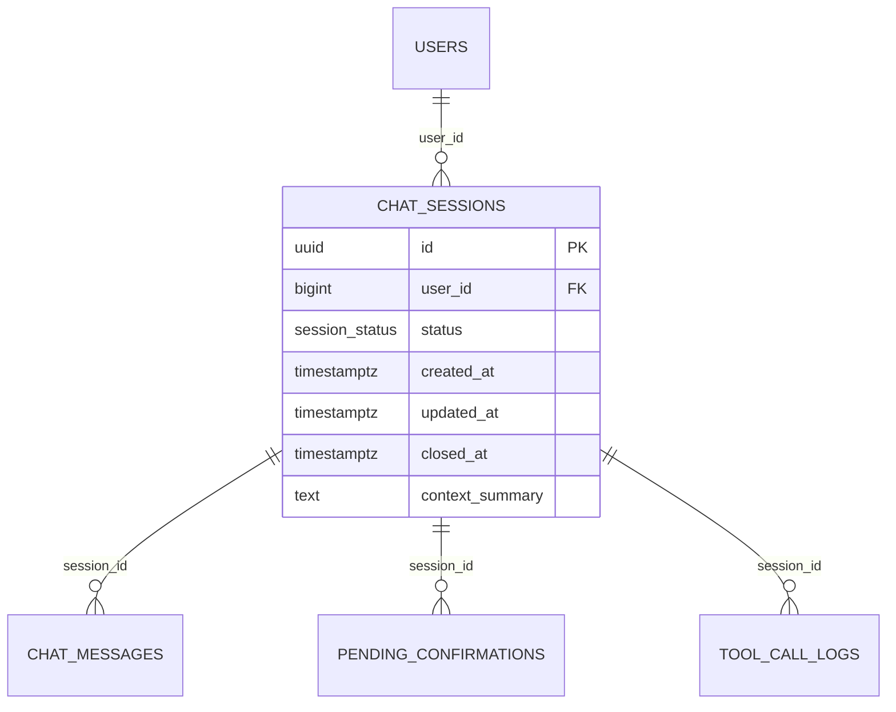

# ENTITY-AICHAT-001: CHAT_SESSIONS

> **Service**: ai-chat-service (Port 8093)
> **Database**: MongoDB
> **Source**: database-entities.md Section 11, 01_technical_module.md, 03_database_tables.md

---

## ERD

---

## Data Dictionary

| # | Column | Type | Constraints | Meaning |
|---|--------|------|-------------|---------|
| 1 | `id` | UUID | PK, DEFAULT gen_random_uuid() | Unique session identifier |
| 2 | `user_id` | BIGINT | NOT NULL, FK to USERS.id | Owner of the chat session |
| 3 | `status` | session_status | NOT NULL, DEFAULT 'ACTIVE' | ACTIVE, CLOSED, or EXPIRED |
| 4 | `context_summary` | TEXT | NULLABLE | Compressed summary when history > 50 messages |
| 5 | `created_at` | TIMESTAMPTZ | NOT NULL, DEFAULT NOW() | Session creation time |
| 6 | `updated_at` | TIMESTAMPTZ | NOT NULL, DEFAULT NOW() | Last activity time |
| 7 | `closed_at` | TIMESTAMPTZ | NULLABLE | When session was closed |

---

## Enum: session_status

| Value | Description |
|-------|-------------|
| ACTIVE | Session is open, accepting messages |
| CLOSED | User explicitly closed the session |
| EXPIRED | Auto-closed after 30 minutes of inactivity |

---

## Indexes

| Index | Fields | Purpose |
|-------|--------|---------|
| `idx_sessions_user` | `user_id` | List sessions for a user |
| `idx_sessions_status` | `status`, `updated_at` | Find expired sessions for cleanup |

---

## Redis Cache

| Key | TTL | Purpose |
|-----|-----|---------|
| `ctx:{sessionId}` | 30 min | Cache last 20 messages (avoid DB query per request) |
| `buf:{sessionId}` | 10 min | Buffer 20 products from PageIndex for "Xem them" |

---

## Cross-References

| Ref ID | Type | Description |
|--------|------|-------------|
| UC-AICHAT-001 | Use Case | Start new chat session |
| UC-AICHAT-002 | Use Case | Send message in session |
| UC-AICHAT-003 | Use Case | Confirm pending action |
| BR-AICHAT-001 | Business Rule | Chat session rules |
| ST-AICHAT-001 | State Diagram | Session state machine |
| FR-AICHAT-001 | Functional Req | Session management |
| DB-11 | Database Section | database-entities.md Section 11 |
