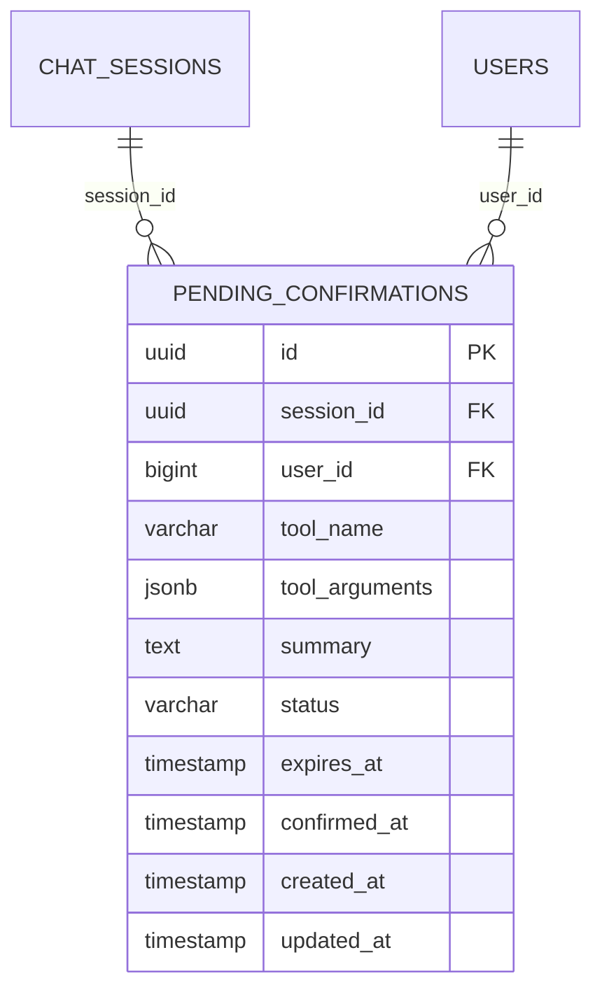

# ENTITY-AICHAT-003: PENDING_CONFIRMATIONS

> **Service**: ai-chat-service (Port 8093)
> **Database**: MongoDB
> **Source**: database-entities.md Section 11

---

## ERD

---

## Data Dictionary

| # | Column | Type | Constraints | Meaning |
|---|--------|------|-------------|---------|
| 1 | `id` | UUID | PK | Unique confirmation identifier |
| 2 | `session_id` | UUID | NOT NULL, FK to CHAT_SESSIONS.id | Owning chat session |
| 3 | `user_id` | BIGINT | NOT NULL, FK to USERS.id | Buyer who must confirm |
| 4 | `tool_name` | VARCHAR(100) | NOT NULL | Tool to execute on confirmation (e.g. `add_to_cart`) |
| 5 | `tool_arguments` | JSONB | NOT NULL | Normalized tool parameters |
| 6 | `summary` | TEXT | NOT NULL | Human-readable description for buyer review |
| 7 | `status` | VARCHAR(20) | NOT NULL, DEFAULT 'PENDING' | PENDING, CONFIRMED, REJECTED, or EXPIRED |
| 8 | `expires_at` | TIMESTAMP | NOT NULL | Automatic expiry (e.g. NOW() + 5 minutes) |
| 9 | `confirmed_at` | TIMESTAMP | NULLABLE | When buyer confirmed (populated on CONFIRMED) |
| 10 | `created_at` | TIMESTAMP | NOT NULL, DEFAULT NOW() | Record creation time |
| 11 | `updated_at` | TIMESTAMP | NOT NULL, DEFAULT NOW() | Last modification time |

---

## Enum: confirmation_status

| Value | Description |
|-------|-------------|
| PENDING | Awaiting buyer confirmation |
| CONFIRMED | Buyer approved, tool will execute |
| REJECTED | Buyer declined, tool will not execute |
| EXPIRED | Auto-expired before buyer responded |

---

## Indexes

| Index | Fields | Purpose |
|-------|--------|---------|
| `idx_pending_confirmations_session` | `session_id` | List pending confirmations for a session |
| `idx_pending_confirmations_user` | `user_id` | List pending confirmations for a user |
| `idx_pending_confirmations_status` | `status` | Filter by status (e.g. find all PENDING) |
| `idx_pending_confirmations_expires` | `expires_at` | Clean up expired confirmations |

---

## Notes

- Part of the Human-in-the-Loop pattern: AI suggests a sensitive action, buyer must confirm before execution
- Each confirmation has a TTL (default 5 minutes); expired items are cleaned up periodically
- Once CONFIRMED or REJECTED, the record is immutable

---

## Cross-References

| Ref ID | Type | Description |
|--------|------|-------------|
| UC-AICHAT-003 | Use Case | Confirm pending action |
| BR-AICHAT-001-04 | Business Rule | Human-in-the-Loop confirmation rules |
| FR-AICHAT-003 | Functional Req | Human-in-the-Loop confirmation |
| ENTITY-AICHAT-001 | Entity | CHAT_SESSIONS |
| ENTITY-AICHAT-004 | Entity | TOOL_CALL_LOGS |
| DB-11 | Database Section | database-entities.md Section 11 |
