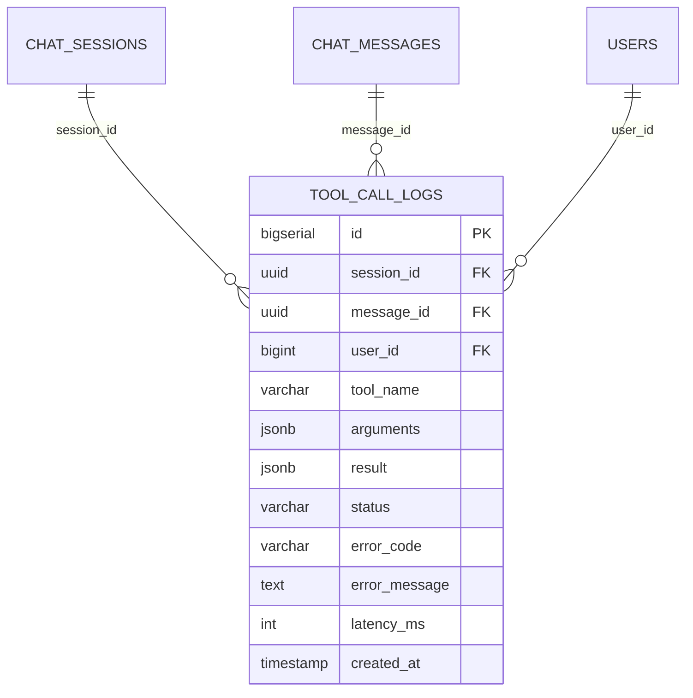

# ENTITY-AICHAT-004: TOOL_CALL_LOGS

> **Service**: ai-chat-service (Port 8093)
> **Database**: MongoDB
> **Source**: database-entities.md Section 11

---

## ERD

---

## Data Dictionary

| # | Column | Type | Constraints | Meaning |
|---|--------|------|-------------|---------|
| 1 | `id` | BIGSERIAL | PK | Unique log entry identifier |
| 2 | `session_id` | UUID | NOT NULL, FK to CHAT_SESSIONS.id | Owning chat session |
| 3 | `message_id` | UUID | NULLABLE, FK to CHAT_MESSAGES.id | Associated TOOL_CALL message (nullable: may be triggered without a message) |
| 4 | `user_id` | BIGINT | NOT NULL, FK to USERS.id | End user who triggered the session |
| 5 | `tool_name` | VARCHAR(100) | NOT NULL | Name of the tool invoked (e.g. `getOrderDetail`) |
| 6 | `arguments` | JSONB | NOT NULL | Raw arguments received from the LLM |
| 7 | `result` | JSONB | NULLABLE | Tool execution result (trimmed if oversized) |
| 8 | `status` | VARCHAR(20) | NOT NULL | SUCCESS, ERROR, or TIMEOUT |
| 9 | `error_code` | VARCHAR(50) | NULLABLE | Machine-readable error code (populated on ERROR) |
| 10 | `error_message` | TEXT | NULLABLE | Human-readable error description (populated on ERROR) |
| 11 | `latency_ms` | INT | NOT NULL | Tool execution time in milliseconds |
| 12 | `created_at` | TIMESTAMP | NOT NULL, DEFAULT NOW() | Log creation time |

---

## Enum: tool_call_status

| Value | Description |
|-------|-------------|
| SUCCESS | Tool executed successfully |
| ERROR | Tool execution failed with an error |
| TIMEOUT | Tool execution exceeded time limit |

---

## Indexes

| Index | Fields | Purpose |
|-------|--------|---------|
| `idx_tool_call_logs_session` | `session_id` | Retrieve all tool calls for a session |
| `idx_tool_call_logs_user` | `user_id` | Retrieve all tool calls for a user |
| `idx_tool_call_logs_tool` | `tool_name` | Filter by tool name for analysis |
| `idx_tool_call_logs_status` | `status` | Filter by status (e.g. find all ERRORs) |
| `idx_tool_call_logs_created_at` | `created_at` | Time-range queries for monitoring |

---

## Notes

- Append-only audit log; records are never modified after creation
- `arguments` stores the raw LLM output (may differ from normalized args in PENDING_CONFIRMATIONS)
- `result` may be truncated for large payloads to control storage
- Used for debugging tool failures and analyzing tool usage patterns

---

## Cross-References

| Ref ID | Type | Description |
|--------|------|-------------|
| UC-AICHAT-002 | Use Case | Send message (triggers tool calls) |
| UC-AICHAT-003 | Use Case | Confirm pending action (logs after confirmation) |
| BR-AICHAT-001-02 | Business Rule | 4-Record pattern rules |
| FR-AICHAT-002 | Functional Req | Message streaming |
| FR-AICHAT-003 | Functional Req | Human-in-the-Loop confirmation |
| ENTITY-AICHAT-001 | Entity | CHAT_SESSIONS |
| ENTITY-AICHAT-002 | Entity | CHAT_MESSAGES |
| ENTITY-AICHAT-003 | Entity | PENDING_CONFIRMATIONS |
| DB-11 | Database Section | database-entities.md Section 11 |
