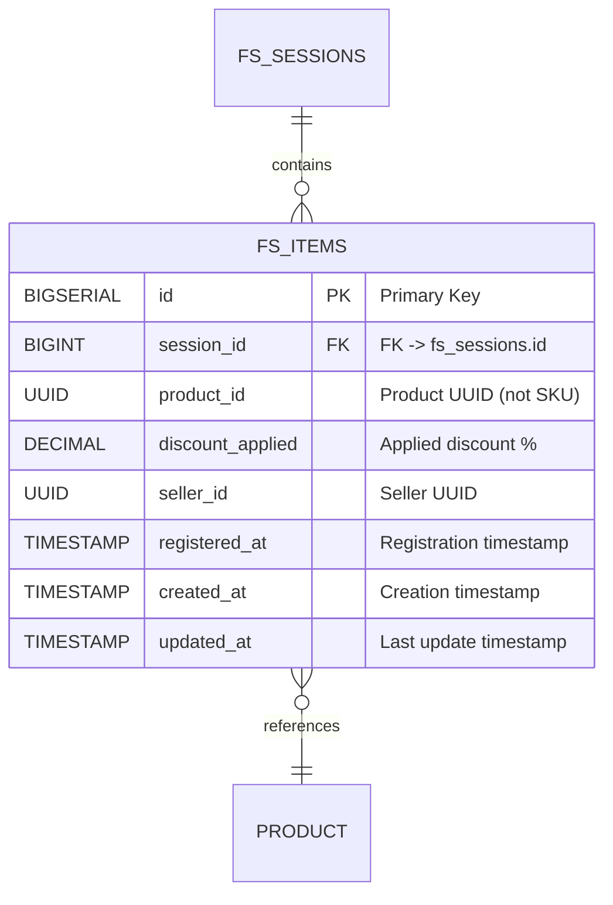

# ENTITY-FLASHSALE-002: FS_ITEMS

**Stable ID:** `ENTITY-FLASHSALE-002`
**Schema:** `flash_sale`
**Storage:** PostgreSQL
**Service:** flashsale-service (port :8086)

---

## ERD (Entity Relationship Diagram)

---

## Data Dictionary

| # | Column | Type | Nullable | Default | Description |
|---|--------|------|----------|---------|-------------|
| 1 | `id` | BIGSERIAL | NOT NULL | auto | Primary Key, auto-increment |
| 2 | `session_id` | BIGINT | NOT NULL | -- | FK -> fs_sessions.id |
| 3 | `product_id` | UUID | NOT NULL | -- | Product UUID participating in flash sale (not SKU/variant) |
| 4 | `discount_applied` | DECIMAL(5,2) | NOT NULL | -- | Discount percentage applied (e.g. 20.00 = 20%) |
| 5 | `seller_id` | UUID | NOT NULL | -- | UUID of the seller who registered the product |
| 6 | `registered_at` | TIMESTAMP | NOT NULL | NOW() | Timestamp when seller registered |
| 7 | `created_at` | TIMESTAMP | NOT NULL | NOW() | Record creation timestamp |
| 8 | `updated_at` | TIMESTAMP | NOT NULL | NOW() | Last modification timestamp |

---

## Constraints

| Constraint | Type | Expression | Purpose |
|------------|------|-----------|---------|
| `pk_fs_items` | PRIMARY KEY | `id` | Row identity |
| `uq_fs_items_session_product` | UNIQUE | `(session_id, product_id)` | One product per session only |
| `chk_discount_applied` | CHECK | `discount_applied > 0` | Discount must be positive |
| `fk_fs_items_session` | FOREIGN KEY | `session_id REFERENCES fs_sessions(id)` | Referential integrity |

---

## Indexes

| Index Name | Columns | Type | Purpose |
|------------|---------|------|---------|
| `pk_fs_items` | `id` | PRIMARY KEY (B-tree) | Row identity |
| `idx_fs_items_session` | `session_id` | B-tree | List items in a session |
| `idx_fs_items_product` | `product_id` | B-tree | Check if product already registered |
| `idx_fs_items_seller` | `seller_id` | B-tree | Seller views their registrations |

---

## Cross-References

| Reference | Description |
|-----------|-------------|
| BR-FLASHSALE-002 | Registration deadline window |
| ENTITY-FLASHSALE-001 | Parent FS_SESSIONS table |
| UC-FLASHSALE-002 | Seller registers product |
| UC-FLASHSALE-005 | Customer purchases flash item |

---

*Generated: 2026-05-09 | Source: database-entities.md section 5, 03_database_tables.md*
