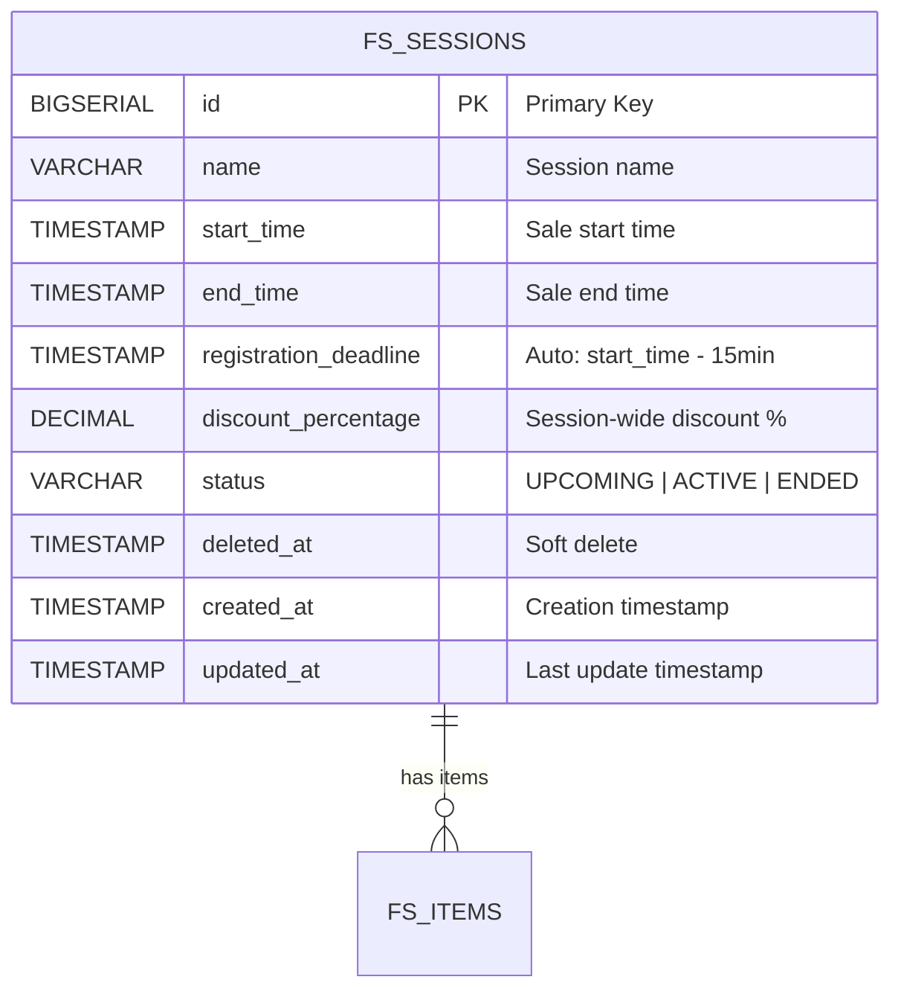

# ENTITY-FLASHSALE-001: FS_SESSIONS

**Stable ID:** `ENTITY-FLASHSALE-001`
**Schema:** `flash_sale`
**Storage:** PostgreSQL
**Service:** flashsale-service (port :8086)

---

## ERD (Entity Relationship Diagram)



---

## Data Dictionary

| # | Column | Type | Nullable | Default | Description |
|---|--------|------|----------|---------|-------------|
| 1 | `id` | BIGSERIAL | NOT NULL | auto | Primary Key, auto-increment |
| 2 | `name` | VARCHAR(255) | NOT NULL | -- | Human-readable session name (e.g. "Flash Sale 8h sang") |
| 3 | `start_time` | TIMESTAMP | NOT NULL | -- | Exact time the flash sale starts (ACTIVE) |
| 4 | `end_time` | TIMESTAMP | NOT NULL | -- | Exact time the flash sale ends (ENDED) |
| 5 | `registration_deadline` | TIMESTAMP | NOT NULL | auto | Calculated = start_time - 15 minutes |
| 6 | `discount_percentage` | DECIMAL(5,2) | NOT NULL | -- | Default discount % for all items in this session |
| 7 | `status` | VARCHAR(20) | NOT NULL | `'UPCOMING'` | Current lifecycle status |
| 8 | `deleted_at` | TIMESTAMP | NULL | NULL | Soft delete marker. NULL = active record |
| 9 | `created_at` | TIMESTAMP | NOT NULL | NOW() | Record creation timestamp |
| 10 | `updated_at` | TIMESTAMP | NOT NULL | NOW() | Last modification timestamp |

---

## Constraints

| Constraint | Type | Expression | Purpose |
|------------|------|-----------|---------|
| `chk_status` | CHECK | `status IN ('UPCOMING', 'ACTIVE', 'ENDED')` | Enforce valid status values |
| `chk_time` | CHECK | `end_time > start_time` | End time must be after start time |
| `chk_registration_deadline` | CHECK | `registration_deadline < start_time` | Deadline must precede session start |
| `chk_discount` | CHECK | `discount_percentage > 0 AND discount_percentage <= 100` | Discount range: (0, 100] |

---

## Indexes

| Index Name | Columns | Type | Purpose |
|------------|---------|------|---------|
| `pk_fs_sessions` | `id` | PRIMARY KEY (B-tree) | Row identity, fast lookup by ID |
| `idx_fs_sessions_status` | `status` | B-tree | Filter sessions by status (list UPCOMING/ACTIVE) |
| `idx_fs_sessions_time` | `start_time`, `end_time` | B-tree | Time-range queries, Redis trigger validation |
| `idx_fs_sessions_registration_deadline` | `registration_deadline` | B-tree | Check registration window open/closed |

---

## Foreign Key References

| From | To | Notes |
|------|----|-------|
| `FS_ITEMS.session_id` | `FS_SESSIONS.id` | Cascade delete handled at application layer (soft delete) |

---

## Status Lifecycle

```
[*] --> UPCOMING : Admin creates session
UPCOMING --> ACTIVE : Redis trigger fires at start_time (BR-FLASHSALE-004)
ACTIVE --> ENDED : Redis trigger fires at end_time (BR-FLASHSALE-004)
ENDED --> [*]
```

---

## Cross-References

| Reference | Description |
|-----------|-------------|
| BR-FLASHSALE-001 | Session time validation (start < end) |
| BR-FLASHSALE-002 | Registration deadline auto-calculation |
| BR-FLASHSALE-003 | Discount range validation |
| BR-FLASHSALE-004 | Status transition rules |
| BR-FLASHSALE-006 | Soft delete rule |
| UC-FLASHSALE-001 | Admin creates session |
| UC-FLASHSALE-003 | View sessions |
| UC-FLASHSALE-006 | System ends session |

---

*Generated: 2026-05-09 | Source: database-entities.md section 5, 03_database_tables.md*
