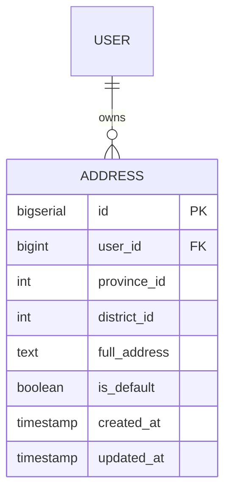

## Entity: Address
Service: identity-service
Entity ID: ENTITY-IDENTITY-006

### ERD

### Data Dictionary
| Field | Type | Constraints | Business Meaning |
|-------|------|-------------|------------------|
| id | BIGSERIAL | PK, NOT NULL | Unique address identifier |
| user_id | BIGINT | FK -> USERS.id, NOT NULL | Owning user |
| province_id | INT | NOT NULL | Province/city code (VN administrative units) |
| district_id | INT | NOT NULL | District code (VN administrative units) |
| full_address | TEXT | NOT NULL | Full street address, ward, etc. |
| is_default | BOOLEAN | NOT NULL, DEFAULT FALSE | Flag for fast checkout -- default address used as shipping default |
| created_at | TIMESTAMP | NOT NULL | Creation timestamp |
| updated_at | TIMESTAMP | NOT NULL | Last update timestamp |

### Indexes
| Index | Columns | Purpose |
|-------|---------|---------|
| idx_addresses_user_id | user_id | Fast lookup of all addresses for a user |

### Constraints
| Constraint | Type | Description |
|-----------|------|-------------|
| FK to USERS.id | Foreign Key | Links to owning user |
| UNIQUE per user for is_default=true | Application-level | At most one default address per user |

### Business Rules
- IF is_default=true and user sets another address as default THEN old default becomes is_default=false (UC-IDENTITY-004)
- IF user attempts to DELETE the only default address THEN reject with 400 (BR-IDENTITY-006)
- Addresses are used for checkout -- Order Service requests address via Kafka request-reply `order.address`

### Referenced By
| Consumer | Mechanism | Purpose |
|----------|-----------|---------|
| Order Service | Kafka request-reply `order.address` | Look up shipping address during checkout |
| ORDERS.shipping_address | JSONB snapshot | Snapshot of address at order time |

### Related Use Cases
| Use Case | Description |
|----------|-------------|
| UC-IDENTITY-004 | Manage Addresses (CRUD + set default) |
