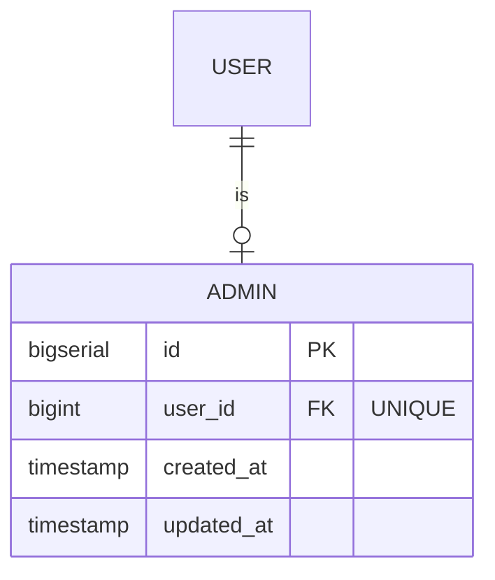

## Entity: Admin
Service: identity-service
Entity ID: ENTITY-IDENTITY-005

### ERD

### Data Dictionary
| Field | Type | Constraints | Business Meaning |
|-------|------|-------------|------------------|
| id | BIGSERIAL | PK, NOT NULL | Unique admin profile identifier |
| user_id | BIGINT | FK -> USERS.id, UNIQUE | 1:1 link to the owning user |
| created_at | TIMESTAMP | NOT NULL | Admin profile creation timestamp |
| updated_at | TIMESTAMP | NOT NULL | Last update timestamp |

### Constraints
| Constraint | Type | Description |
|-----------|------|-------------|
| FK to USERS.id | Foreign Key | Links to base user account |
| UNIQUE(user_id) | Unique | One user can have at most one admin profile |

### Business Rules
- Admin accounts are created via seed data only (no public registration endpoint)
- Admin role grants access to all `/admin/**` endpoints

### Admin Capabilities (from API)
| Action | Endpoint |
|--------|----------|
| List users | GET /admin/users |
