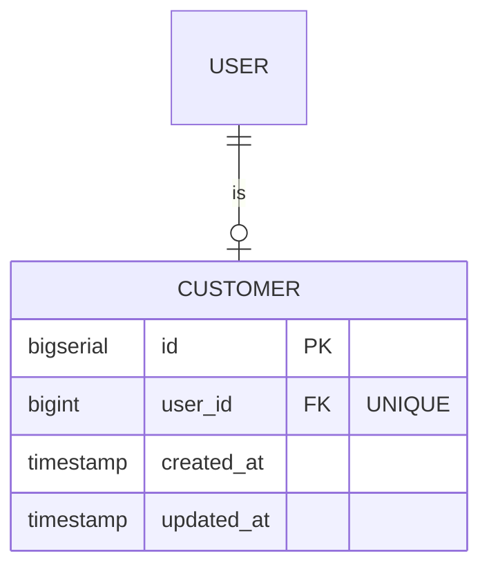

## Entity: Customer
Service: identity-service
Entity ID: ENTITY-IDENTITY-003

### ERD

### Data Dictionary
| Field | Type | Constraints | Business Meaning |
|-------|------|-------------|------------------|
| id | BIGSERIAL | PK, NOT NULL | Unique customer profile identifier |
| user_id | BIGINT | FK -> USERS.id, UNIQUE | 1:1 link to the owning user |
| created_at | TIMESTAMP | NOT NULL | Profile creation timestamp |
| updated_at | TIMESTAMP | NOT NULL | Last update timestamp |

### Constraints
| Constraint | Type | Description |
|-----------|------|-------------|
| FK to USERS.id | Foreign Key | Links to base user account |
| UNIQUE(user_id) | Unique | One user can have at most one customer profile |

### Business Rules
- IF user registers with role BUYER THEN a CUSTOMERS row is created automatically
- IF user registers via POST /auth/register THEN CUSTOMERS row created (FR-IDENTITY-001)
- A Customer is the actor for: cart operations, order checkout, flash sale participation, refund requests

### Referenced By
| Entity / Table | FK Column | Purpose |
|---------------|-----------|---------|
| CART | customer_id | One customer has one cart |
| PARENT_ORDERS | customer_id | Orders placed by this customer |

### Related Use Cases
| Use Case | Description |
|----------|-------------|
| UC-IDENTITY-001 | Register -- creates Customer row on BUYER registration |
