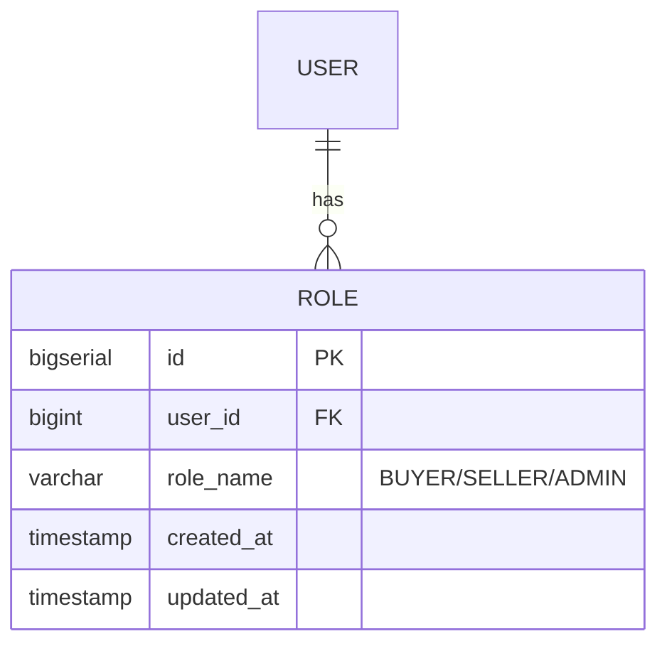

## Entity: Role
Service: identity-service
Entity ID: ENTITY-IDENTITY-002

### ERD

### Data Dictionary
| Field | Type | Constraints | Business Meaning |
|-------|------|-------------|------------------|
| id | BIGSERIAL | PK, NOT NULL | Unique role assignment identifier |
| user_id | BIGINT | FK -> USERS.id, ON DELETE CASCADE | Owning user |
| role_name | VARCHAR | NOT NULL | Role name: BUYER / SELLER / ADMIN |
| created_at | TIMESTAMP | NOT NULL | Assignment timestamp |
| updated_at | TIMESTAMP | NOT NULL | Last update timestamp |

### Indexes
| Index | Columns | Purpose |
|-------|---------|---------|
| idx_roles_user_id | user_id | Fast lookup of all roles for a user |

### Constraints
| Constraint | Type | Description |
|-----------|------|-------------|
| FK to USERS.id | Foreign Key | ON DELETE CASCADE -- deleting a user removes their roles |

### Business Rules
- A user MAY have multiple roles simultaneously (e.g., BUYER + SELLER)
- IF user registers via POST /auth/register THEN role_name = BUYER is assigned
- IF user registers via POST /auth/register/seller THEN role_name = SELLER is assigned
- IF user is created as ADMIN THEN role_name = ADMIN (manual/seed only)

### Referenced By
| Use Case | Description |
|----------|-------------|
| UC-IDENTITY-001 | Register -- creates BUYER role |
| UC-IDENTITY-006 | Seller Register -- creates SELLER role |
