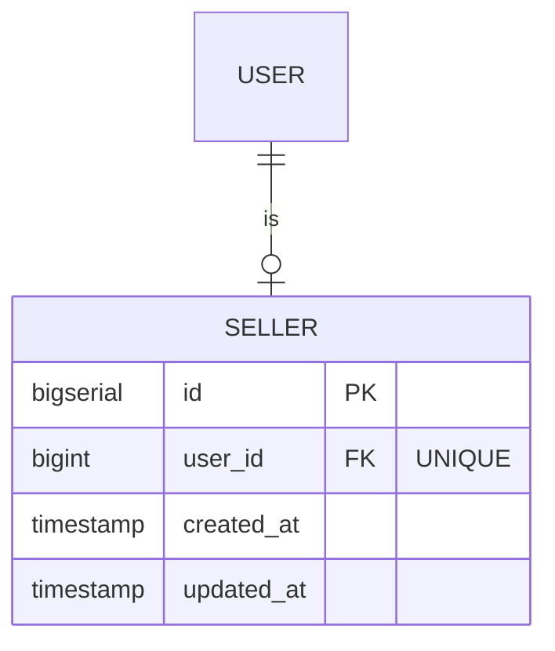

## Entity: Seller
Service: identity-service
Entity ID: ENTITY-IDENTITY-004

### ERD

### Data Dictionary
| Field | Type | Constraints | Business Meaning |
|-------|------|-------------|------------------|
| id | BIGSERIAL | PK, NOT NULL | Unique seller profile identifier |
| user_id | BIGINT | FK -> USERS.id, UNIQUE | 1:1 link to the owning user |
| created_at | TIMESTAMP | NOT NULL | Seller profile creation timestamp |
| updated_at | TIMESTAMP | NOT NULL | Last update timestamp |

### Constraints
| Constraint | Type | Description |
|-----------|------|-------------|
| FK to USERS.id | Foreign Key | Links to base user account |
| UNIQUE(user_id) | Unique | One user can have at most one seller profile |

### Business Rules
- IF user registers via POST /auth/register/seller THEN SELLERS row created (UC-IDENTITY-006)
- Seller MUST complete Stripe KYC before listing products
- Seller registration triggers Kafka event: seller.registered
- Admin MAY suspend seller posting (BR-IDENTITY-005)

### Referenced By
| Entity / Table | FK Column | Purpose |
|---------------|-----------|---------|
| ORDERS | seller_id | Orders fulfilled by this seller |
| FS_ITEMS | seller_id | Flash sale items registered by this seller |
| SELLER_STRIPE_ACCOUNTS | seller_id | Stripe Connect account link |
| SELLER_TRANSFERS | seller_id | Payout records |

### Related Kafka Events
| Event | Trigger |
|-------|---------|
| seller.registered | POST /auth/register/seller (UC-IDENTITY-006) |
| seller.onboarding_completed | Stripe KYC webhook callback |

### Related Use Cases
| Use Case | Description |
|----------|-------------|
| UC-IDENTITY-006 | Seller Registration |
