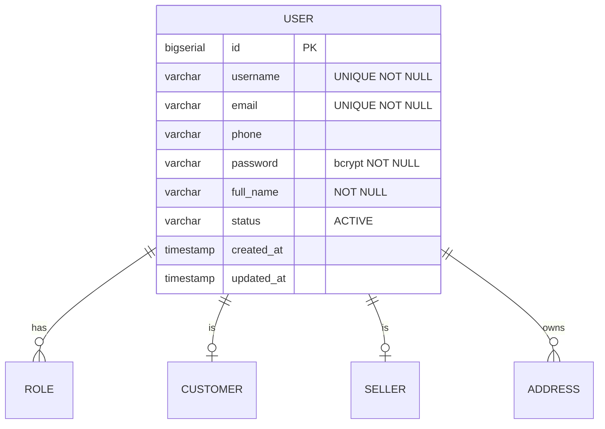

## Entity: User
Service: identity-service
Entity ID: ENTITY-IDENTITY-001

### ERD


### Data Dictionary
| Field | Type | Constraints | Business Meaning |
|-------|------|-------------|------------------|
| id | BIGSERIAL | PK, NOT NULL | Unique user identifier |
| username | VARCHAR | UNIQUE, NOT NULL | Login username, 3-50 chars, a-z 0-9 . _ |
| email | VARCHAR | UNIQUE, NOT NULL | Verified email address |
| phone | VARCHAR | NULLABLE | VN phone number (optional at registration) |
| password | VARCHAR | NOT NULL | Bcrypt-hashed password, min 8 chars |
| full_name | VARCHAR | NOT NULL | Display name, 2-100 chars |
| status | VARCHAR | NULLABLE | ACTIVE (null = ACTIVE implicitly) |
| created_at | TIMESTAMP | NOT NULL | Account creation timestamp |
| updated_at | TIMESTAMP | NOT NULL | Last update timestamp |

Note: `role` is NOT stored on the User entity. Roles are stored in the separate `roles` table via `Role` entity (ENTITY-IDENTITY-002), linked by `user_id` FK. A user may have multiple roles.

Note: `version` (optimistic lock) is NOT present in the User entity. User has no `@Version` field.

### Indexes
| Index | Columns | Purpose |
|-------|---------|---------|
| idx_users_email | email (UNIQUE) | Login by email |
| idx_users_username | username (UNIQUE) | Login by username |

### Referenced By
| Entity | FK Column | Relationship |
|--------|-----------|-------------|
| ROLE (ENTITY-IDENTITY-002) | user_id | One user has many roles |
| CUSTOMER (ENTITY-IDENTITY-003) | user_id | One user has zero-or-one customer profile |
| SELLER (ENTITY-IDENTITY-004) | user_id | One user has zero-or-one seller profile |
| ADDRESS (ENTITY-IDENTITY-006) | user_id | One user has many addresses |

### State Transitions
See [state-user.md](../../state-diagrams/identity-service/state-user.md)

```
[*] --> ACTIVE : register (BR-IDENTITY-001)
```

### Related Kafka Events
| Event | Trigger |
|-------|---------|
| account.registered | POST /auth/register (UC-IDENTITY-001) |
| account.updated | PUT /users/me (UC-IDENTITY-003) |
