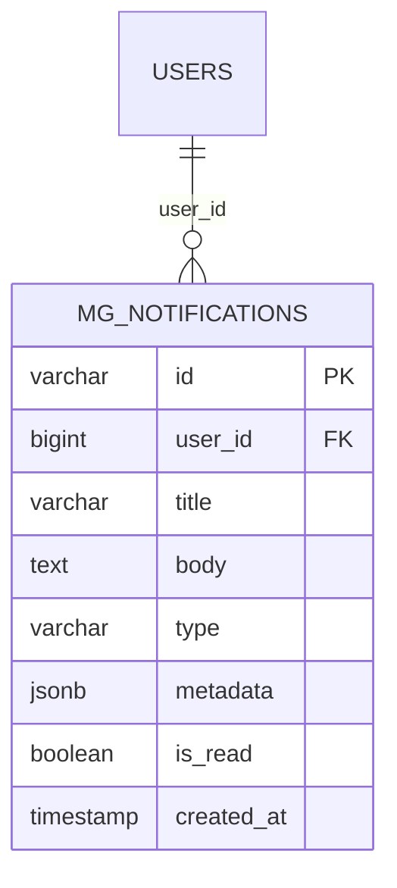

# ENTITY-NOTIF-001: MG_NOTIFICATIONS

> **Service**: notification-service (Port 8092)
> **Database**: MongoDB (not PostgreSQL)
> **Collection**: mg_notifications
> **Source**: database-entities.md Section 8, 03_database_tables.md

---

## ERD (Conceptual)

---

## Data Dictionary

| # | Column | Type | Constraints | Meaning |
|---|--------|------|-------------|---------|
| 1 | `id` | VARCHAR | PK, MongoDB ObjectId | Unique notification identifier |
| 2 | `user_id` | BIGINT | NOT NULL, FK to USERS.id | Recipient of the notification |
| 3 | `title` | VARCHAR | NOT NULL | Notification title |
| 4 | `body` | TEXT | NOT NULL | Notification body content |
| 5 | `type` | VARCHAR | NOT NULL | Notification type (see Type Catalog) |
| 6 | `metadata` | JSONB | NULLABLE | Supplementary data: deeplink, entity IDs |
| 7 | `is_read` | BOOLEAN | DEFAULT false | Whether user has viewed this notification |
| 8 | `created_at` | TIMESTAMP | DEFAULT NOW() | Creation time. TTL index: auto-delete after 90 days |

---

## Type Catalog

| Type | Priority | Kafka Source Topic |
|------|----------|--------------------|
| ORDER_CREATED | NORMAL | order.created |
| ORDER_PAID | HIGH | payment.success |
| ORDER_SHIPPED | NORMAL | order.shipped |
| ORDER_DELIVERED | NORMAL | order.delivered |
| ORDER_CANCELLED | HIGH | order.cancelled |
| ORDER_AUTO_CANCELLED | HIGH | order.auto_cancelled |
| REFUND_REQUESTED | NORMAL | refund.requested |
| REFUND_APPROVED | HIGH | refund.admin_approved |
| REFUND_REJECTED | HIGH | refund.rejected |
| FLASH_SALE_STARTING | HIGH | flash_sale.session_started |
| FLASH_SALE_ENDED | LOW | flash_sale.session_ended |
| FS_ITEM_APPROVED | NORMAL | flash_sale.item_approved |
| FS_ITEM_REJECTED | NORMAL | flash_sale.item_rejected |
| PRODUCT_APPROVED | NORMAL | product.approved |
| PRODUCT_REJECTED | HIGH | product.rejected |
| SELLER_STRIPE_REQUIREMENT | HIGH | seller.stripe_requirement |
| STRIPE_ACCOUNT_SUSPENDED | URGENT | stripe.account_suspended |

---

## Indexes

| Index | Fields | Type | Purpose |
|-------|--------|------|---------|
| `idx_user_created` | `user_id`, `created_at` | Compound | Paginated query per user |
| `idx_unread_user` | `is_read`, `user_id` | Compound | Unread count + filter |
| `idx_ttl` | `created_at` | TTL (90d) | Auto-delete expired notifications |

---

## Kafka Integration (Consumer Only)

Notification Service produces **zero** events. It consumes topics from:

- **Identity Service**: seller.registered
- **Product Service**: product.pending_review, product.approved, product.rejected
- **Order Service**: order.shipped, order.delivered, order.cancelled, order.auto_cancelled, order.returned
- **Payment Service**: payment.success, payment.failed, refund.*, seller.transfer.*, seller.stripe_requirement, stripe.account_suspended
- **Flash Sale Service**: flash_sale.session_started, flash_sale.session_ended, flash_sale.item_registered, flash_sale.item_approved, flash_sale.item_rejected

---

## Cross-References

| Ref ID | Type | Description |
|--------|------|-------------|
| UC-NOTIF-001 | Use Case | Stream real-time notifications (SSE) |
| UC-NOTIF-002 | Use Case | View notification history |
| UC-NOTIF-003 | Use Case | Mark notification as read |
| BR-NOTIF-001 | Business Rule | Notification lifecycle rules |
| ST-NOTIF-001 | State Diagram | Notification state machine (unread -> read) |
| FR-NOTIF-001 | Functional Req | SSE real-time delivery |
| FR-NOTIF-002 | Functional Req | Paginated history |
| FR-NOTIF-003 | Functional Req | Read/unread management |
| DB-08 | Database Section | database-entities.md Section 8 |
