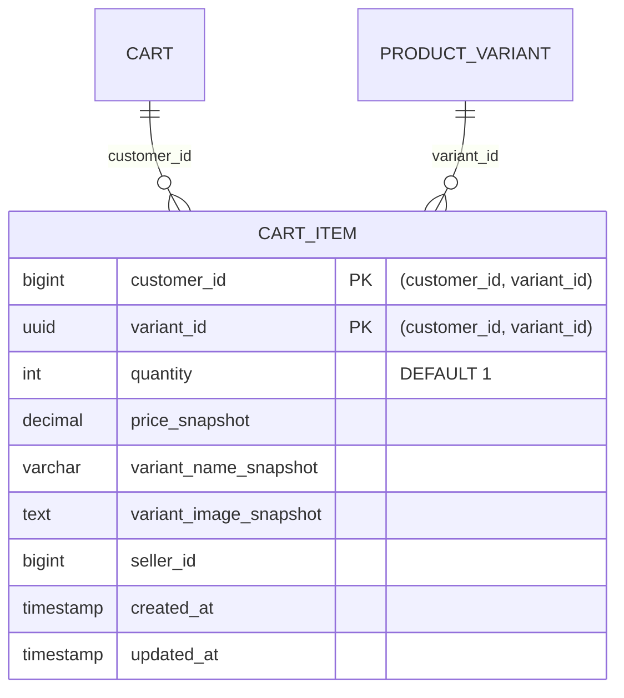

# ENTITY-PRODUCT-007: CART_ITEM

> **Service**: product-service (Port 8084)
> **Database**: PostgreSQL
> **Table**: cart_items
> **Source**: database-entities.md Section 4, 03_database_tables.md Section 7

---

## ERD

---

## Data Dictionary

| # | Field | Type | Constraints | Meaning |
|---|-------|------|-------------|---------|
| 1 | `customer_id` | BIGINT | PK (composite), NOT NULL | Customer who owns this cart item |
| 2 | `variant_id` | UUID | PK (composite), NOT NULL, FK → product_variant.id | The SKU in the cart |
| 3 | `quantity` | INT | NOT NULL, DEFAULT 1 | Desired quantity; > 0 and <= 1000 per API validation |
| 4 | `price_snapshot` | DECIMAL(18,2) | NOT NULL | Price at time of adding to cart; used for change detection |
| 5 | `variant_name_snapshot` | VARCHAR(500) | NOT NULL | Cached variant name for display even if variant is deleted |
| 6 | `variant_image_snapshot` | TEXT | NULLABLE | Cached image URL for display even if image is removed |
| 7 | `seller_id` | BIGINT | NOT NULL | Seller who owns the product |
| 8 | `created_at` | TIMESTAMP | Auto-set | When item was added to cart |
| 9 | `updated_at` | TIMESTAMP | Auto-set | Last quantity/price update |

**COMPOSITE PK(customer_id, variant_id)** — each variant appears at most once per customer.
No soft-delete (`deleted_at`) column. Cart items are **hard-deleted** when:
- Customer manually removes them via `DELETE /cart/items/{variantId}`
- Customer clears cart via `DELETE /cart`
- Checkout completed (payment succeeded) — `order.paid` event triggers hard delete
- Checkout cancelled/failed (payment failed) — `order.payment_failed` event triggers hard delete

---

## Indexes

| Index Name | Fields | Type | Purpose |
|-----------|--------|------|---------|
| `uk_cart_items_customer_variant` | `(customer_id, variant_id)` | PostgreSQL UNIQUE constraint | Enforces one entry per variant per customer; enables UPSERT |
| `idx_cart_items_customer` | `(customer_id)` | B-tree | Fetch all items for a given customer |
| `idx_cart_items_variant` | `(variant_id)` | B-tree | Find carts containing a specific variant |

---

## Lazy Evaluation Strategy

When `GET /cart` is called, the service compares real-time variant data against snapshots:

| Condition | Flag Returned | UI Action |
|-----------|---------------|-----------|
| `product_variant.price != price_snapshot` | `price_changed` | Show old vs new price; prompt user to confirm update |
| `product_variant.stock_quantity == 0` | `out_of_stock` | Dim item, disable checkbox |
| `product_variant.status != 'active'` | `unavailable` | Dim item, disable checkbox |
| `product_variant.stock_quantity < quantity` | `insufficient_stock` | Warn user, cap quantity |

If any of these conditions exist at Checkout Preview, the API returns **409 Conflict** and the UI blocks progression until the cart is refreshed.

---

## Cross-References

| Ref ID | Type | Description |
|--------|------|-------------|
| FR-PRODUCT-017 | Functional Requirement | Add item to cart |
| FR-PRODUCT-018 | Functional Requirement | Update cart item quantity |
| FR-PRODUCT-019 | Functional Requirement | Remove item from cart |
| UC-PRODUCT-009 | Use Case | Add to cart (customer) |
| UC-PRODUCT-010 | Use Case | Update cart item (customer) |
| UC-PRODUCT-011 | Use Case | Remove from cart (customer) |
| BR-PRODUCT-010 | Business Rule | Cart item uniqueness (per variant) |
| BR-PRODUCT-011 | Business Rule | Price snapshot rules |
| BR-PRODUCT-012 | Business Rule | Quantity limits |
