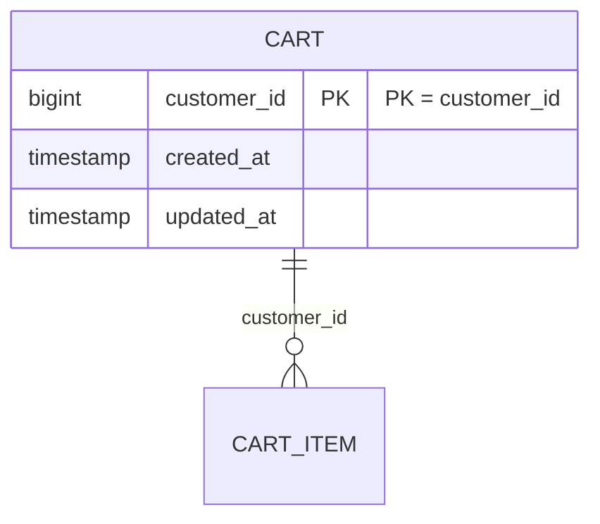

# ENTITY-PRODUCT-006: CART

> **Service**: product-service (Port 8084)
> **Database**: PostgreSQL
> **Table**: carts
> **Source**: database-entities.md Section 4, 03_database_tables.md Section 6

---

## ERD

---

## Data Dictionary

| # | Field | Type | Constraints | Meaning |
|---|-------|------|-------------|---------|
| 1 | `customer_id` | BIGINT | PK, NOT NULL | Customer ID from Identity Service; exactly 1 cart per customer |
| 2 | `created_at` | TIMESTAMP | Auto-set | Row creation timestamp |
| 3 | `updated_at` | TIMESTAMP | Auto-set | Last modification timestamp |

---

## Design Rationale

- **PK = customer_id**: Each customer has exactly one cart. No separate UUID PK needed.
- Cart record is created lazily on first `POST /cart/items`.
- Cart is never deleted — only its items are removed.
- No `status` or `deleted_at` columns needed.

---

## Cross-References

| Ref ID | Type | Description |
|--------|------|-------------|
| FR-PRODUCT-016 | Functional Requirement | Get customer cart |
| UC-PRODUCT-008 | Use Case | View cart (customer) |
| BR-PRODUCT-009 | Business Rule | One cart per customer |
| state-cart.md | State Diagram | active -> converted (on checkout) |
