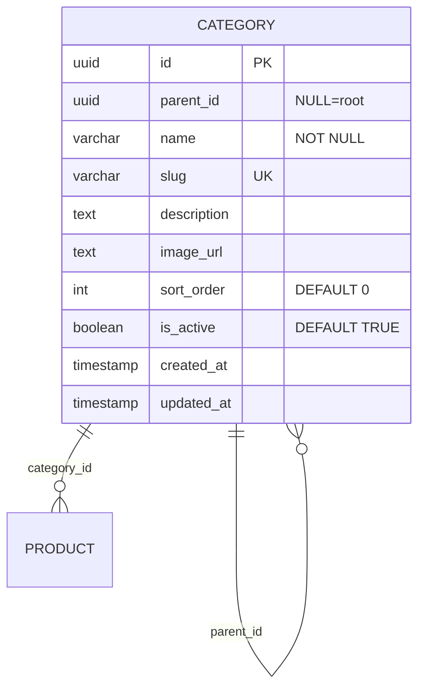

# ENTITY-PRODUCT-001: CATEGORY

> **Service**: product-service (Port 8084)
> **Database**: PostgreSQL
> **Table**: categories
> **Source**: database-entities.md Section 3, 03_database_tables.md Section 1

---

## ERD

---

## Data Dictionary

| # | Field | Type | Constraints | Meaning |
|---|--------|------|-------------|---------|
| 1 | `id` | UUID | PK (gen_random_uuid()) | Unique category identifier |
| 2 | `parent_id` | UUID | NULLABLE, FK → category.id | Parent category; NULL = root (top-level). No CASCADE. |
| 3 | `name` | VARCHAR(255) | NOT NULL | Display name (e.g., "Ao Thun Nam") |
| 4 | `slug` | VARCHAR(255) | UNIQUE | URL-friendly identifier for SEO (e.g., "ao-thun-nam") |
| 5 | `description` | TEXT | NULLABLE | Optional category description |
| 6 | `image_url` | TEXT | NULLABLE | Banner/icon URL for category display |
| 7 | `sort_order` | INT | DEFAULT 0 | Display ordering; lower numbers appear first |
| 8 | `is_active` | BOOLEAN | DEFAULT true | FALSE hides category and all its products from storefront |
| 9 | `created_at` | TIMESTAMP | Auto-set | Row creation timestamp |
| 10 | `updated_at` | TIMESTAMP | Auto-set | Last modification timestamp |

---

## Indexes

| Index Name | Fields | Type | Purpose |
|------------|---------|------|---------|
| `idx_category_parent` | `(parent_id)` | B-tree | Fast child-category lookup for tree traversal |
| `idx_category_slug` | `(slug)` | PostgreSQL UNIQUE constraint | Slug-based lookup for SEO URLs and duplicate prevention |

---

## Cross-References

| Ref ID | Type | Description |
|--------|------|-------------|
| FR-PRODUCT-001 | Functional Requirement | Browse category tree |
| FR-PRODUCT-002 | Functional Requirement | Admin create category |
| FR-PRODUCT-003 | Functional Requirement | Admin update category |
| UC-PRODUCT-001 | Use Case | Browse catalog |
| UC-PRODUCT-002 | Use Case | Manage categories |
| BR-PRODUCT-001 | Business Rule | Category hierarchy constraints |
| BR-PRODUCT-002 | Business Rule | Leaf-only product assignment |