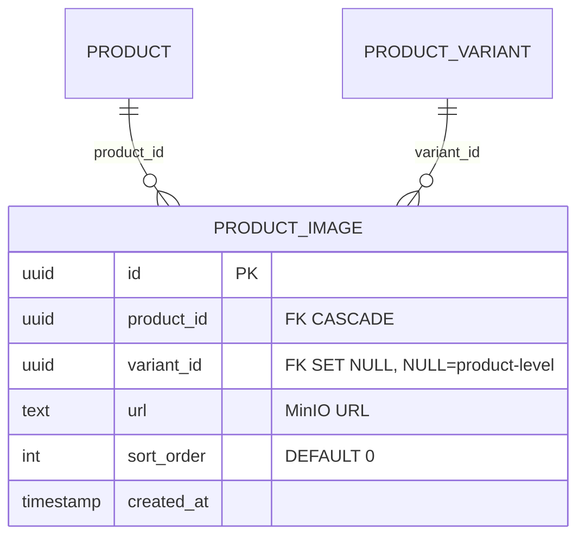

# ENTITY-PRODUCT-004: PRODUCT_IMAGE

> **Service**: product-service (Port 8084)
> **Database**: PostgreSQL
> **Table**: product_images
> **Source**: database-entities.md Section 3, 03_database_tables.md Section 4

---

## ERD



---

## Data Dictionary

| # | Field | Type | Constraints | Meaning |
|---|--------|------|-------------|---------|
| 1 | `id` | UUID | PK | Unique image identifier |
| 2 | `product_id` | UUID | NOT NULL, FK → product.id ON DELETE CASCADE | Parent product. |
| 3 | `variant_id` | UUID | NULLABLE, FK → product_variant.id ON DELETE SET NULL | NULL = common product image; non-NULL = variant-specific image |
| 4 | `url` | TEXT | NOT NULL | Full MinIO object URL (binary stored in MinIO, not DB) |
| 5 | `sort_order` | INT | DEFAULT 0 | Display order; smallest value = primary/thumbnail image |
| 6 | `created_at` | TIMESTAMP | Auto-set | Row creation timestamp |

---

## Storage Convention

```
MinIO Bucket: products-media
Key Pattern:  products/{seller_id}/{product_id}/{uuid}-{type}.{ext}

Variants:
  {uuid}-front.jpg          -> Original
  {uuid}-front_thumb.jpg    -> Thumbnail
  {uuid}-front_small.jpg    -> List image
```

---

## Indexes

| Index Name | Fields | Type | Purpose |
|------------|---------|------|---------|
| `idx_product_image_product` | `(product_id)` | B-tree | Fetch all images for a product gallery |
| `idx_product_image_variant` | `(variant_id)` | B-tree | Fetch variant-specific images |

---

## Display Logic by Context

| Context | Query | Fallback |
|---------|-------|----------|
| Listing card / Homepage | `variant_id IS NULL AND sort_order = MIN` | -- |
| Product Detail (default) | `variant_id IS NULL ORDER BY sort_order` | -- |
| Product Detail (variant selected) | `variant_id = :selected_id` | Fallback to product images |
| Cart item | `cart_item.variant_image_snapshot` (not this table) | -- |

---

## Cross-References

| Ref ID | Type | Description |
|--------|------|-------------|
| FR-PRODUCT-012 | Functional Requirement | Upload product images |
| FR-PRODUCT-013 | Functional Requirement | Delete product image |
| UC-PRODUCT-005 | Use Case | Upload images (seller) |
| BR-PRODUCT-006 | Business Rule | Image validation (format, count, size) |
