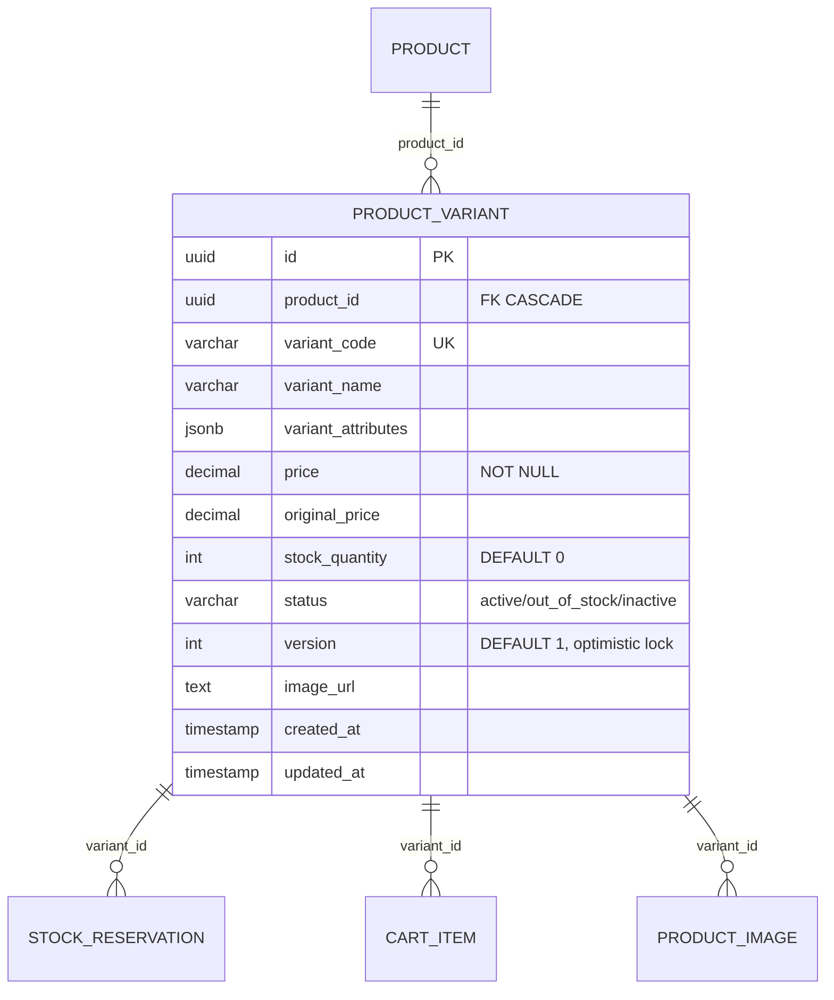

# ENTITY-PRODUCT-003: PRODUCT_VARIANT

> **Service**: product-service (Port 8084)
> **Database**: PostgreSQL
> **Table**: product_variants
> **Source**: database-entities.md Section 3, 03_database_tables.md Section 3

---

## ERD



---

## Data Dictionary

| # | Field | Type | Constraints | Meaning |
|---|--------|------|-------------|---------|
| 1 | `id` | UUID | PK | Unique variant (SKU) identifier |
| 2 | `product_id` | UUID | NOT NULL, FK → product.id ON DELETE CASCADE | Parent product. |
| 3 | `variant_code` | VARCHAR(100) | UNIQUE | Internal seller SKU code (e.g., "NK-AIR-RED-XL"); 3-50 chars, alphanumeric+dash |
| 4 | `variant_name` | VARCHAR(255) | NULLABLE | Group label for variant dimension (e.g., "Mau sac, Size") |
| 5 | `variant_attributes` | JSONB | NULLABLE | Concrete variant values (e.g., `{"color":"Den","size":"M"}`) |
| 6 | `price` | DECIMAL(18,2) | NOT NULL | Current sale price in VND; > 0, max 9,999,999,999 |
| 7 | `original_price` | DECIMAL(18,2) | NULLABLE | Original/strikethrough price for discount display |
| 8 | `stock_quantity` | INT | NOT NULL, DEFAULT 0 | Available inventory count |
| 9 | `status` | VARCHAR(50) | NOT NULL, DEFAULT 'active' | Variant lifecycle: `active`, `out_of_stock`, `inactive` |
| 10 | `version` | INT | NOT NULL, DEFAULT 1 | Optimistic lock for concurrent stock updates; enforced at application layer |
| 11 | `image_url` | TEXT | NULLABLE | Quick variant image URL (from MinIO) |
| 12 | `created_at` | TIMESTAMP | Auto-set | Row creation timestamp |
| 13 | `updated_at` | TIMESTAMP | Auto-set | Last modification timestamp |

### `status` Values

| Value | Meaning |
|-------|---------|
| `active` | On sale with stock > 0 |
| `out_of_stock` | stock_quantity = 0; visible but purchase disabled |
| `inactive` | Seller hidden; not shown to customers |

### Variant Matrix Example

```
variant_attributes: {"color":"Den","size":"M"}  -> price 150000, stock 10, active
variant_attributes: {"color":"Den","size":"L"}  -> price 150000, stock  5, active
variant_attributes: {"color":"Trang","size":"M"} -> price 160000, stock  0, out_of_stock
variant_attributes: {"color":"Trang","size":"L"} -> price 160000, stock  8, active
```

Frontend groups by `variant_attributes` keys to render the selection matrix.

---

## Indexes

| Index Name | Fields | Type | Purpose |
|------------|---------|------|---------|
| `idx_variant_product` | `(product_id)` | B-tree | List all variants of a product |
| `idx_variant_status` | `(status)` | B-tree | Filter active/inactive variants |
| `idx_variant_price` | `(price)` | B-tree | Sort/filter by price range |
| `idx_variant_attributes` | `(variant_attributes)` | GIN | Search by variant attribute values |

---

## Cross-References

| Ref ID | Type | Description |
|--------|------|-------------|
| FR-PRODUCT-009 | Functional Requirement | Add variant to product |
| FR-PRODUCT-010 | Functional Requirement | Update variant |
| FR-PRODUCT-011 | Functional Requirement | Update stock |
| UC-PRODUCT-004 | Use Case | Manage variants (seller) |
| UC-PRODUCT-006 | Use Case | Manage stock (seller) |
| UC-PRODUCT-007 | Use Case | Reserve stock (system) |
| BR-PRODUCT-004 | Business Rule | Variant code uniqueness |
| BR-PRODUCT-005 | Business Rule | Stock validation and optimistic locking |
