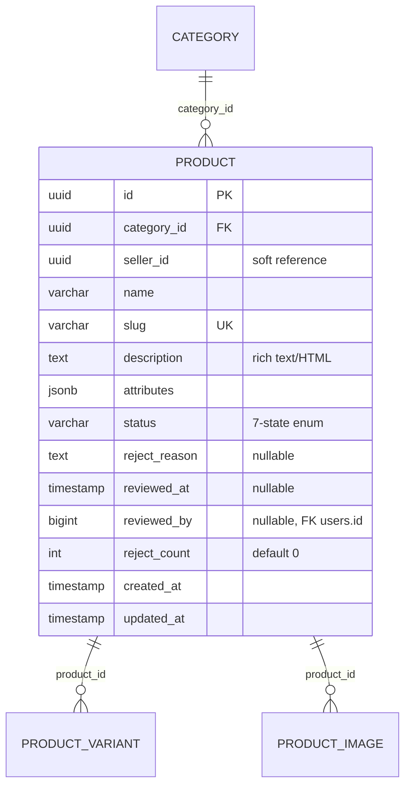

# ENTITY-PRODUCT-002: PRODUCT

> **Service**: product-service (Port 8084)
> **Database**: PostgreSQL (per `database-entities.md` §3 — catalog migrated to PostgreSQL; old MongoDB `mg_products` deprecated)
> **Table**: products
> **Source**: database-entities.md Section 3, 03_database_tables.md Section 2
> **Last Updated**: 2026-05-10 (v3 — **P3-11 APPROVED**: status enum expanded to 7 values + 4 admin review columns added)

---

## ERD



---

## Data Dictionary

| # | Field | Type | Constraints | Meaning |
|---|--------|------|-------------|---------|
| 1 | `id` | UUID | PK (gen_random_uuid()) | Unique product identifier |
| 2 | `category_id` | UUID | NOT NULL, FK → category.id | Owning category (must be a leaf node per BR-PRODUCT-002) |
| 3 | `seller_id` | UUID | NOT NULL, soft reference (no hard FK) | Seller who owns the product (from Identity Service) |
| 4 | `name` | VARCHAR(500) | NOT NULL | Product display name; 5-200 characters validated at API |
| 5 | `slug` | VARCHAR(500) | UNIQUE, NOT NULL | URL-friendly product path for SEO |
| 6 | `description` | TEXT | NULLABLE | Rich text/HTML description rendered in Product Detail "Mô tả" tab |
| 7 | `attributes` | JSONB | NULLABLE | Structured key-value attributes rendered in Product Detail "Chi tiết" tab |
| 8 | `status` | VARCHAR(50) | NOT NULL, DEFAULT 'draft', CHECK enum (7 values) | Product lifecycle state — see "Status Values" below |
| 9 | `reject_reason` | TEXT | NULLABLE | Admin's reason when last rejected (≥10 chars when set; cleared on approve) |
| 10 | `reviewed_at` | TIMESTAMP | NULLABLE | When admin last acted (approve/reject) |
| 11 | `reviewed_by` | BIGINT | NULLABLE, FK soft → users.id | Admin user_id who reviewed |
| 12 | `reject_count` | INT | NOT NULL DEFAULT 0 | Total rejections (3-strike limit per BR-PRODUCT-009.8; reset to 0 on approve) |
| 13 | `created_at` | TIMESTAMP | NOT NULL DEFAULT NOW() | Row creation timestamp |
| 14 | `updated_at` | TIMESTAMP | Auto-updated | Last modification timestamp |

### `attributes` Examples (PostgreSQL JSONB)

```json
// Fashion
{"material": "100% Cotton", "origin": "Viet Nam", "style": "Casual", "washing": "Giat may toi da 30 do C", "target": "Nam"}

// Electronics
{"ram": "8GB", "storage": "256GB", "screen_size": "6.7 inch", "battery": "5000mAh", "os": "Android 14"}
```

### `status` Values (P3-11 applied — 7-state lifecycle)

| Value | Meaning | Visible | Sellable | Editable |
|-------|---------|---------|----------|----------|
| `draft` | Seller composing; never reviewed | No | No | Yes (full edit) |
| `pending` | Awaiting admin review | No | No | No (locked) |
| `approved` | Admin approved; not yet published | No | No | Yes (re-edit forces back to draft) |
| `rejected` | Admin rejected with reason | No | No | Yes (resubmit loop, max 3 strikes) |
| `active` | On sale; ≥1 variant stock>0 | Yes | Yes | Limited (price/stock OK) |
| `out_of_stock` | All variants stock=0 (auto-derived) | Yes ("Hết hàng") | No | Yes (restock) |
| `inactive` | Seller manually hidden | No | No | Yes |

See `state-product.md` for the full 7-state diagram with all 14 transitions and `BR-PRODUCT-009` for the workflow rules.

---

## Indexes

| Index Name | Fields | Type | Purpose |
|------------|---------|------|---------|
| `idx_product_category` | `(category_id)` | B-tree | List products by category |
| `idx_product_seller` | `(seller_id)` | B-tree | Seller's product dashboard (`GET /sellers/me/products`) |
| `idx_product_status` | `(status)` | B-tree | Filter active/inactive products for listings |
| `idx_product_slug` | `(slug)` | Unique B-tree | SEO URL resolution |
| `idx_product_attributes` | `(attributes)` | GIN (JSONB) | Search/filter by attribute key-values |
| `idx_products_status_pending` | `(status, created_at)` WHERE status='pending' | Partial B-tree | Admin review queue FIFO (UC-PRODUCT-013) |

---

## Cross-References

| Ref ID | Type | Description |
|--------|------|-------------|
| FR-PRODUCT-004 | Functional Requirement | Seller create product |
| FR-PRODUCT-005 | Functional Requirement | List/search products |
| FR-PRODUCT-006 | Functional Requirement | Product detail view |
| FR-PRODUCT-007 | Functional Requirement | Seller update product |
| FR-PRODUCT-008 | Functional Requirement | Delete product |
| UC-PRODUCT-003 | Use Case | Create product (seller) |
| UC-PRODUCT-001 | Use Case | Browse catalog |
| BR-PRODUCT-003 | Business Rule | Product status transitions (active/out_of_stock/inactive subset) |
| BR-PRODUCT-002 | Business Rule | Leaf-only category assignment |
| BR-PRODUCT-009 | Business Rule | Admin product review workflow (P3-11 applied) |
| UC-PRODUCT-012 | Use Case | Submit product for review (seller) |
| UC-PRODUCT-013 | Use Case | List pending products (admin) |
| UC-PRODUCT-014 | Use Case | Approve product (admin) |
| UC-PRODUCT-015 | Use Case | Reject product (admin) |
| state-product.md | State Diagram | 7-state lifecycle (draft → pending → approved → active ↔ out_of_stock ↔ inactive) |
| P3-11 | DB Proposal | Schema expansion (APPROVED & applied): status enum 7 values + 4 admin review columns (`reject_reason`, `reviewed_at`, `reviewed_by`, `reject_count`) + partial index `idx_products_status_pending` |
