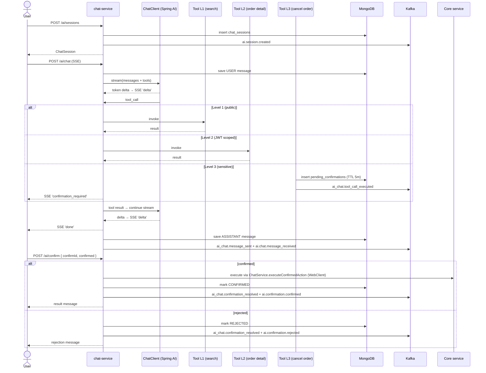
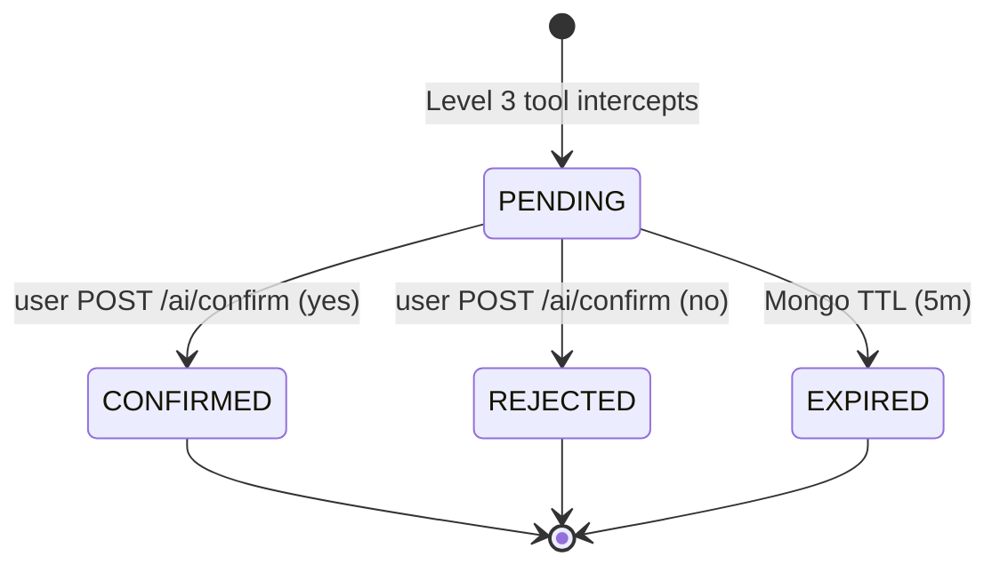

# Flow: AI Chat Streaming & Human Confirmation
**Primary service:** `chat-service`  
**Verified against code:** 2026-06-16

## 1. Mục đích
Trợ lý AI có **tool calling** (Spring AI ChatClient), trả lời streaming qua **SSE**. Với các hành động Level 3 (`cancelOrder`, …), tạo `pending_confirmation` trong MongoDB và đợi user **xác nhận / từ chối** trước khi thực thi.

## 2. Actors & Trigger
| Actor | Hành động |
|-------|----------|
| Logged-in user | Tạo session, gửi tin nhắn, xác nhận hành động sensitive |
| LLM (OpenAI / DeepSeek compatible) | Quyết định gọi tool nào |
| Core services | Bị gọi qua WebClient/Tool layer khi confirmed |

## 3. Public Endpoints (service-internal — chat uses `/ai` prefix, không phải `/v1`)
| Method | Path | Handler |
|--------|------|---------|
| POST (SSE) | `/ai/chat` | `ChatController.chat` (L36) |
| GET | `/ai/chat/history` | `ChatController.getHistory` (L65) |
| POST | `/ai/sessions` | `ChatController.createSession` (L96) |
| GET | `/ai/sessions` | `ChatController.listSessions` (L111) |
| DELETE | `/ai/sessions/{sessionId}` | `ChatController.deleteSession` (L130) |
| POST | `/ai/confirm` | `ChatController.confirm` (L158) |
| GET | `/ai/suggest` | `ChatController.suggest` (L190) |

## 4. Kafka Topics
| Direction | Topic | Notes |
|-----------|-------|-------|
| → produce | `ai.session.created` | Session insert |
| → produce | `ai_chat.message_sent` (legacy) + `ai.chat.message_received` (current) | After each assistant turn |
| → produce | `ai_chat.tool_call_executed` | After every tool invocation |
| → produce | `ai_chat.confirmation_resolved` (legacy) + `ai.confirmation.confirmed` / `ai.confirmation.rejected` | After Level-3 resolve |

## 5. Sequence Diagram

## 6. State Transitions — `pending_confirmations.status`

## 7. Implementation Map
| UC | Code reference |
|----|----------------|
| UC-AICHAT-001 Start Session | `ChatController.createSession` (L96), `ChatService.createSession` (~L260) |
| UC-AICHAT-002 Send Message | `ChatController.chat` (L36), `ChatService.streamChat` (~L77), `publishMessageSent` (~L533) |
| UC-AICHAT-003 Confirm / Reject Action | `ChatController.confirm` (L158), `ChatService.confirmAction` (~L297), `SystemActionTool.performSystemAction` (~L42) |

## 8. Notes & Caveats
- **Pending storage is MongoDB only** (TTL index 5m). Redis is **not** used for `pending:{confirmId}` despite some older docs.
- **Dual-event compatibility:** legacy `ai_chat.*` topics are kept alongside new `ai.*` aliases. Notification-service consumes both.
- **Rate limiter is Redis-backed with local fallback** (`rate:{userId}:chat`, `rate:{userId}:tool`).
- **Adding a new Level-3 tool** requires both a `@Tool` annotated method **and** explicit handling in `ChatService.executeConfirmedAction` (no auto-dispatch).
- **Confirmed action execution** calls core services through WebClient with the original JWT delegated.
