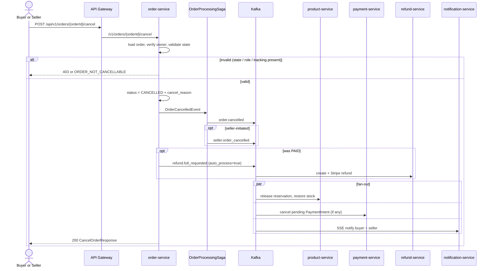

# Flow: Order Cancellation (Cross-service)
**Services involved:** `order-service` (owner), `product-service`, `payment-service`, `refund-service`, `notification-service`  
**Verified against code:** 2026-06-16

## 1. Mục đích
Hủy đơn hàng do **buyer** hoặc **seller** khởi tạo, bao gồm side-effect: **giải phóng tồn kho** (product), **hủy PaymentIntent đang pending** (payment), và **tự động hoàn tiền** nếu đơn đã PAID (refund).

## 2. Actors & Trigger
| Actor | Điều kiện |
|-------|----------|
| Buyer | Đơn `PENDING` hoặc `PAID` chưa có tracking |
| Seller | Đơn `PAID` chưa ship, kèm `reason` ≥ 10 ký tự |

## 3. Public Endpoint
| Method | Path | Handler |
|--------|------|---------|
| POST | `/v1/orders/{orderId}/cancel` | `OrderController.cancelOrder` (L120) → `OrderService.cancelOrder` (~L282) |

Header: `X-User-Role` (BUYER / SELLER), body: `CancelOrderRequest { reason }`.

## 4. Kafka Topics
| Direction | Topic | Notes |
|-----------|-------|-------|
| → produce | `order.cancelled` | Always (Axon Saga emits) |
| → produce | `seller.order_cancelled` | Only when seller-initiated (enriched payload) |
| → produce | `refund.full_requested` (auto_process=true) | Only when cancelling a `PAID` order |
| ← consume (downstream) | `order.cancelled` | by product / payment / notification |
| ← consume (downstream) | `refund.full_requested` | by refund-service |

## 5. Sequence Diagram

## 6. State Rules
| Initiator | Allowed `orders.status` | Other constraints |
|-----------|------------------------|-------------------|
| Buyer | `PENDING`, `PAID` | `PAID` must not have `tracking_number` |
| Seller | `PAID` | Not yet shipped, `reason.length() ≥ 10` |

## 7. Implementation Map
| Concern | Code reference |
|---------|----------------|
| HTTP entry | `OrderController.cancelOrder` (L120) |
| Domain rules | `OrderService.cancelOrder` (~L282), `publishAutoFullRefundRequested` (~L353) |
| Saga emit | `OrderProcessingSaga` (~L190) |
| Stock release | `product-service` Kafka consumer for `order.cancelled` |
| Payment intent cancel | `payment-service` Kafka consumer for `order.cancelled` |
| Refund auto path | `refund-service.RefundService.onRefundFullRequested` (~L355) |
| Notification fan-out | `notification-service` Order/Payment/Refund consumers |

## 8. Notes & Caveats
- **Seller cancellation enriches** event with `seller.order_cancelled` to help notification template differentiate.
- **`auto_process=true`** flag tells refund-service to skip admin review for cancellation-driven refunds.
- **Pending PaymentIntent cancellation** is a no-op if Stripe webhook had already moved it to `succeeded` — payment-service guards on current status.
- **No distributed transaction** — each side-effect is best-effort with retries; `order.cancelled` is the single source of truth.
