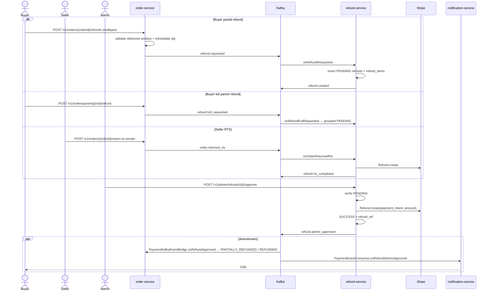

# Flow: Refund Processing (Cross-service)
**Services involved:** `order-service`, `refund-service`, `payment-service`, `notification-service`  
**Verified against code:** 2026-06-16

## 1. Mục đích
Mô tả **toàn bộ vòng đời refund** từ ba điểm khởi: **buyer request partial refund**, **buyer full refund parent order**, và **seller return-to-sender (RTS)** — đến khi Stripe refund chạy xong và downstream service đồng bộ trạng thái.

> **Kiến trúc:** entry duy nhất cho buyer là `order-service`; `refund-service` chỉ nhận sự kiện qua Kafka và expose admin review endpoints.

## 2. Actors & Trigger
| Actor | Đường vào |
|-------|----------|
| Buyer | `POST /v1/orders/{orderId}/refunds` (partial, multipart evidence) |
| Buyer | `POST /v1/orders/parent/{parentOrderId}/refund` (full) |
| Buyer | `POST /v1/orders/parent/{parentOrderId}/refunds/partial` |
| Seller | `POST /v1/orders/{orderId}/return-to-sender` |
| Admin | `POST /v1/admin/refunds/{refundId}/approve` hoặc `/reject` |

## 3. Public Endpoints
| Method | Path | Owner | Handler |
|--------|------|-------|---------|
| POST | `/v1/orders/{orderId}/refunds` | order | `RefundController.createPartialRefund` (L33) |
| POST | `/v1/orders/parent/{parentOrderId}/refund` | order | `RefundController.createFullRefund` (L43) |
| POST | `/v1/orders/parent/{parentOrderId}/refunds/partial` | order | `RefundController.createPartialOnParent` (L53) |
| POST | `/v1/orders/{orderId}/return-to-sender` | order | `OrderController.returnToSender` (L171) |
| GET | `/v1/admin/refunds` (+filters) | refund | `AdminRefundController.list` (L28) |
| POST | `/v1/admin/refunds/{refundId}/approve` | refund | `AdminRefundController.approveRefund` (L53) |
| POST | `/v1/admin/refunds/{refundId}/reject` | refund | `AdminRefundController.rejectRefund` (L65) |

## 4. Kafka Topics
| Direction (from refund-service POV) | Topic | Notes |
|------------------------------------|-------|-------|
| ← consume | `refund.requested` | Buyer partial refund |
| ← consume | `refund.full_requested` | Buyer full parent order (or order-cancel auto) |
| ← consume | `order.returned_rts` | Seller RTS |
| → produce | `refund.created` | After PENDING records inserted |
| → produce | `refund.admin_approved` | Admin approve → Stripe ok |
| → produce | `refund.rejected` | Admin reject |
| → produce | `refund.rts_completed` | RTS auto path |

## 5. Sequence Diagram

## 6. Implementation Map
| Concern | Code reference |
|---------|----------------|
| Order-side validation + emit | `OrderRefundCommandService` (kafkaTemplate.send REFUND_REQUESTED L98, REFUND_FULL_REQUESTED L166) |
| Refund-side creation | `RefundService.onRefundRequested` (~L264), `onRefundFullRequested` (~L355), `onOrderReturnedRts` (~L419) |
| Admin review | `AdminRefundController.approveRefund` (L53), `rejectRefund` (L65), service `approveRefund` (~L153), `rejectRefund` (~L223) |
| Stripe call | `RefundService.executeStripeRefund` (extracts PaymentIntent from `transactions.raw_response`) |
| Order status sync | `order-service` consumes `refund.admin_approved` + `refund.rts_completed` |

## 7. Notes & Caveats
- **`refund-service` does not expose a public create endpoint.** Old docs that mention `POST /refunds` direct on refund-service are wrong.
- **Transfer reversal logic lives in `refund-service`**, not in `payment-service` (no `payment-service` consumer for `refund.admin_approved` exists).
- **RTS bypasses admin** — `refund.rts_completed` arrives directly without `refund.admin_approved`.
- **Refund item DTO** currently lacks `productName` / image — known schema improvement.
- **`auto_process=true`** flag (cancellation-driven full refund) tells refund-service to skip admin review and call Stripe immediately.
