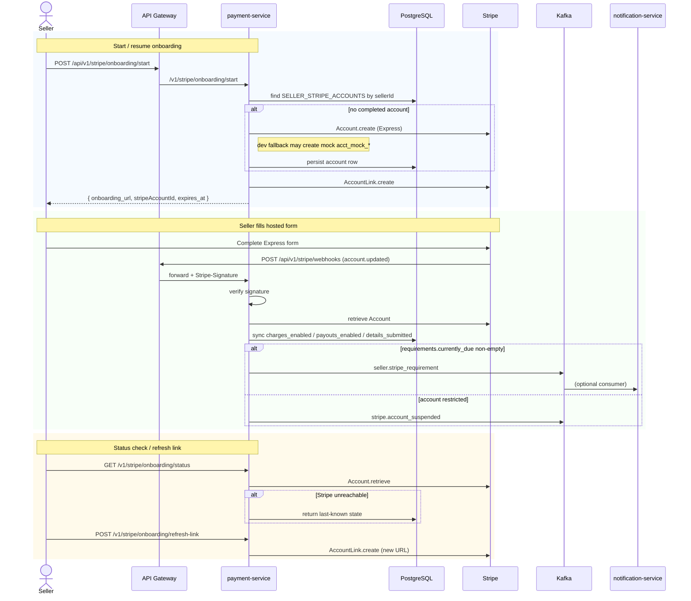
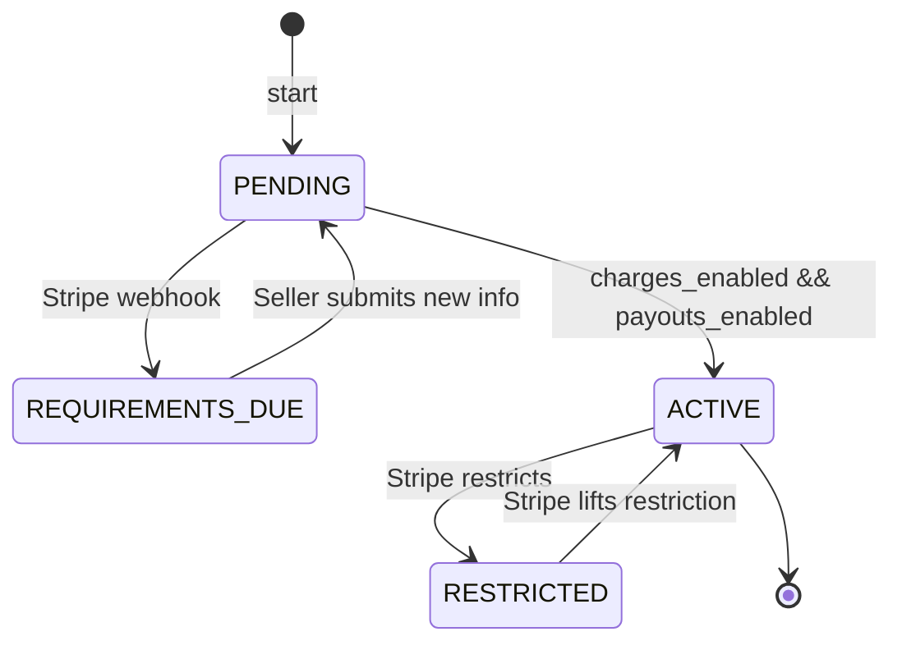

# Flow: Stripe Connect Onboarding (Cross-service)
**Services involved:** `payment-service`, Stripe (external), `notification-service` (optional)  
**Verified against code:** 2026-06-16

## 1. Mục đích
Cho phép seller hoàn tất **Stripe Connect Express onboarding** để nhận được payout. Quản lý trạng thái tài khoản (`charges_enabled`, `payouts_enabled`, `details_submitted`), URL onboarding hết hạn, và đồng bộ trạng thái khi nhận webhook `account.updated`.

## 2. Actors & Trigger
| Actor | Hành động |
|-------|----------|
| Seller (đã đăng ký role) | Bắt đầu / làm mới onboarding |
| Stripe | Gửi webhook khi seller submit form |
| Admin | Xem danh sách trạng thái onboarding theo seller |

## 3. Public Endpoints
| Method | Path | Handler |
|--------|------|---------|
| POST | `/v1/stripe/onboarding/start` | `StripeOnboardingController.startOnboarding` (L30) |
| GET | `/v1/stripe/onboarding/status` | `getStatus` (L46) |
| POST | `/v1/stripe/onboarding/refresh-link` | `refreshLink` (L60) |
| GET | `/v1/stripe/onboarding/admin/sellers` | `getAdminSellerOverview` (L74) |
| POST | `/v1/stripe/webhooks` | `PaymentController.handleStripeWebhook` (L84) |

## 4. Kafka Topics
| Direction | Topic | Notes |
|-----------|-------|-------|
| → produce | `seller.stripe_requirement` | When `requirements.currently_due` non-empty |
| → produce | `stripe.account_suspended` | When Stripe marks account restricted |
| ← consume (optional) | `seller.registered` | (notification-service path — not strict prerequisite) |

## 5. Sequence Diagram

## 6. State Transitions — `seller_stripe_accounts.account_status`

## 7. Implementation Map
| Concern | Code reference |
|---------|----------------|
| Start onboarding | `StripeOnboardingController.startOnboarding` (L30), service `startOnboarding` (~L34) |
| Status sync (live Stripe call) | `StripeOnboardingService.getOnboardingStatus` — falls back to DB if Stripe call fails |
| Refresh link | `StripeOnboardingController.refreshLink` (L60) |
| Webhook account sync | `PaymentService.handleAccountUpdated` (called from `PaymentController.handleStripeWebhook` L84) |
| URL expiry cleanup | `StripeOnboardingUrlScheduler` |

## 8. Notes & Caveats
- **Webhook route is `/v1/stripe/webhooks`** (plural). Keep gateway/public docs consistent.
- **No `seller.stripe_active` topic exists** in current code — older docs referencing identity-service consumer for that event are stale.
- **Dev fallback `acct_mock_*`** is only created when Stripe is unavailable in dev environment. Production path always hits Stripe.
- **Refresh link** must be called explicitly by frontend when current onboarding URL is past `onboarding_url_expires_at`.
- **Admin overview endpoint** (`/admin/sellers`) lists all seller accounts with status summary — used by Admin SPA.
