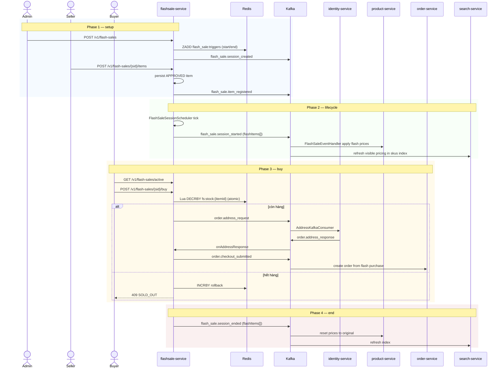
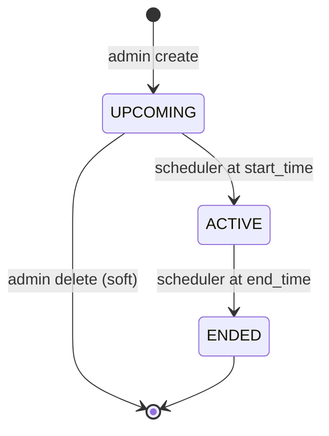

# Flow: Flash Sale Session, Registration & Purchase
**Primary service:** `flashsale-service`  
**Verified against code:** 2026-06-16

## 1. Mục đích
Quản lý **phiên flash sale** (UPCOMING / ACTIVE / ENDED), việc **seller đăng ký sản phẩm** vào phiên, và **buyer mua flash** với decrement nguyên tử trên Redis. Đồng bộ giá flash sang `product-service` và `search-service` qua Kafka.

## 2. Actors & Trigger
| Actor | Hành động |
|-------|----------|
| Admin | Tạo / cập nhật / xóa phiên |
| Seller | Đăng ký item vào phiên (auto-approve) |
| Buyer | Xem phiên active, mua flash |
| Scheduler | Kích hoạt / kết thúc phiên theo timer |

## 3. Public Endpoints (service-internal `/v1/flash-sales`)
| Method | Path | Handler |
|--------|------|---------|
| GET | `/` | `FlashSaleController.getSessions` (L24) |
| GET | `/active` | `getActiveSessions` (L31) |
| GET | `/{sessionId}` | `getSessionDetail` (L37) |
| POST | `/` | `createSession` (L44) |
| PUT / DELETE | `/{sessionId}` | `updateSession` (L52) / `deleteSession` (L61) |
| POST | `/{sessionId}/buy` | `buyFlashSale` (L69) |
| POST | `/{sessionId}/items` | `createFlashSaleItem` (L79) |
| POST | `/{sessionId}/items/{itemId}/approve` / `/reject` | `approveItem` / `rejectItem` (L89, L99) |
| POST / DELETE | `/{sessionId}/reminders` | Reminder subscribe / unsubscribe (L109, L118) |

## 4. Kafka Topics
| Direction | Topic | Notes |
|-----------|-------|-------|
| → produce | `flash_sale.session_created` | On create |
| → produce | `flash_sale.session_started` / `flash_sale.session_ended` | Scheduler tick — payload includes `flashItems[]{sku_code, flash_price, flash_stock}` |
| → produce | `flash_sale.item_registered` | Seller registers (auto-approved) |
| → produce | `flash_sale.item_approved` / `flash_sale.item_rejected` | Admin overrides (kept for legacy compat) |
| → produce | `order.address_request` | Resolve buyer address |
| ← consume | `order.address_response` | Reply from identity |
| → produce | `order.checkout_submitted` | Buy → drive into order flow |

## 5. Sequence Diagram

## 6. State Transitions — `fs_sessions.status`

## 7. Implementation Map
| UC | Code reference |
|----|----------------|
| UC-FLASHSALE-001 Admin Create Session | `FlashSaleController.createSession` (L44), `FlashSaleService.createSession` (~L166) |
| UC-FLASHSALE-002 Seller Register Product | `createFlashSaleItem` (L79), service (~L127); auto-approved |
| UC-FLASHSALE-003 View Sessions | `getSessions` / `getActiveSessions` / `getSessionDetail` |
| UC-FLASHSALE-004 Buyer Buy | `buyFlashSale` (L69) + Lua decrement script |
| UC-FLASHSALE-006 System End Session | `FlashSaleSessionScheduler` (~L39); payload includes `flashItems[]` at ~L92 |

## 8. Notes & Caveats
- **Stock model:** flash stock kept in Redis (`fs:stock:{itemId}`) — DB row is the canonical reference but live decrement is Redis.
- **Auto-approve:** seller items become `APPROVED` immediately; admin approve/reject endpoints stay for legacy/manual cases.
- **Price sync payload** keeps backward-compatible `flashPriceMap` field for older product-service consumers.
- **Reminder endpoints** exist in code but are not in the active UC catalog.
- **Reactive stack:** `flashsale-service` uses WebFlux + R2DBC; do not mix with blocking JPA helpers.
