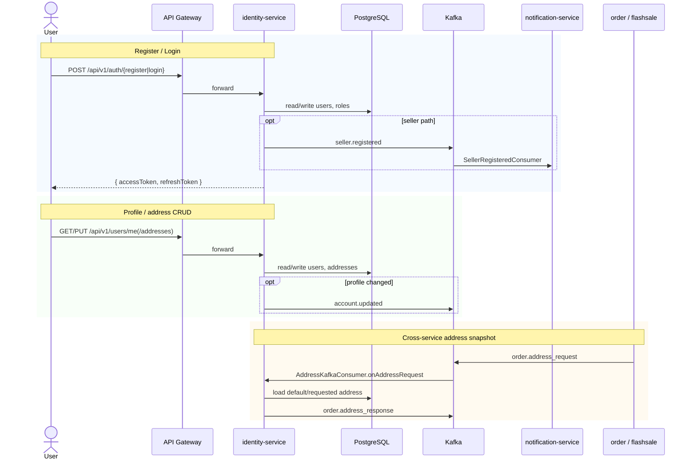

# Flow: Identity Access, Profile & Address
**Primary service:** `identity-service`  
**Verified against code:** 2026-06-16

## 1. Mục đích
Quản lý vòng đời tài khoản (đăng ký buyer/seller, đăng nhập, refresh, logout), hồ sơ cá nhân và sổ địa chỉ. Đồng thời phục vụ snapshot địa chỉ cho `order-service` / `flashsale-service` khi checkout.

## 2. Actors & Trigger
| Actor | Khi nào | Hành động |
|-------|--------|----------|
| Guest | Lần đầu vào hệ thống | Register / Login |
| User (BUYER/SELLER) | Có access token | Update profile, manage addresses |
| Order / Flashsale service | Tạo đơn cần địa chỉ | Kafka request `order.address_request` |

## 3. Public Endpoints (service-internal `/v1`)
| Method | Path | Handler |
|--------|------|---------|
| POST | `/auth/register` | `AuthController.register` |
| POST | `/auth/login` | `AuthController.login` |
| POST | `/auth/refresh` | `AuthController.refresh` |
| POST | `/auth/logout` | `AuthController.logout` |
| POST | `/auth/seller/register` | `AuthController.registerSeller` |
| GET / PUT | `/users/me` | `UserController.getCurrentUser` / `updateCurrentUser` |
| POST | `/users/me/seller` | `UserController.registerAsSeller` |
| GET / POST | `/users/me/addresses` | `UserController.getAddresses` / `addAddress` |
| PUT / DELETE | `/users/me/addresses/{id}` | `UserController.updateAddress` / `deleteAddress` |
| GET | `/users/me/avatar-presigned` | Avatar upload URL |

## 4. Kafka Topics
| Direction | Topic | Producer / Consumer |
|-----------|-------|---------------------|
| → produce | `seller.registered` | After role upgrade or seller registration |
| → produce | `account.updated` | After `PUT /users/me` |
| → produce | `order.address_response` | `AddressKafkaConsumer` reply |
| ← consume | `order.address_request` | `AddressKafkaConsumer.onAddressRequest` |

## 5. Sequence Diagram

## 6. Implementation Map
| UC | Code reference |
|----|----------------|
| UC-IDENTITY-001 Customer Registration | `AuthController.register` (~L67), `AuthService.registerUser` (~L42) |
| UC-IDENTITY-002 Login | `AuthController.login` (~L45), `AuthService.authenticateUser` (~L114) |
| UC-IDENTITY-003 Manage Profile | `UserController.getCurrentUser` / `updateCurrentUser` (~L29, L35), `UserService.updateUserProfile` (~L82) |
| UC-IDENTITY-004 Manage Addresses | `UserController.getAddresses`/`addAddress`/`updateAddress`/`deleteAddress` (~L60–L83) |
| UC-IDENTITY-006 Seller Registration | `AuthController.registerSeller` (~L135), `UserController.registerAsSeller` (~L100), `UserService.registerAsSeller` (~L154) |
| — Cross-service | `AddressKafkaConsumer.onAddressRequest` |

## 7. Notes & Caveats
- `account.updated` is published only on `PUT /users/me`, not on address mutations.
- Admin lock/unlock endpoints exist in code but are outside the active use-case set.
- Refresh tokens live in Redis with TTL; logout blacklists the access token in Redis.
- `seller.registered` is emitted from both registration paths (auth and user role-upgrade).
