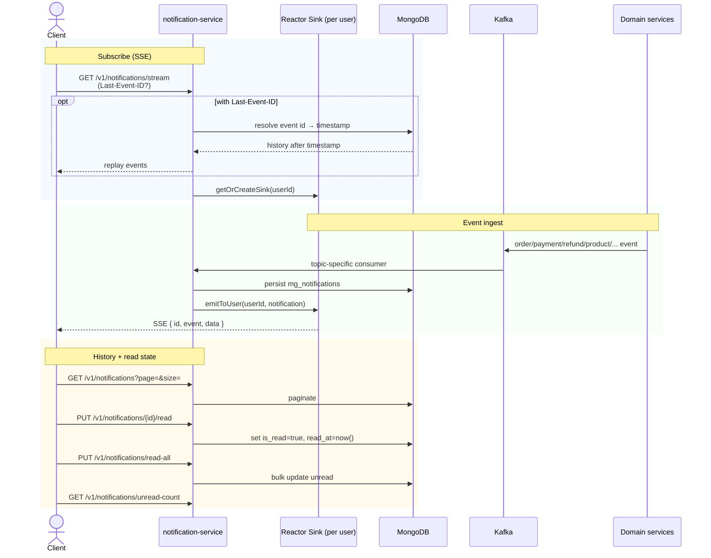

# Flow: Notification Stream & Read State
**Primary service:** `notification-service`  
**Verified against code:** 2026-06-16

## 1. Mục đích
Tổng hợp các event nghiệp vụ từ nhiều service qua Kafka, **persist** vào MongoDB, và **đẩy real-time** đến client qua **SSE** (Reactor sinks). Hỗ trợ replay khi mất kết nối (`Last-Event-ID`) và quản lý trạng thái đã đọc.

## 2. Actors & Trigger
| Actor | Hành động |
|-------|----------|
| Domain services | Publish event (order / payment / refund / product / chat / transfer / flash-sale / identity / Stripe) |
| Logged-in user (Web/Mobile) | Subscribe SSE, list history, mark read |

## 3. Public Endpoints (service-internal `/v1/notifications`)
| Method | Path | Handler |
|--------|------|---------|
| GET (SSE) | `/stream` | `NotificationController.stream` (~L32) |
| GET | `/` (page, size) | `getNotifications` (~L46) |
| GET | `/unread-count` | `getUnreadCount` |
| PUT / PATCH | `/{notifId}/read` | `markAsRead` (~L63) |
| PUT / PATCH | `/read-all` | `markAllAsRead` (~L72) |

## 4. Kafka Topics (consumer side)
| Topic family | Consumer class |
|-------------|---------------|
| `order.*` | `OrderEventConsumer` |
| `payment.*` / `refund.*` | `PaymentEventConsumer` |
| `seller.transfer_*` / `payout.*` / `transfer.*` | `TransferEventConsumer` |
| `product.*` / `category.*` | `ProductEventConsumer` |
| `flash_sale.*` | `FlashSaleEventConsumer` |
| `seller.registered` / `account.updated` / `stripe.account_suspended` | `IdentityEventConsumer` |
| `ai_chat.*` / `ai.*` | `ChatEventConsumer` |

## 5. Sequence Diagram

## 6. Implementation Map
| UC | Code reference |
|----|----------------|
| UC-NOTIF-001 Stream | `NotificationController.stream` (~L32), `NotificationService.getNotificationStream` (~L87) |
| UC-NOTIF-002 History | `NotificationController.getNotifications` (~L46), service `getNotifications` (~L95) |
| UC-NOTIF-003 Mark Read | `markAsRead` (~L63), `markAllAsRead` (~L72) — supports both `PUT` and compat `PATCH` |

## 7. Notes & Caveats
- **In-memory Reactor sinks** per user (not Redis pub/sub) → cross-node fan-out is **not** wired today. Single replica is the supported deployment.
- **Replay** is driven by Mongo persistence + `Last-Event-ID` resolution, not by an offset on the sink.
- **Consumer modularity:** each Kafka topic family lives in its own consumer class under `service.consumer` — easy to extend.
- **TTL retention** on `mg_notifications` is managed at the Mongo collection level (not in this flow doc).
