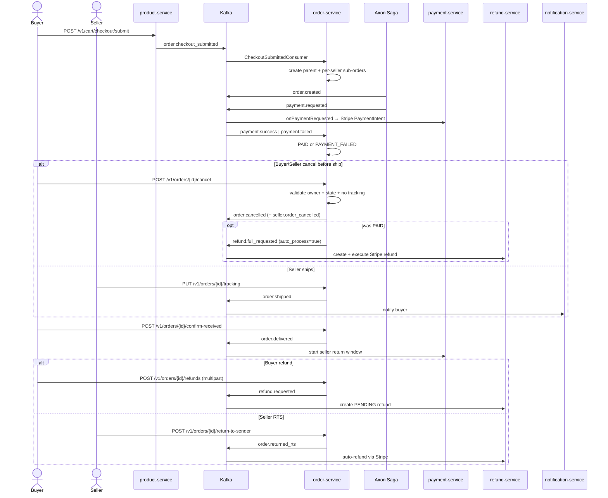
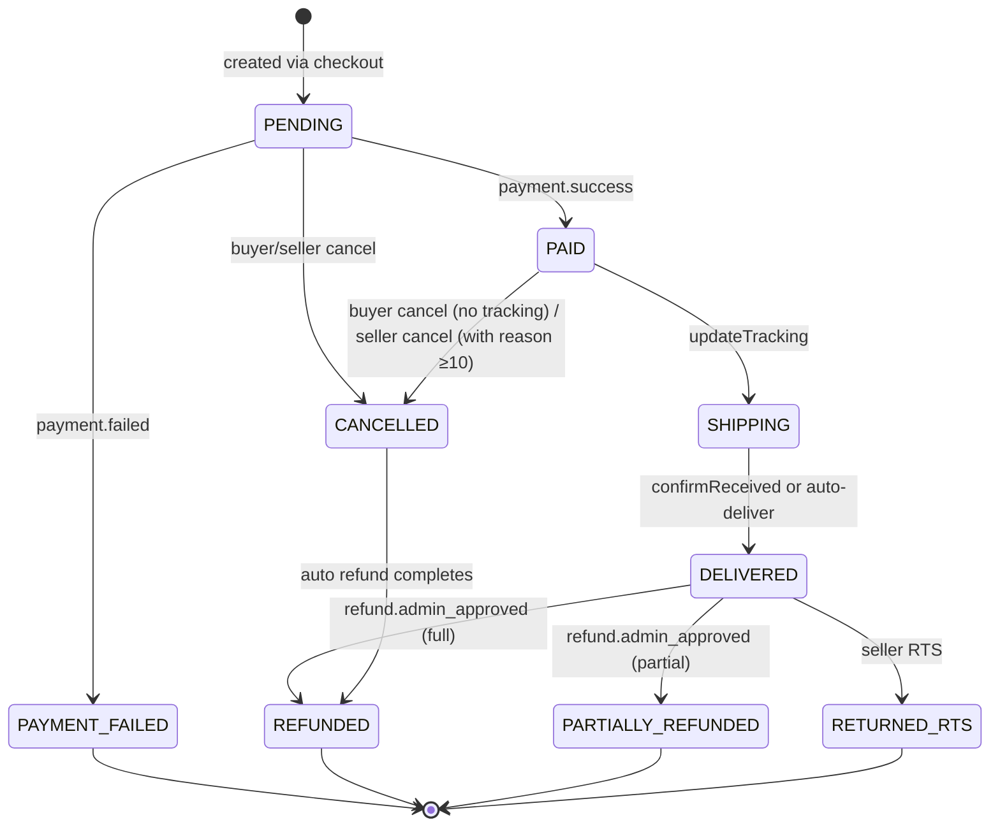

# Flow: Order Lifecycle & Returns
**Primary service:** `order-service`  
**Verified against code:** 2026-06-16

## 1. Mục đích
Sở hữu vòng đời `parent_order` / `orders` từ khi checkout đến khi giao xong, hoàn tiền, hoặc bị hủy. Dùng **Axon CQRS/Event Sourcing + Saga** để điều phối Product (reserve stock) ↔ Payment (Stripe) ↔ Refund.

## 2. Actors & Trigger
| Actor | Hành động |
|-------|----------|
| Buyer | Submit checkout, cancel, confirm-received, request refund |
| Seller | Update tracking (ship), cancel before shipping, return-to-sender |
| Scheduler | Auto-cancel PENDING timeout, auto-deliver SHIPPING timeout |

## 3. Public Endpoints (service-internal `/v1`, all under `@RequestMapping("/v1")`)
| Method | Path | Handler |
|--------|------|---------|
| POST | `/orders/checkout` | `OrderController` (rarely used; primary entry is via Kafka `order.checkout_submitted`) |
| GET | `/orders` | `OrderController.getBuyerOrders` (L61) |
| GET | `/orders/{orderId}` | `OrderController.getOrderDetail` (L87) |
| GET | `/orders/parent/{parentOrderId}` | `OrderController.getParentOrderDetail` (L103) |
| POST | `/orders/{orderId}/cancel` | `OrderController.cancelOrder` (L120) |
| PUT | `/orders/{orderId}/tracking` | `OrderController.updateTracking` (L137) |
| POST | `/orders/{orderId}/confirm-received` | `OrderController.confirmReceived` (L154) |
| POST | `/orders/{orderId}/return-to-sender` (multipart) | `OrderController.returnToSender` (L171) |
| GET | `/sellers/me/orders` | `OrderController.getSellerOrders` (L195) |
| GET | `/sellers/me/dashboard` | `OrderController.getSellerDashboard` (L221) |
| POST | `/orders/{orderId}/refunds` | `RefundController.createPartialRefund` (L33) |
| POST | `/orders/parent/{parentOrderId}/refund` | `RefundController.createFullRefund` (L43) |
| POST | `/orders/parent/{parentOrderId}/refunds/partial` | `RefundController.createPartialOnParent` (L53) |
| GET | `/orders/{orderId}/refunds` / `/{refundId}` | List / detail refund |
| GET | `/orders/{orderId}/refunds/presigned-url` | Evidence upload |

## 4. Kafka Topics
| Direction | Topic | Notes |
|-----------|-------|-------|
| ← consume | `order.checkout_submitted` | Entry point — creates parent + sub-orders |
| → produce | `order.created` | Axon saga emit |
| → produce | `payment.requested` | Saga emits to payment-service |
| ← consume | `payment.success` / `payment.failed` | Move orders to PAID or back |
| → produce | `order.shipped` / `order.delivered` / `order.auto_cancelled` | Saga |
| → produce | `order.cancelled` / `seller.order_cancelled` | Cancel path |
| → produce | `refund.requested` / `refund.full_requested` | Buyer / system refund |
| → produce | `order.returned_rts` | Seller RTS |
| ← consume | `refund.admin_approved` / `refund.rts_completed` | Update order status |
| ↔ reply | `order.address_request/response` | Inflate shipping address |

## 5. Sequence Diagram

## 6. State Transitions — `orders.status`

## 7. Implementation Map
| UC | Code reference |
|----|----------------|
| UC-ORDER-001 Checkout | `CheckoutSubmittedConsumer.onCheckoutSubmitted` (~L34), `OrderService.createOrderFromEvent` (~L65) |
| UC-ORDER-002 View Orders | `OrderController.getBuyerOrders` / `getOrderDetail` / `getParentOrderDetail` |
| UC-ORDER-003 Cancel (Buyer) | `OrderController.cancelOrder` (L120), `OrderService.cancelOrder` (~L282) |
| UC-ORDER-004 Ship | `OrderController.updateTracking` (L137), `OrderService.updateTracking` (~L405) |
| UC-ORDER-005 Confirm Delivery | `OrderController.confirmReceived` (L154), `OrderService.confirmReceived` (~L446), `OrderLifecycleScheduler` (~L55) |
| UC-ORDER-006 Return / RTS | `OrderController.returnToSender` (L171); buyer refund via `RefundController.createPartialRefund` (L33) |
| UC-ORDER-007 Seller Orders | `OrderController.getSellerOrders` / `getSellerDashboard` |
| UC-ORDER-008 Seller Cancel | Same `cancelOrder`; saga path: `OrderProcessingSaga` (~L190), `OrderService.publishAutoFullRefundRequested` (~L353) |

## 8. Notes & Caveats
- **Axon is scoped to `order-service` only.** Other services use Kafka + local persistence.
- **Auto lifecycle:** `OrderLifecycleScheduler` handles payment timeout cancel + auto-deliver safety net.
- **Paid cancellation** publishes `refund.full_requested` with `auto_process=true` so refund-service skips admin review.
- **Address inflation:** order-service uses Kafka request-reply with identity-service (`order.address_request/response`).
- **RTS** bypasses admin approval — `refund.rts_completed` arrives after Stripe call.
