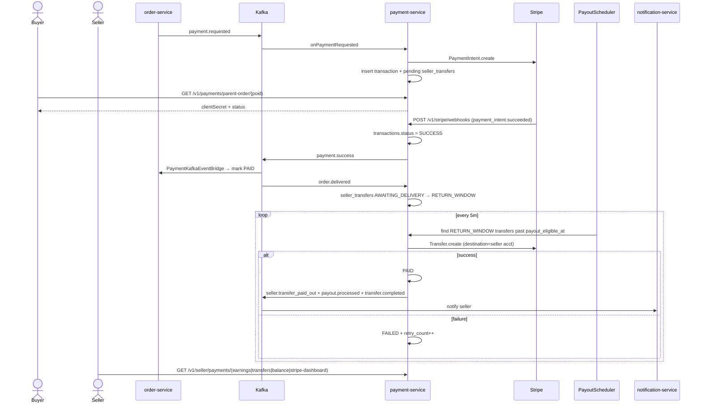
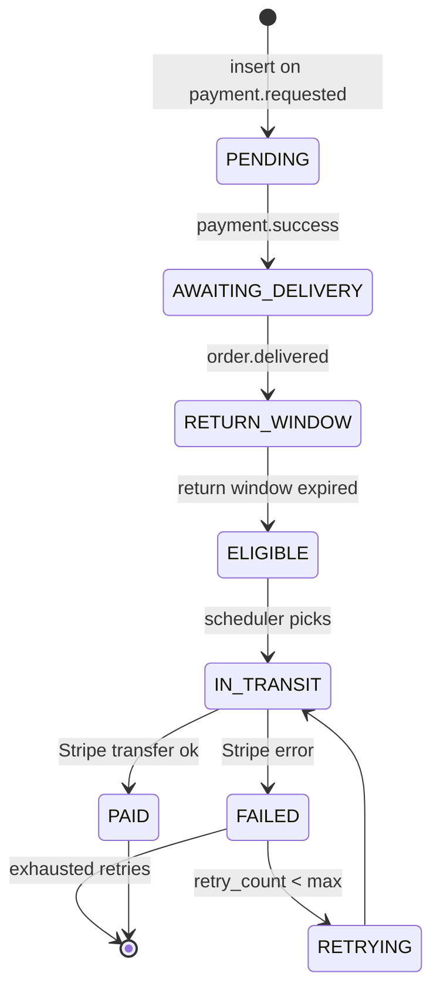

# Flow: Payment, Stripe Webhooks & Seller Payout
**Primary service:** `payment-service`  
**Verified against code:** 2026-06-16

## 1. Mục đích
Tạo `PaymentIntent` Stripe khi nhận `payment.requested`, xử lý webhook, và **giải ngân chậm** (delayed payout) cho seller sau khi đơn được giao và qua **return window** (cửa sổ hoàn trả).

## 2. Actors & Trigger
| Actor | Hành động |
|-------|----------|
| Order-service (Saga) | Publish `payment.requested` sau khi tạo order |
| Buyer | Lấy `clientSecret` để confirm Stripe Elements |
| Stripe | Gửi webhook `payment_intent.succeeded`, `charge.refunded`, `account.updated` |
| PayoutScheduler | Tìm seller-transfer đủ điều kiện và chuyển khoản |
| Seller | Xem earnings / transfers / balance / Stripe dashboard |

## 3. Public Endpoints
| Method | Path | Handler |
|--------|------|---------|
| GET | `/v1/payments/parent-order/{parentOrderId}` | `PaymentController.getTransactionByParentOrder` (L32) |
| GET | `/v1/payments/client-secret/{parentOrderId}` | `PaymentController.getClientSecret` (L49) |
| POST | `/v1/stripe/webhooks` | `PaymentController.handleStripeWebhook` (L84) |
| POST | `/v1/stripe/onboarding/start` | `StripeOnboardingController.startOnboarding` (L30) |
| GET | `/v1/stripe/onboarding/status` | `getStatus` (L46) |
| POST | `/v1/stripe/onboarding/refresh-link` | `refreshLink` (L60) |
| GET | `/v1/stripe/onboarding/admin/sellers` | Admin overview (L74) |
| GET | `/v1/seller/payments/earnings` | `SellerPaymentsController.getEarnings` (L32) |
| GET | `/v1/seller/payments/transfers` | `getSellerTransfers` (L42) |
| GET | `/v1/seller/payments/balance` | `getSellerBalance` (L59) |
| GET | `/v1/seller/payments/stripe-dashboard` | `getStripeDashboard` (L73) |

## 4. Kafka Topics
| Direction | Topic | Notes |
|-----------|-------|-------|
| ← consume | `payment.requested` | Create PaymentIntent + pending seller transfers |
| → produce | `payment.success` / `payment.failed` | After Stripe webhook |
| ← consume | `order.delivered` | Move seller transfers AWAITING_DELIVERY → RETURN_WINDOW |
| ← consume | `order.cancelled` | Cancel pending PaymentIntent |
| → produce | `seller.transfer_paid_out`, `payout.processed`, `transfer.completed` | After payout |
| → produce | `seller.stripe_requirement` | When Stripe webhook reports `requirements.currently_due` |
| → produce | `stripe.account_suspended` | Account update with restricted state |

## 5. Sequence Diagram

## 6. State Transitions — `seller_transfers.status`

## 7. Implementation Map
| UC | Code reference |
|----|----------------|
| UC-PAYMENT-001 Onboard Stripe | `StripeOnboardingController.startOnboarding` (L30), service `startOnboarding` (~L34) |
| UC-PAYMENT-002 Process Payment | `PaymentService.onPaymentRequested` (~L562), lookup `/v1/payments/parent-order/{poid}` (L32) |
| UC-PAYMENT-003 Handle Webhook | `PaymentController.handleStripeWebhook` (L84), `PaymentService.handleWebhook` (~L124) |
| UC-PAYMENT-007 Transfer to Seller | `PaymentService.onOrderDelivered` (~L682), `PayoutScheduler.processEligiblePayouts` (~L61), `publishPayoutEvent` (~L160) |
| UC-PAYMENT-008 View Transfers | `SellerPaymentsController.getSellerTransfers` (L42), `getSellerBalance` (L59) |

## 8. Notes & Caveats
- **Webhook route is `/v1/stripe/webhooks`** (plural). Gateway maps `/api/v1/stripe/webhooks` to it.
- **3 transfer events** published on success (`seller.transfer_paid_out`, `payout.processed`, `transfer.completed`) for backward compat with consumers from different doc generations.
- **Balance calculation** counts pending/awaiting-delivery/return-window/eligible as pending; only `PAID` counts as available.
- **Dev fallback:** when Stripe is unreachable in dev, `StripeOnboardingService` may create a mock `acct_mock_*` account.
