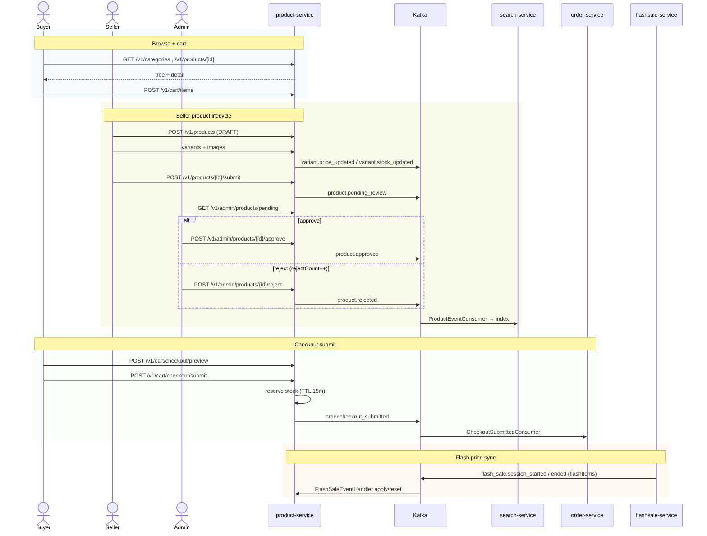
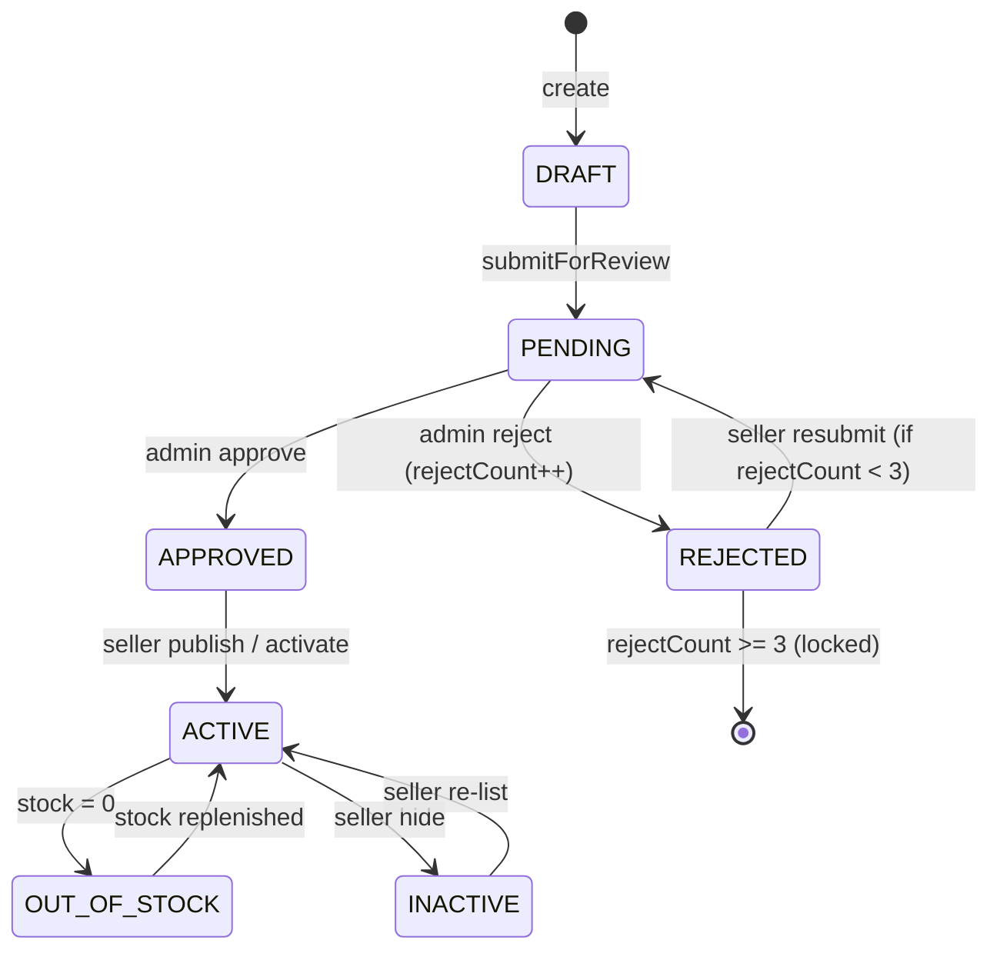

# Flow: Product Catalog, Cart, Checkout & Admin Review
**Primary service:** `product-service`  
**Verified against code:** 2026-06-16

## 1. Mục đích
Cung cấp dữ liệu **catalog đọc** (category, product detail), **catalog ghi** (CRUD sản phẩm/biến thể/ảnh), **giỏ hàng** và **checkout submit** (đặt trước tồn kho, phát `order.checkout_submitted`). Đồng thời điều phối **luồng admin duyệt sản phẩm** với cơ chế 3-strike.

## 2. Actors & Trigger
| Actor | Hành động |
|-------|----------|
| Buyer | Browse category & product, manage cart, submit checkout |
| Seller | Create/update product, variants, images, submit for review |
| Admin | List pending, approve / reject products |

## 3. Public Endpoints (service-internal `/v1`)
| Method | Path | Handler |
|--------|------|---------|
| GET | `/categories` (+ tree) | `CategoryController.getCategoryTree` |
| GET | `/products/{id}` | `ProductController.getProduct` |
| POST / PUT / DELETE | `/products` (+ `{id}`) | `ProductController` create/update/soft-delete |
| POST | `/products/{id}/submit` | `ProductController.submitForReview` |
| POST / PATCH / DELETE | `/products/{id}/variants` (+ id) | `ProductController` variant CRUD |
| POST | `/products/{id}/images/presigned-url` | `ProductController` |
| POST / PUT | `/products/{id}/images` (+ id) | `ProductController` |
| GET / POST / PUT / DELETE | `/cart` (+ `/items`, `/items/{id}`) | `CartController` |
| POST | `/cart/checkout/preview` | `CartController.preview` |
| POST | `/cart/checkout/submit` | `CartController.submit` → `CheckoutSubmitService.submit` |
| POST | `/cart/{cartId}/reserve` | `CartController.reserveStock` |
| GET / POST | `/admin/products/pending` / `{id}/approve` / `{id}/reject` | `AdminProductController` |
| GET / POST | `/admin/categories` etc. | `AdminCategoryController` |

## 4. Kafka Topics
| Direction | Topic | Producer / Consumer |
|-----------|-------|---------------------|
| → produce | `product.pending_review` | Seller submits |
| → produce | `product.approved` / `product.rejected` | Admin decision |
| → produce | `variant.price_updated` / `variant.stock_updated` | Variant mutation |
| → produce | `category.created` / `category.updated` | Category mutation |
| → produce | `cart.item_added` (analytics) | Add to cart |
| → produce | `order.checkout_submitted` | Checkout submit |
| ← consume | `order.cancelled` | Release reservation, restore stock |
| ← consume | `order.paid` | Convert reservation → consumed |
| ← consume | `flash_sale.session_started/ended` | `FlashSaleEventHandler` apply/reset flash price |
| ↔ reply | `search.index_data.request/response` | Provide product snapshot for search reindex |

## 5. Sequence Diagram

## 6. State Transitions — `product.status`

## 7. Implementation Map
| UC | Code reference |
|----|----------------|
| UC-PRODUCT-001 Browse | `CategoryController.getCategoryTree`, `ProductController.getProduct`; listing via `search-service` |
| UC-PRODUCT-002 Manage Categories | `AdminCategoryController` + `CategoryService.create/update/delete` |
| UC-PRODUCT-003 Create Product | `ProductController.createProduct` (~L45), `ProductService.createProduct` (~L56) |
| UC-PRODUCT-004 Manage Variants | `VariantService.create/update/delete` |
| UC-PRODUCT-005 Upload Images | `ImageService` + `ProductController` presigned URL |
| UC-PRODUCT-006 Manage Stock | `InventoryService.adjust/get` (log endpoint is placeholder) |
| UC-PRODUCT-007 Reserve Stock | `InventoryService.reserveStock` (~L136), `CheckoutSubmitService.submit` (~L43) |
| UC-PRODUCT-008..011 Cart | `CartController` + `CartService` |
| UC-PRODUCT-012 Submit for Review | `ProductService.submitForReview` (~L175); enforces 3-strike lockout |
| UC-PRODUCT-013..015 Admin Review | `AdminProductController` + `ProductService.approve/reject` |

## 8. Notes & Caveats
- **Inventory log** endpoint currently returns an empty placeholder; mutations themselves are real.
- **3-strike resubmit** is enforced in `submitForReview` (not as a seller-account lock).
- **Listing** is delegated to `search-service`; product-service only owns detail + category read.
- **Reject response** returns the updated `ProductResponse` body, not 204.
