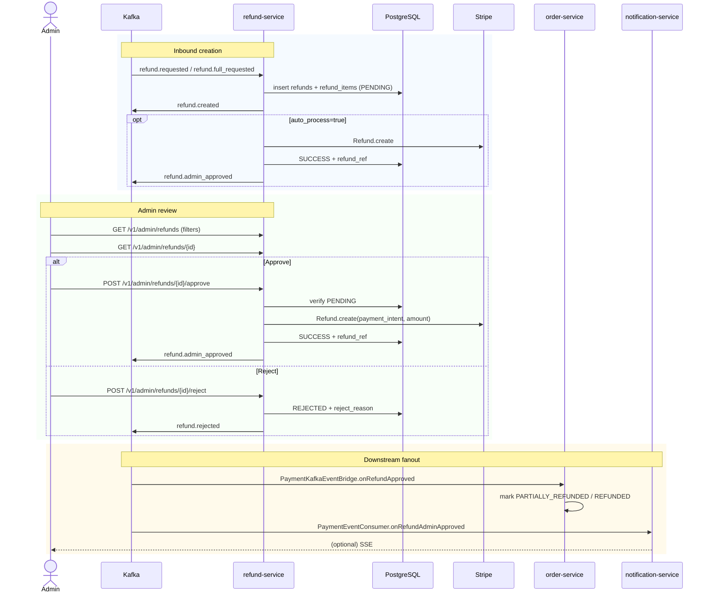
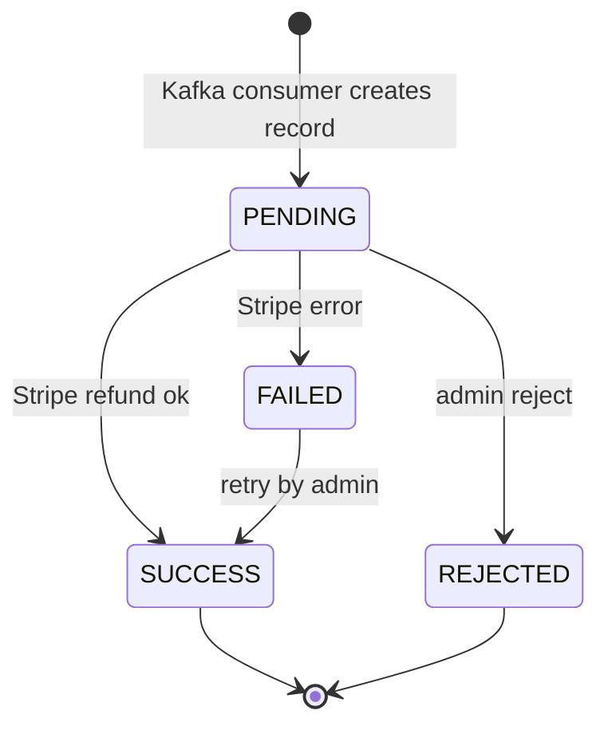

# Flow: Refund Admin Review
**Primary service:** `refund-service`  
**Verified against code:** 2026-06-16

## 1. Mục đích
Lưu trữ và xử lý các yêu cầu hoàn tiền: tạo refund từ event Kafka (do `order-service` phát), cho admin **duyệt / từ chối**, gọi **Stripe Refund API**, và phát event downstream cho `order-service` / `notification-service`.

> **Lưu ý kiến trúc:** `refund-service` **không** expose public `POST /refunds`. Mọi entry là qua Kafka, để giữ một nguồn quy tắc duy nhất ở `order-service`.

## 2. Actors & Trigger
| Actor | Hành động |
|-------|----------|
| Order-service | Publish `refund.requested` / `refund.full_requested` / `order.returned_rts` |
| Admin | List / detail / approve / reject refund |

## 3. Public Endpoints (Admin only — service-internal `/v1/admin/refunds`)
| Method | Path | Handler |
|--------|------|---------|
| GET | `/` (+ filters) | `AdminRefundController.list` (L28) |
| GET | `/{refundId}` | `AdminRefundController.detail` (L43) |
| POST | `/{refundId}/approve` | `AdminRefundController.approveRefund` (L53) |
| POST | `/{refundId}/reject` | `AdminRefundController.rejectRefund` (L65) |

## 4. Kafka Topics
| Direction | Topic | Notes |
|-----------|-------|-------|
| ← consume | `refund.requested` | Buyer-initiated partial refund |
| ← consume | `refund.full_requested` | Order-cancel auto refund (with `auto_process=true`) |
| ← consume | `order.returned_rts` | Seller RTS — bypass admin |
| → produce | `refund.created` | After PENDING records inserted |
| → produce | `refund.admin_approved` | After successful Stripe refund |
| → produce | `refund.rejected` | Admin reject |
| → produce | `refund.rts_completed` | RTS auto path |

## 5. Sequence Diagram

## 6. State Transitions — `refunds.status`

## 7. Implementation Map
| UC | Code reference |
|----|----------------|
| UC-REFUND-001 Create Refund | `RefundService.onRefundRequested` (~L264), `onRefundFullRequested` (~L355), `onOrderReturnedRts` (~L419) — no public REST entry |
| UC-REFUND-002 Approve | `AdminRefundController.approveRefund` (L53), `RefundService.approveRefund` (~L153) |
| UC-REFUND-003 Reject | `AdminRefundController.rejectRefund` (L65), `RefundService.rejectRefund` (~L223) |

## 8. Notes & Caveats
- **`refund-service` owns transfer-reversal logic** (against `seller_transfers`); `payment-service` does **not** consume `refund.admin_approved` in current code. Any doc that says otherwise is stale.
- **Stripe PaymentIntent ID** is extracted from `transactions.raw_response` JSONB rather than stored as a column.
- **Refund items currently lack `productName` / image** — fix tracked separately (DB + DTO change in refund-service).
- **RTS path** writes the same tables but skips admin approval; the inbound event signals success once Stripe call returns.
