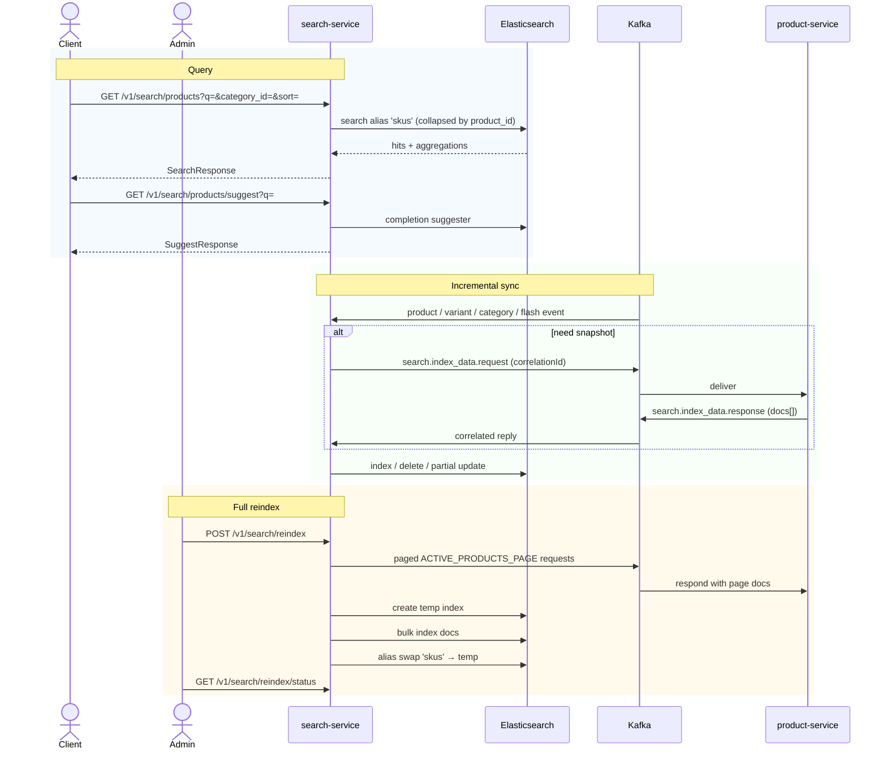

# Flow: Search Query, Suggest & Reindex
**Primary service:** `search-service`  
**Verified against code:** 2026-06-16

## 1. Mục đích
Cung cấp **tìm kiếm full-text tiếng Việt** trên Elasticsearch index `skus`, với filter (giá, danh mục, flash, sao, tồn) và **gợi ý từ khóa**. Dùng Kafka request-reply để **đồng bộ snapshot sản phẩm** từ `product-service` mà không cần REST coupling. Hỗ trợ **reindex toàn bộ** với swap alias.

## 2. Actors & Trigger
| Actor | Hành động |
|-------|----------|
| Buyer / Customer SPA | GET search / suggest |
| Admin | Trigger reindex, check status |
| Product / Variant / Category event producers | Trigger incremental index |
| Flash-sale lifecycle events | Refresh visible pricing |

## 3. Public Endpoints (service-internal `/v1/search`)
| Method | Path | Handler |
|--------|------|---------|
| GET | `/products` | `SearchController.searchProducts` (~L24) |
| GET | `/products/suggest` | `SearchController.suggestProducts` (~L42) |
| POST | `/reindex` | `SearchController.triggerReindex` (~L52) |
| GET | `/reindex/status` | `SearchController.reindexStatus` (~L72) |

## 4. Kafka Topics
| Direction | Topic | Notes |
|-----------|-------|-------|
| ← consume | `product.created` / `product.updated` / `product.approved` / `product.rejected` | Indexing trigger |
| ← consume | `variant.price_updated` / `variant.stock_updated` | Partial update |
| ← consume | `category.updated` | Refresh category_path |
| ← consume | `flash_sale.session_started` / `flash_sale.session_ended` | Refresh `has_discount`, `discount_pct` |
| ↔ request-reply | `search.index_data.request/response` | Pull product snapshot from product-service (correlation, 30s timeout) |

## 5. Sequence Diagram

## 6. Implementation Map
| UC | Code reference |
|----|----------------|
| UC-SEARCH-001 Search Products | `SearchController.searchProducts` (~L24), `SearchQueryService.search` (~L16), `ElasticsearchService.search` (~L149) |
| UC-SEARCH-001b Suggestions | `SearchController.suggestProducts` (~L42), `SearchQueryService.suggest` (~L45) |
| UC-SEARCH-003 Reindex | `SearchController.triggerReindex` (~L52), `ReindexService.triggerReindex` (~L40), `executeReindexAsync` (~L64) |

## 7. Notes & Caveats
- **SKU-first index** with field collapsing by `product_id`. Listing displays SKU đại diện qua `inner_hits`.
- **Vietnamese analysis:** `asciifolding (preserve_original)` + `fuzziness: AUTO` + synonym file.
- **Fixture filtering:** `search-service` excludes products with category slug prefixes `fe-` / `e2e-` via config (`search.hidden-category-prefixes`).
- **Reindex state is in-memory** in `ReindexService` → resets on service restart.
- **Request-reply timeout** is 30s; a stalled product-service responder fails enrichment without REST coupling.
- **Internal path is `/v1/search/...`**; gateway prefixes `/api`.
