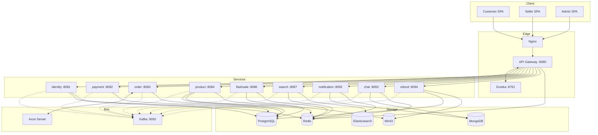

# System Architecture
**Service:** platform (stealing-from-paradise)  
**Verified against code:** 2026-06-16

## Service Registry

| ID | Service | Port | DB | Pattern | Trách nhiệm |
|----|---------|------|----|---------|-------------|
| SVC-001 | api-gateway | 8080 | Redis | Spring Cloud Gateway (WebFlux) | Routing, JWT HS256 validate, rate-limit |
| SVC-002 | discovery-service | 8761 | — | Netflix Eureka | Service registry & health |
| SVC-003 | identity-service | 8081 | PostgreSQL + Redis | JPA | Auth, JWT, users, addresses |
| SVC-004 | payment-service | 8082 | PostgreSQL + Kafka | JPA | Stripe Connect, multi-vendor split, payouts |
| SVC-005 | order-service | 8083 | PostgreSQL + Axon | **CQRS / Event Sourcing + Saga** | Checkout, order lifecycle, RTS |
| SVC-006 | product-service | 8084 | PostgreSQL + MinIO + Redis | JPA | Catalog, variants, cart, ảnh, admin review |
| SVC-007 | flashsale-service | 8086 | PostgreSQL (R2DBC) + Redis | **Reactive (WebFlux)** + Kafka | Session lifecycle, atomic decrement |
| SVC-008 | search-service | 8087 | Elasticsearch + Redis | CQRS read | Tìm kiếm tiếng Việt SKU-first |
| SVC-009 | notification-service | 8092 | MongoDB + Redis | Reactive + **SSE** | Đẩy thông báo real-time |
| SVC-010 | chat-service | 8093 | MongoDB + Redis | Reactive + **Spring AI** | Trợ lý AI, tool calling, HITL |
| SVC-011 | refund-service | 8094 | PostgreSQL + Kafka | JPA | Admin refund review, RTS auto refund |

Plus `common-lib` (shared DTO/JWT/Kafka constants/`OutboxPoller`) and `dev-data-runner` (seed dev data).

## Infrastructure Map

| Component | Port | Dùng bởi | Mục đích |
|-----------|------|---------|---------|
| PostgreSQL | 5432 | identity, payment, order, flashsale, product, refund | OLTP ACID |
| MongoDB | 27017 | notification, chat | Document store |
| Redis | 6379 | api-gateway, identity, product, flashsale, search, notification, chat | JWT blocklist, reservation/session state, rate-limit, atomic counter, pub/sub |
| Elasticsearch | 9200 | search | Full-text index `skus` |
| MinIO | 9000/9001 | product, refund | Object storage (S3-compatible) — ảnh sản phẩm, evidence refund |
| Kafka | 9092 | tất cả service | Event streaming + request-reply |
| Axon Server | 8024 UI / 8124 gRPC | order | Event store + command/query bus |

## Frontend Apps

| App | Port | Stack | Layout |
|-----|------|-------|--------|
| Customer | 3000 | React 19 + Vite + TS + TanStack Query + Zustand + Tailwind + Stripe.js | `Layout + BottomTabBar` |
| Seller | 3001 | Như Customer | `SidebarLayout` |
| Admin | 3002 | Như Customer (không Stripe) | `SidebarLayout` |

Shared: `frontend/shared/` — UI primitives, icons (no icon lib), hooks, toast wrapper (`sonner` → `notify.*`), Axios interceptors.

## Tech Stack

| Layer | Versions |
|-------|----------|
| Backend | Java 25 LTS · Spring Boot 4.0.4 · Spring Cloud 2025.1.1 · Axon 4.13.0 · Spring AI 2.0.0-M6 |
| Reactive | Spring WebFlux · Reactor · R2DBC |
| Persistence | PostgreSQL 15.4 · MongoDB 6.0.8 · Redis 7.2.1 · Elasticsearch 8.10.2 · MinIO · Axon Server |
| Messaging | Apache Kafka (Confluent 7.4.0) + Zookeeper |
| Frontend | React 19 · Vite 6 · TypeScript 5.6 · TanStack Query 5.62 · Zustand 5 · Tailwind 3.4 · Axios 1.7 · Stripe.js 5.5 |
| DevOps | Docker Compose · Nginx |
| Observability | Spring Actuator · Micrometer + Prometheus registry (tracing chưa cấu hình) |

## Cross-cutting

| Concern | Cách triển khai |
|---------|-----------------|
| Auth | identity-service issue JWT HS256, gateway validate, refresh token Redis TTL 7d |
| Rate-limit | Token bucket Redis ở gateway + chat-service endpoint |
| Scheduler safety | `@SchedulerLock` (ShedLock) bao quanh mọi `@Scheduled` — an toàn scale-out |
| Distributed transaction | Axon Saga (`OrderProcessingSaga`, `ParentOrderPaymentSaga`) cho checkout đa service |
| Inter-service sync | REST qua gateway (Sync), Kafka event 46 topic (Async), Kafka request-reply 5 pair (Sync-like) |
| Observability | `/actuator/health`, `/actuator/prometheus`; tracing (OpenTelemetry/Zipkin) chưa wire |

## Architecture Diagram

## Key Architectural Decisions
| # | Quyết định | Lý do |
|---|-----------|------|
| 1 | Microservices 11 service, DB riêng | Scale theo domain, cô lập lỗi, deploy độc lập |
| 2 | CQRS/ES chỉ ở `order-service` | Tránh over-engineer; chỉ Order cần audit + replay |
| 3 | Axon + Kafka song song | Axon: domain event aggregate · Kafka: integration cross-service |
| 4 | Saga orchestration (không choreography) | Dễ debug, có saga coordinator nhìn rõ state |
| 5 | Reactive chỉ ở flashsale/notification/chat | Reactive đắt khi nghiệp vụ vốn blocking; bật virtual thread đủ cho phần còn lại |
| 6 | Polyglot persistence | Mỗi workload có DB phù hợp |
| 7 | Stripe Connect Express | Tránh tự build KYC + multi-vendor payout |
| 8 | Spring AI + Tool Calling + HITL | Standardize tool API, swap LLM dễ |
| 9 | 3 SPA tách biệt | Bảo mật, hiệu năng, team autonomy |
| 10 | SSE thay vì WebSocket | Đủ cho push thông báo, đơn giản |
| 11 | Redis atomic cho flash sale | Throughput cao, latency thấp |
| 12 | Elasticsearch SKU-first + field collapsing | Listing hiển thị SKU đại diện qua inner_hits |

## Related Docs
- [overview/FLOWS.md](FLOWS.md) — Sơ đồ luồng cross-service (sequence/state)
- [../messaging/KAFKA_CATALOG.md](../messaging/KAFKA_CATALOG.md) — Catalog topic, đối chiếu `KafkaTopics.java`
- [../messaging/KAFKA_REQUEST_REPLY.md](../messaging/KAFKA_REQUEST_REPLY.md) — 5 pair request-reply
- [../operations/CRONJOBS.md](../operations/CRONJOBS.md) — Schedulers + ShedLock
- [../operations/API_URLS.md](../operations/API_URLS.md) — Endpoint catalog
- [../operations/ENVIRONMENT_VARIABLES.md](../operations/ENVIRONMENT_VARIABLES.md) — Env vars
- [../operations/RUNNING_GUIDE.md](../operations/RUNNING_GUIDE.md) — Hướng dẫn chạy
- [../flows/README.md](../flows/README.md) — Per-service business flows
- [../database-entities.md](../database-entities.md) — Schema DB (authoritative)
