# Cross-Service Flow Diagrams
**Verified against code:** 2026-06-16

> Đây là tổng hợp **các luồng nghiệp vụ trọng yếu** ở cấp cross-service, dùng Mermaid. Chi tiết per-service xem [../flows/](../flows/README.md).

## 1. Flash Sale Lifecycle

### 1.1 Tạo session (Admin)
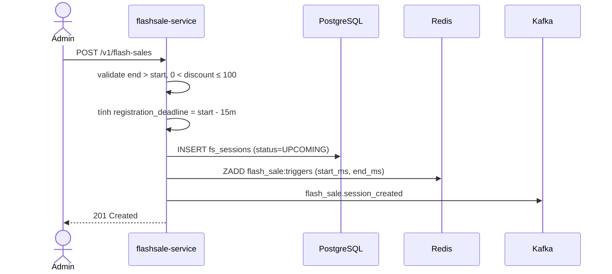

### 1.2 Seller đăng ký sản phẩm (auto-approve)
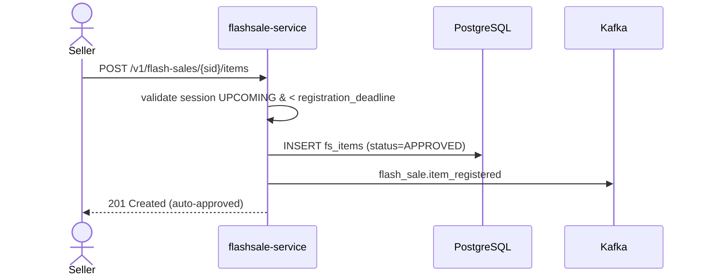

### 1.3 Scheduler chuyển trạng thái
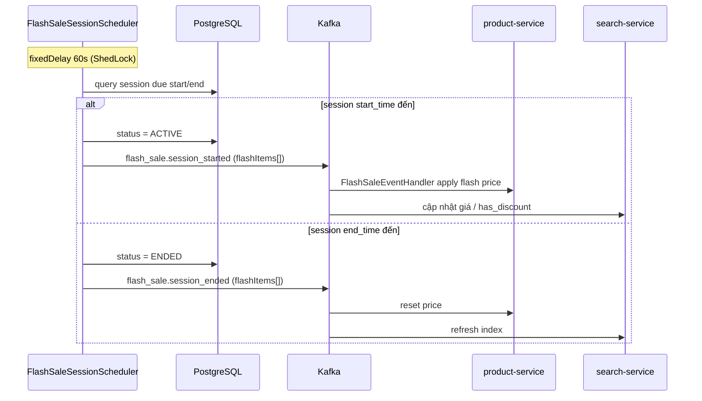

### 1.4 Buyer mua
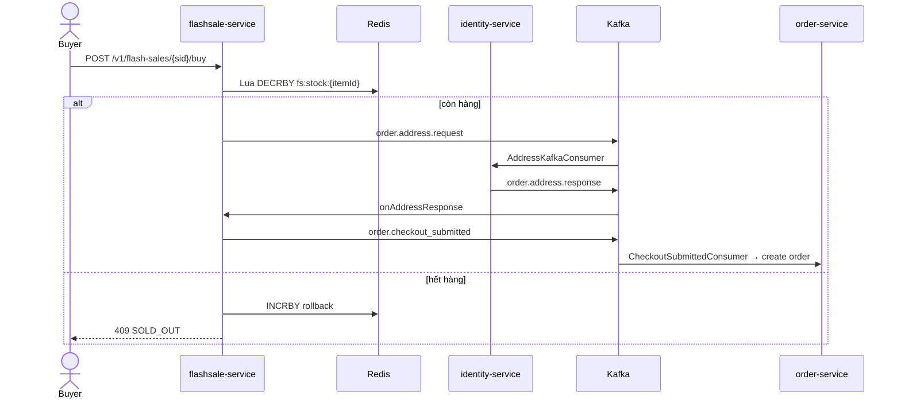

## 2. Checkout Saga (Cross-Service)

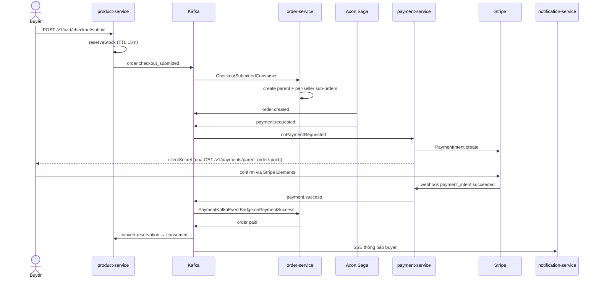

## 3. Order Cancellation (đa nguồn khởi)
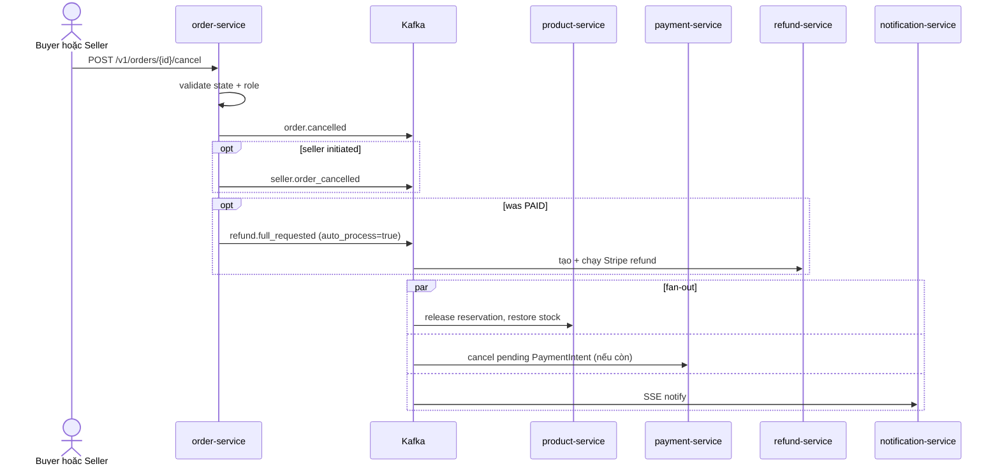

## 4. Refund (3 đường khởi)
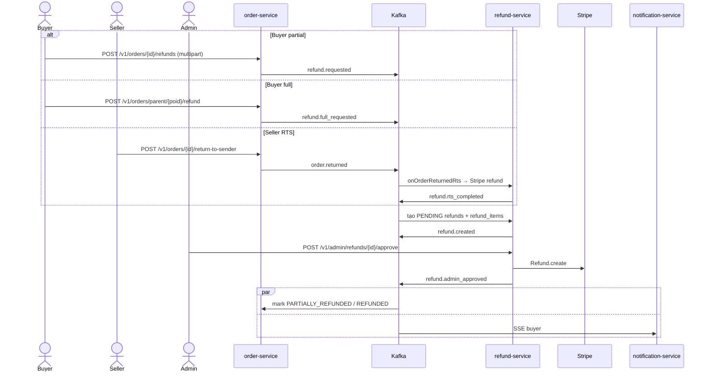

## 5. Stripe Connect Onboarding
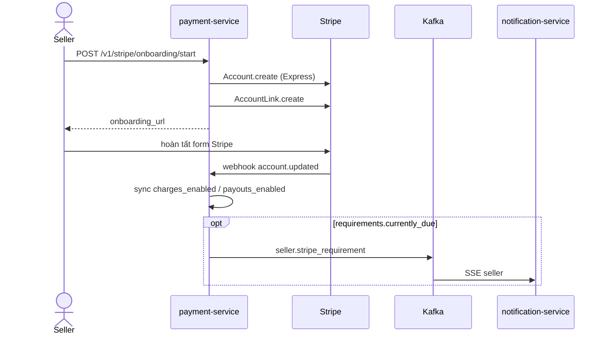

## 6. Payout (Delayed)
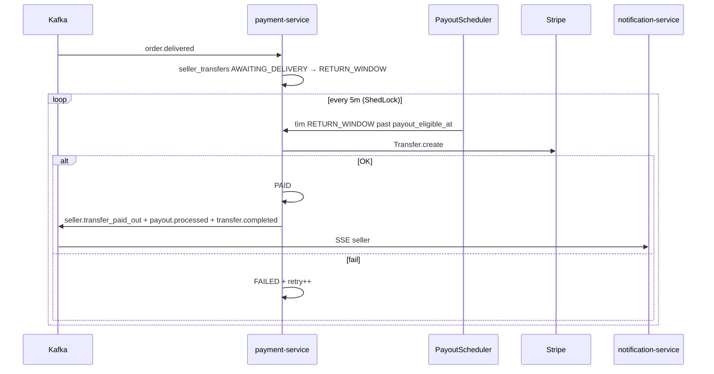

## 7. Notification Stream
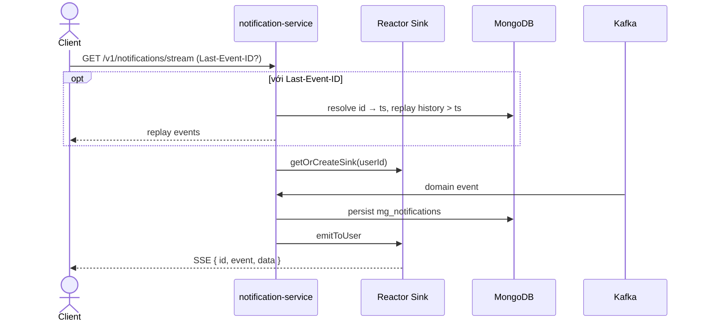

## 8. AI Chat — Tool Calling + HITL
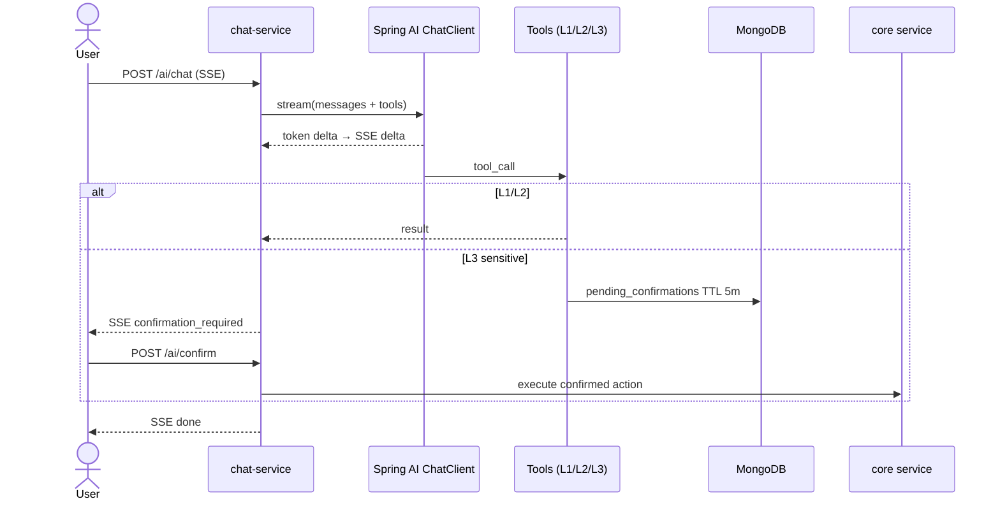

## Related
- Detailed per-service flows: [../flows/](../flows/README.md)
- Kafka catalog: [../messaging/KAFKA_CATALOG.md](../messaging/KAFKA_CATALOG.md)
- Architecture overview: [ARCHITECTURE.md](ARCHITECTURE.md)
