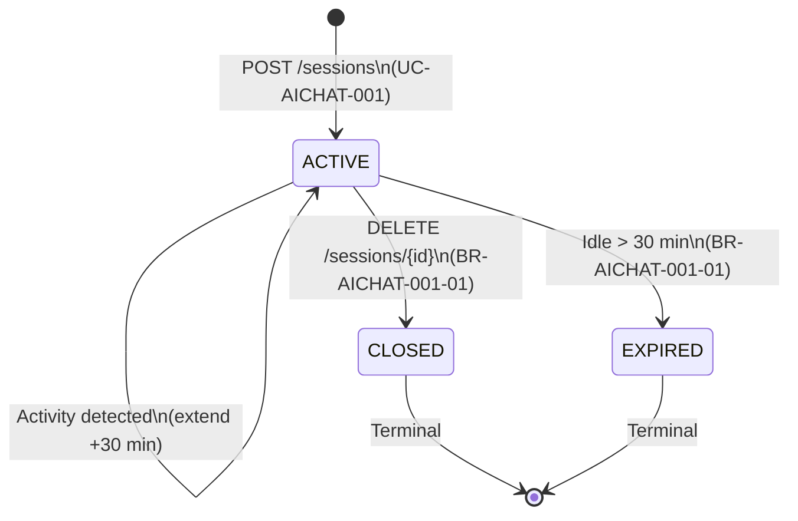

# State Diagram: Chat Session

**Stable ID:** `STATE-AICHAT-001`

> **Service**: ai-chat-service (Port 8093)
> **Entity**: CHAT_SESSIONS
> **Source**: BR-AICHAT-001-01

---

## States

| State | Description |
|-------|-------------|
| **ACTIVE** | Session is open, accepting messages, auto-extending on activity |
| **CLOSED** | User explicitly closed the session via DELETE /sessions/{id} |
| **EXPIRED** | Auto-closed after 30 minutes of inactivity |

---

## State Transition Table

| From | To | Trigger | UC/BR Reference |
|------|----|---------|-----------------|
| [*] | ACTIVE | POST /sessions (UC-AICHAT-001) | UC-AICHAT-001, BR-AICHAT-001-01 |
| ACTIVE | ACTIVE | Any activity (message, confirm) extends expiry +30 min | BR-AICHAT-001-01 |
| ACTIVE | CLOSED | DELETE /sessions/{id} | UC-AICHAT-001 (implicit), BR-AICHAT-001-01 |
| ACTIVE | EXPIRED | Idle timer: 30 min no activity | BR-AICHAT-001-01 |
| CLOSED | [*] | Terminal state (Redis cache cleared) | BR-AICHAT-001-01 |
| EXPIRED | [*] | Terminal state (Redis cache cleared) | BR-AICHAT-001-01 |

---

## State Diagram (Mermaid)

---

## State Invariants

| State | Invariant |
|-------|-----------|
| ACTIVE | `status = ACTIVE`, `closed_at IS NULL`, can receive messages |
| CLOSED | `status = CLOSED`, `closed_at IS NOT NULL`, messages rejected (422) |
| EXPIRED | `status = EXPIRED`, `closed_at IS NULL` (auto-closed, not user-closed) |

---

## Terminal State Effects

| Transition | Effect |
|------------|--------|
| ACTIVE -> CLOSED | Publish `ai.session.closed` (reason: USER_CLOSED), clear Redis `ctx:{id}`, `buf:{id}` |
| ACTIVE -> EXPIRED | Publish `ai.session.closed` (reason: IDLE_TIMEOUT), clear Redis `ctx:{id}`, `buf:{id}` |

---

## Cross-References

| Ref ID | Target |
|--------|--------|
| BR-AICHAT-001-01 | Session lifecycle rules |
| UC-AICHAT-001 | Start chat |
| UC-AICHAT-002 | Send message |
| ENTITY-AICHAT-001 | CHAT_SESSIONS |
