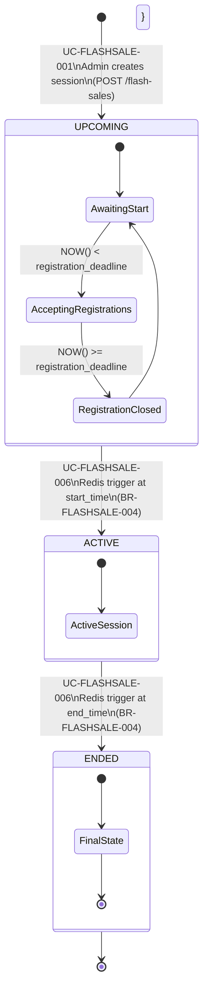

# State Diagram: FS_SESSIONS

**Stable ID:** `STATE-FLASHSALE-001`
**Entity:** `FS_SESSIONS`
**Service:** flashsale-service (port :8086)

---

## State Diagram



---

## State Transition Table

| From State | To State | Trigger | Actor | Rule | Kafka Event |
|------------|----------|---------|-------|------|-------------|
| [*] | UPCOMING | `POST /flash-sales` | Admin | BR-FLASHSALE-001, BR-FLASHSALE-003 | `flash_sale.session_created` |
| UPCOMING | ACTIVE | Redis ZSET at `start_time` | System | BR-FLASHSALE-004 | `flash_sale.session_started` |
| ACTIVE | ENDED | Redis ZSET at `end_time` | System | BR-FLASHSALE-004 | `flash_sale.session_ended` |
| ENDED | [*] | Terminal state | System | -- | -- |

---

## Forbidden Transitions

| From | To | Enforcement | Error |
|------|----|-------------|-------|
| ACTIVE | UPCOMING | Application + DB CHECK | `INVALID_STATUS_TRANSITION` |
| ENDED | ACTIVE | Application + DB CHECK | `INVALID_STATUS_TRANSITION` |
| ENDED | UPCOMING | Application + DB CHECK | `INVALID_STATUS_TRANSITION` |
| UPCOMING | ENDED | Application + DB CHECK | Must go through ACTIVE first |
| ACTIVE | [*] (delete) | Application | `SESSION_ACTIVE_CANNOT_DELETE` |

---

## State Properties

### UPCOMING
| Property | Value |
|----------|-------|
| **Entry condition** | Admin creates session via `POST /flash-sales` |
| **Allowed operations** | Update session, Soft delete, Register products |
| **Sub-states** | Accepting Registration (NOW < deadline) -> Registration Closed (NOW >= deadline) |
| **Kafka events on entry** | `flash_sale.session_created` |

### ACTIVE
| Property | Value |
|----------|-------|
| **Entry condition** | `NOW >= start_time` + Redis Worker fires trigger |
| **Allowed operations** | View session only (purchase via standard checkout) |
| **Forbidden operations** | Update session, Delete session, Register products |
| **Kafka events on entry** | `flash_sale.session_started` |

### ENDED
| Property | Value |
|----------|-------|
| **Entry condition** | `NOW >= end_time` + Redis Worker fires trigger |
| **Allowed operations** | View session (admin only) |
| **Forbidden operations** | All mutations (update, delete, register, purchase) |
| **Kafka events on entry** | `flash_sale.session_ended` |

---

## Soft Delete (BR-FLASHSALE-006)

```
Soft delete is available ONLY from UPCOMING state (and requires no registered items).
It sets deleted_at = NOW() — the row remains in the database but is filtered from all queries.
```

| State | Soft Delete Allowed? |
|-------|---------------------|
| UPCOMING | Yes (if no FS_ITEMS registered) |
| ACTIVE | No |
| ENDED | No |

---

## Cross-References

| Reference | Description |
|-----------|-------------|
| BR-FLASHSALE-004 | Status transition rules |
| BR-FLASHSALE-006 | Soft delete rule |
| UC-FLASHSALE-001 | Admin creates session |
| UC-FLASHSALE-006 | System transitions session status |
| ENTITY-FLASHSALE-001 | FS_SESSIONS table |
| FR-FLASHSALE-007 | System transition session status |

---

*Generated: 2026-05-09 | Sources: database-entities.md, flashsale_service_flow.md*
