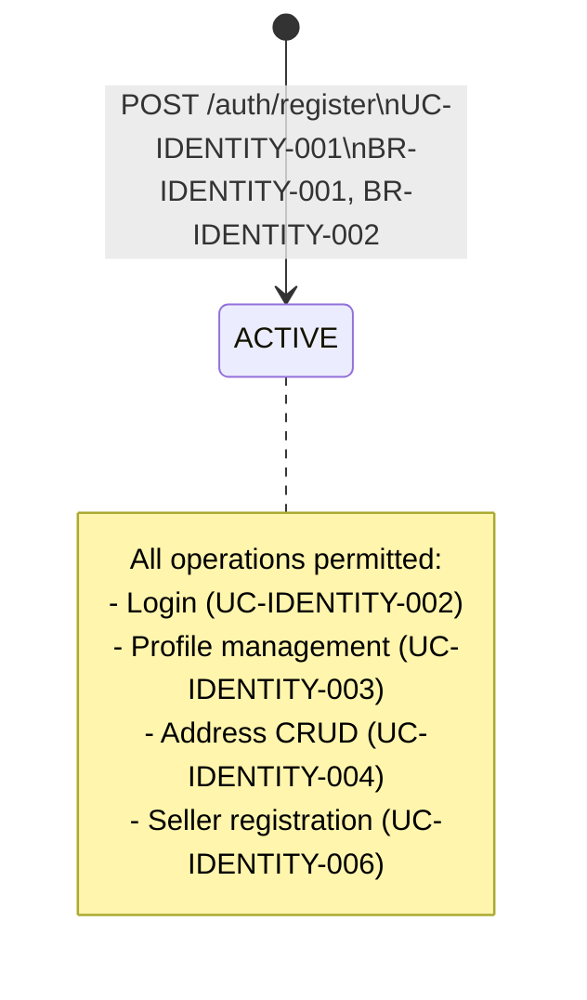

# State Diagram: User Account Lifecycle

**Stable ID:** `STATE-IDENTITY-001`

Service: identity-service
Entity: ENTITY-IDENTITY-001 (User)

## State Transition Table

| From | To | Trigger | Actor | BR | UC |
|------|----|---------|-------|-----|-----|
| [*] | ACTIVE | POST /auth/register | Guest | BR-IDENTITY-001, BR-IDENTITY-002 | UC-IDENTITY-001 |
| [*] | ACTIVE | POST /auth/register/seller | Guest | BR-IDENTITY-001, BR-IDENTITY-002 | UC-IDENTITY-006 |
