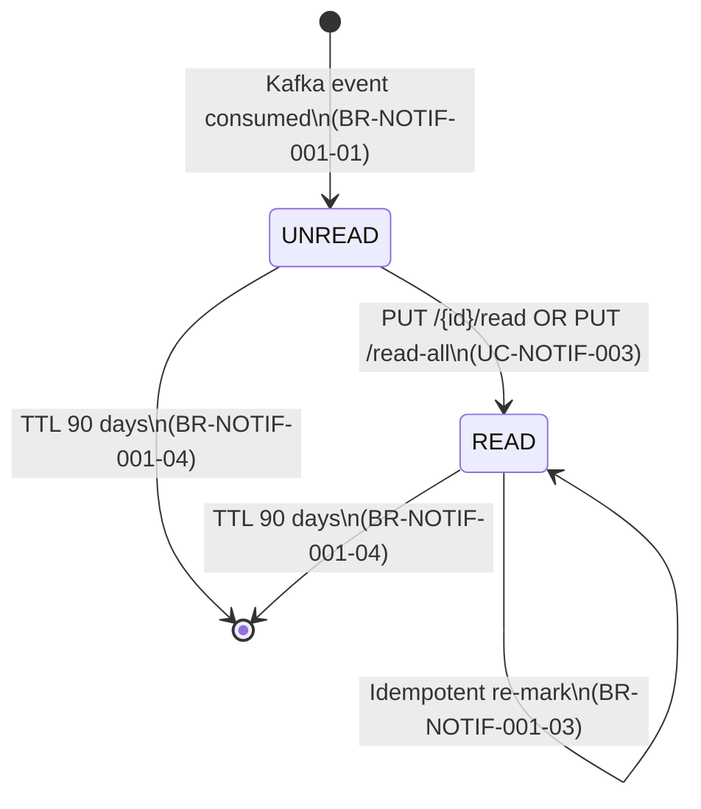

# State Diagram: Notification

**Stable ID:** `STATE-NOTIFICATION-001`

> **Service**: notification-service (Port 8092)
> **Entity**: MG_NOTIFICATIONS
> **Source**: BR-NOTIF-001-03

---

## States

| State | Description |
|-------|-------------|
| **UNREAD** | Notification created (via Kafka event), `is_read = false` |
| **READ** | User has viewed/marked notification, `is_read = true` |
| **[EXPIRED]** | Auto-deleted by MongoDB TTL after 90 days (not a state, document removed) |

---

## State Transition Table

| From | To | Trigger | UC/BR Reference |
|------|----|---------|-----------------|
| [created] | UNREAD | Kafka event received, document inserted | BR-NOTIF-001-01 |
| UNREAD | READ | PUT /notifications/{id}/read | UC-NOTIF-003, BR-NOTIF-001-03 |
| UNREAD | READ | PUT /notifications/read-all (bulk) | UC-NOTIF-003, BR-NOTIF-001-03 |
| READ | READ | PUT /notifications/{id}/read (idempotent) | BR-NOTIF-001-03 |
| UNREAD | [deleted] | TTL: `created_at` + 90 days | BR-NOTIF-001-04 |
| READ | [deleted] | TTL: `created_at` + 90 days | BR-NOTIF-001-04 |

---

## State Diagram (Mermaid)

---

## State Invariants

| State | Invariant |
|-------|-----------|
| UNREAD | `is_read = false` |
| READ | `is_read = true` |
| Any | `user_id` never changes |
| Any | `created_at` never changes |
| Any | `id`, `type`, `title`, `body` immutable after creation |

---

## Cross-References

| Ref ID | Target |
|--------|--------|
| BR-NOTIF-001 | Notification business rules |
| UC-NOTIF-003 | Mark read use case |
| ENTITY-NOTIF-001 | MG_NOTIFICATIONS entity |
