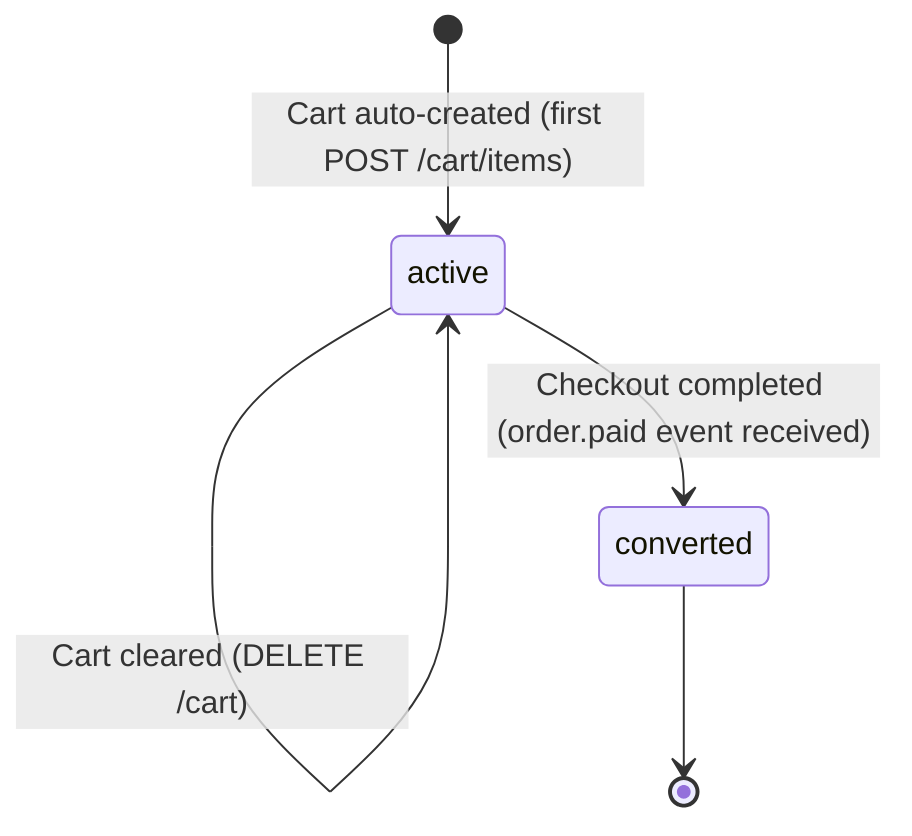

# State Diagram: CART

**Stable ID:** `STATE-PRODUCT-002`

> **Entity**: ENTITY-PRODUCT-006 (CART)
> **Last Updated**: 2026-05-26

---

## State Machine



---

## Transition Table

| # | From | To | Trigger | Actor | Business Rule | Use Case |
|---|------|-----|---------|-------|---------------|----------|
| 1 | `[*]` | `active` | `POST /cart/items` with no existing cart -> lazy creation | System | BR-PRODUCT-009 | UC-PRODUCT-009 |
| 2 | `active` | `active` | `PUT /cart/items/{variantId}` (update quantity) | Customer | BR-PRODUCT-012 | UC-PRODUCT-010 |
| 3 | `active` | `active` | `DELETE /cart/items/{variantId}` (remove item) | Customer | Hard delete | UC-PRODUCT-011 |
| 4 | `active` | `active` | `DELETE /cart` (clear all items, cart retained) | Customer | Hard delete all | UC-PRODUCT-011 |
| 5 | `active` | `converted` | `order.paid` event received; cart items hard-deleted by (customer_id, variant_id) | System | -- | UC-PRODUCT-007 |
| 6 | `converted` | `[*]` | Cart items cleared; cart record may be retained or archived | System | -- | -- |

---

## Cart Lifecycle

```
  Customer browses -> no cart exists yet

  First POST /cart/items -> Cart auto-created (PK = customer_id)
  |
  +--> GET /cart -> view items
  +--> PUT /cart/items/{variantId} -> adjust quantities
  +--> DELETE /cart/items/{variantId} -> hard delete item
  +--> DELETE /cart -> hard delete all items (cart persists)

  Customer checks out:
  |
  +--> Checkout Preview validates cart integrity
  |    (price match, stock available, variant active)
  |
  +--> order.checkout_submitted event -> Order Service creates order
  +--> Payment succeeds
  |    -> order.paid event (with session_id + user_id)
  |    -> Stock reservation confirmed
  |    -> Cart items hard-deleted: DELETE cart_items WHERE (customer_id, variant_id) IN (...)
  +--> Payment fails
       -> order.payment_failed event (with session_id + user_id)
       -> Stock reservation released
```

---

## Event-Driven Side Effects

| Kafka Event | Action | Module |
|-------------|--------|--------|
| `order.paid` | Confirm stock reservation + hard-delete cart items by (user_id, variant_id) | Inventory + Cart |
| `order.payment_failed` | Release stock reservation | Inventory + Cart |
| `order.returned` | Restore stock (for returned items) | Inventory |
| `flash_sale.session_ended` | Remove expired flash sale items from all carts | Cart |

---

## Key Design Changes (2026-05-26)

- **No soft-delete**: Cart items are hard-deleted. No `deleted_at` column.
- **Composite PK**: `cart_items.PK = (customer_id, variant_id)` instead of UUID.
- **Cart PK = customer_id**: No separate UUID PK for Cart entity.
- **No cart_item_id in stock_reservation**: Cart items identified by `(user_id, variant_id)` via Kafka event payload.

---

## Cross-References

| Ref ID | Type |
|--------|------|
| ENTITY-PRODUCT-006 | CART |
| ENTITY-PRODUCT-007 | CART_ITEM |
| BR-PRODUCT-009 | One cart per customer |
| BR-PRODUCT-010 | Hard delete strategy |
| FR-PRODUCT-016 | Get customer cart |
| FR-PRODUCT-020 | Clear entire cart |
| UC-PRODUCT-008 | View cart |
| UC-PRODUCT-009 | Add to cart |
