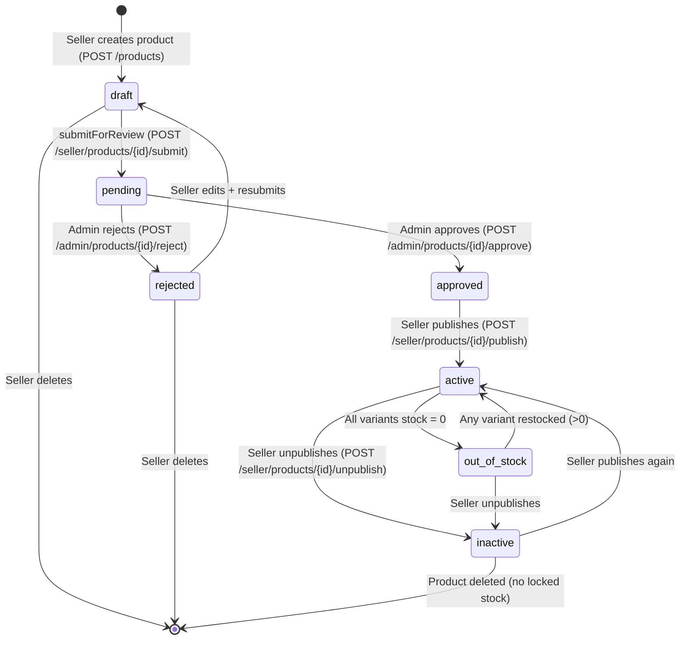

# State Diagram: PRODUCT

**Stable ID:** `STATE-PRODUCT-001`

> **Entity**: ENTITY-PRODUCT-002 (PRODUCT)
> **Status Column**: `product.status` (VARCHAR 50, CHECK enum)
> **Last Updated**: 2026-05-10 (v3 — admin review workflow re-activated; P3-11 APPROVED & applied)

---

## State Machine (7 states)



---

## Transition Table

| # | From | To | Trigger | Actor | Business Rule | Use Case | Kafka Event |
|---|------|-----|---------|-------|---------------|----------|-------------|
| 1 | `[*]` | `draft` | `POST /products` creates product | Seller | BR-PRODUCT-002 (leaf category) | UC-PRODUCT-003 | — |
| 2 | `draft` | `pending` | `POST /seller/products/{id}/submit` | Seller | BR-PRODUCT-009 (submit for review) | UC-PRODUCT-012 | `product.pending_review` |
| 3 | `pending` | `approved` | `POST /admin/products/{id}/approve` | Admin | BR-PRODUCT-009 | UC-PRODUCT-014 | `product.approved` |
| 4 | `pending` | `rejected` | `POST /admin/products/{id}/reject` | Admin | BR-PRODUCT-009 (reason ≥10 chars) | UC-PRODUCT-015 | `product.rejected` |
| 5 | `rejected` | `draft` | Seller edits product fields | Seller | BR-PRODUCT-009 | UC-PRODUCT-012 (resubmit loop) | — |
| 6 | `approved` | `active` | `POST /seller/products/{id}/publish` | Seller | BR-PRODUCT-003 | UC-PRODUCT-003 | `product.activated` |
| 7 | `active` | `out_of_stock` | All variants reach `stock_quantity = 0` | System (automatic) | BR-PRODUCT-003 | UC-PRODUCT-006 | — |
| 8 | `out_of_stock` | `active` | Any variant `stock_quantity > 0` again | System (automatic) | BR-PRODUCT-003 | UC-PRODUCT-006 | — |
| 9 | `active` | `inactive` | `POST /seller/products/{id}/unpublish` | Seller | BR-PRODUCT-003 | UC-PRODUCT-003 | `product.deactivated` |
| 10 | `out_of_stock` | `inactive` | `POST /seller/products/{id}/unpublish` | Seller | BR-PRODUCT-003 | UC-PRODUCT-003 | `product.deactivated` |
| 11 | `inactive` | `active` | `POST /seller/products/{id}/publish` | Seller | BR-PRODUCT-003 | UC-PRODUCT-003 | `product.activated` |
| 12 | `draft` | `[*]` | `DELETE /seller/products/{id}` | Seller | — | UC-PRODUCT-003 | — |
| 13 | `rejected` | `[*]` | `DELETE /seller/products/{id}` | Seller | — | UC-PRODUCT-003 | — |
| 14 | `inactive` | `[*]` | `DELETE /seller/products/{id}` (no locked stock) | Seller | — | UC-PRODUCT-003 | — |

---

## State Descriptions

| State | Visible on shop? | Sellable? | Editable by seller? | Notes |
|-------|------------------|-----------|---------------------|-------|
| `draft` | No | No | Yes (full edit) | Seller is composing; never reviewed |
| `pending` | No | No | No (locked during review) | Awaiting admin decision |
| `approved` | No | No | Yes (re-edit forces back to draft+resubmit) | Admin approved but not published |
| `rejected` | No | No | Yes | Admin rejected; seller can edit + resubmit |
| `active` | Yes | Yes | Limited (price/stock OK; structural change → resubmit) | Live on marketplace |
| `out_of_stock` | Yes ("Sold out" badge) | No | Yes (restock) | Auto-derived, not manually set |
| `inactive` | No | No | Yes | Seller unpublished; can re-publish |

---

## Computation Logic

Product `status` is partly **derived** (auto for `active ↔ out_of_stock`) and partly **manually set** (admin / seller actions for the rest):

```
IF seller submitted product to review:
    status = 'pending' (locked)
ELSE IF admin acted:
    status = 'approved' or 'rejected'
ELSE IF seller manually set product to inactive:
    status = 'inactive'
ELSE IF status = 'active' AND no variant has stock_quantity > 0:
    status = 'out_of_stock'  -- automatic
ELSE IF status = 'out_of_stock' AND any variant restocked:
    status = 'active'  -- automatic
```

---

## Forbidden Transitions

| From | To | Reason |
|------|----|--------|
| `draft` | `active` | Must go through admin review |
| `draft` | `approved` | Must be `pending` first |
| `pending` | `draft` | Lock during review (only admin can move out) |
| `pending` | `active` | Must pass admin approve first |
| `rejected` | `pending` | Must edit + resubmit (back to draft) |
| `rejected` | `approved` | Must be re-reviewed |
| `inactive` | `out_of_stock` | Seller must publish first; then system evaluates stock |
| `out_of_stock` | `active` (manual) | Only via auto restock; cannot manually toggle |

---

## Constraints

| Rule | Detail |
|------|--------|
| Reject reason | Required ≥10 chars; persisted in `products.reject_reason` |
| Reviewer metadata | `products.reviewed_at` + `products.reviewed_by` MUST be set on every approve/reject |
| Search re-indexing | `approved → active` triggers ES indexing; `active → inactive/out_of_stock` triggers de-indexing or visibility flag |
| Deletion blocked if stock locked | 409 if any variant has active `stock_reservation` (status = pending) |
| Backfill | Existing products at activation time are grandfathered as `approved` (then promoted by seller publish) |

---

## Cross-References

| Ref ID | Type |
|--------|------|
| ENTITY-PRODUCT-002 | PRODUCT |
| ENTITY-PRODUCT-003 | PRODUCT_VARIANT |
| BR-PRODUCT-003 | Product status transitions (active/inactive/out_of_stock subset) |
| BR-PRODUCT-009 | Admin review workflow (draft/pending/approved/rejected) |
| FR-PRODUCT-004 | Seller create product |
| FR-PRODUCT-007 | Seller update product |
| FR-PRODUCT-008 | Delete product |
| UC-PRODUCT-012 | Submit Product for Review (seller) |
| UC-PRODUCT-013 | List Pending Products (admin) |
| UC-PRODUCT-014 | Approve Product (admin) |
| UC-PRODUCT-015 | Reject Product (admin) |
| P3-11 | DB schema (APPROVED & applied 2026-05-10): extended status enum to 7 values + 4 review columns (`reject_reason`, `reviewed_at`, `reviewed_by`, `reject_count`) + partial index `idx_products_status_pending` (`database-entities.md` §3) |
