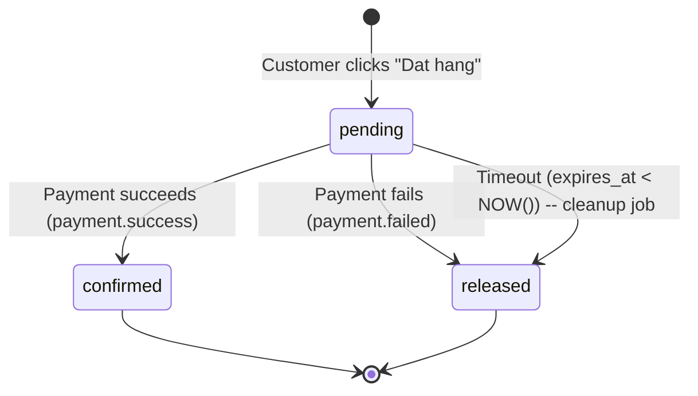

# State Diagram: STOCK_RESERVATION

**Stable ID:** `STATE-PRODUCT-003`

|> **Entity**: ENTITY-PRODUCT-005 (STOCK_RESERVATION)
|> **Status Column**: `stock_reservation.status` (VARCHAR 50)
|> **Last Updated**: 2026-05-25 (pessimistic locking now guards ALL stock mutations: reserve, release, restore, restock; version field enables proactive optimistic lock for seller inventory updates)

---

## State Machine



---

## Transition Table

|| # | From | To | Trigger | Actor | Business Rule | Use Case |
||---|------|-----|---------|-------|---------------|----------|
|| 1 | `[*]` | `pending` | `order.created` event received; reservation inserted with `expires_at = NOW() + 15 min` | System | BR-PRODUCT-007 | UC-PRODUCT-007 |
|| 2 | `pending` | `confirmed` | `payment.success` event received (payment success) | System (Order Service) | -- | UC-PRODUCT-007 |
|| 3 | `pending` | `released` | `payment.failed` event received (payment failure) | System (Order Service) | BR-PRODUCT-007 | UC-PRODUCT-007 |
|| 4 | `pending` | `released` | `expires_at < NOW()` -- cleanup job (runs every 1-5 min) | System (Scheduler) | BR-PRODUCT-007 | -- |
|| 5 | `confirmed` | `[*]` | Terminal state | -- | -- | -- |
|| 6 | `released` | `[*]` | Terminal state | -- | -- | -- |

---

## Lifecycle Timeline

```
  t=0      Customer clicks "Dat hang"
           -> Transaction (SELECT ... FOR UPDATE on product_variant)
           -> IF stock_quantity < requested: ROLLBACK, return "out of stock"
           -> INSERT reservation (pending, expires_at = NOW()+15min)
           -> UPDATE stock_quantity -= qty
           -> COMMIT (row lock released)

  t=0..15  Payment processing window

  t < 15   Payment succeeds
           -> UPDATE reservation SET status = 'confirmed'
           -> Stock already deducted, no restore needed

  t < 15   Payment fails
           -> UPDATE reservation SET status = 'released'
           -> SELECT ... FOR UPDATE on product_variant
           -> UPDATE stock_quantity += qty
           -> COMMIT

  t > 15   (Cleanup job catches it)
           -> UPDATE reservation SET status = 'released'
           -> SELECT ... FOR UPDATE on product_variant
           -> UPDATE stock_quantity += qty
           -> COMMIT
```

---

## Side Effects Per Transition

|| Transition | DB Action | Kafka Event |
||------------|-----------|-------------|
|| `[*]` -> `pending` | SELECT FOR UPDATE, stock_quantity -= qty | -- |
|| `pending` -> `confirmed` | (none, already deducted) | -- |
|| `pending` -> `released` | UPDATE stock_quantity += qty (pessimistic lock on product_variant row) | -- |

---

## Constraints

|| Rule | Detail |
||------|--------|
|| TTL | 15 minutes from creation |
|| Cleanup interval | 1-5 minutes |
|| Idempotency | Cleanup checks `status = 'pending'` before releasing |
|| Locking | Pessimistic locking (`SELECT ... FOR UPDATE`) only on `product_variants` during reserve operation |
|| Cascading statuses | Product and variant statuses recomputed after stock changes |

---

## Cross-References

|| Ref ID | Type |
||--------|------|
|| ENTITY-PRODUCT-005 | STOCK_RESERVATION |
|| BR-PRODUCT-005 | Pessimistic locking for concurrent reservations |
|| BR-PRODUCT-007 | Reservation expiry (15 min TTL) |
|| FR-PRODUCT-014 | Reserve stock during checkout |
|| FR-PRODUCT-015 | Release expired reservations |
|| UC-PRODUCT-007 | Reserve stock (system) |
