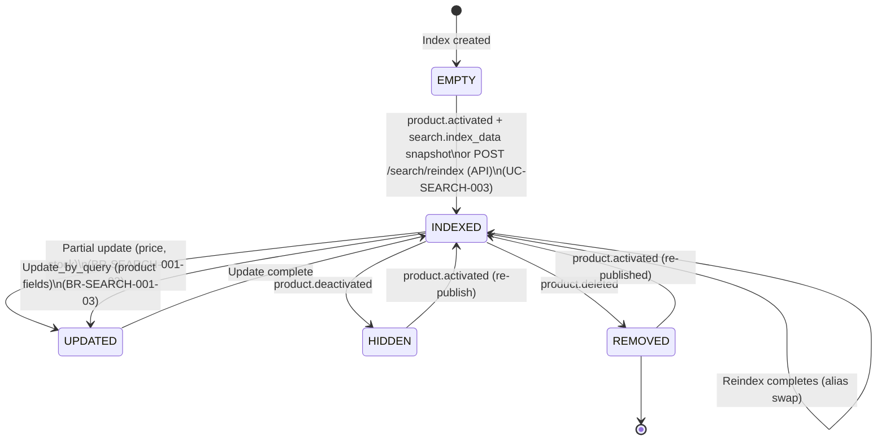

# State Diagram: Search Index Lifecycle

**Stable ID:** `STATE-SEARCH-001`

> **Service**: search-service (Port 8087)
> **Index**: `skus` (Elasticsearch)
> **Source**: BR-SEARCH-001
> **Updated**: 2026-06-07 (clarified that Search fetches Product indexing snapshots through Kafka request-reply)

---

## States

| State | Description |
|-------|-------------|
| **INDEXED** | SKU document exists in index, `is_active = true`, visible in search |
| **HIDDEN** | SKU/Product is inactive: `is_active = false`, excluded from search results |
| **UPDATED** | Document fields modified via partial update (price, stock, etc.) |
| **REMOVED** | Document deleted from index entirely |
| **[EMPTY]** | Index does not exist or is newly created (before first data load) |

---

## State Transition Table

| From | To | Trigger | UC/BR Reference |
|------|----|---------|-----------------|
| [EMPTY] | INDEXED | `product.activated` event followed by `search.index_data` snapshot OR POST /search/reindex (UC-SEARCH-003) | UC-SEARCH-003, BR-SEARCH-001-03, BR-SEARCH-001-06 |
| INDEXED | UPDATED | Partial update via Kafka event (price/stock change) | BR-SEARCH-001-03 |
| UPDATED | INDEXED | Update completed successfully | BR-SEARCH-001-03 |
| INDEXED | UPDATED | Update_by_query via Kafka (product fields) | BR-SEARCH-001-03 |
| INDEXED | HIDDEN | `product.deactivated` event (seller unpublishes) | BR-SEARCH-001-03 |
| HIDDEN | INDEXED | Product reactivated via `product.activated` (re-publish) | BR-SEARCH-001-03 |
| INDEXED | REMOVED | `product.deleted` event | BR-SEARCH-001-03 |
| REMOVED | INDEXED | Product re-created and re-published (`product.activated`) | BR-SEARCH-001-03 |
| INDEXED | INDEXED | Reindex completes (alias swap to new index) | UC-SEARCH-003, BR-SEARCH-001-06 |

---

## State Diagram (Mermaid)

---

## State Invariants

| State | Invariant |
|-------|-----------|
| INDEXED | `is_active = true`, document present in active alias |
| HIDDEN | `is_active = false`, document present but excluded from queries |
| UPDATED | Transient state; resolves immediately to INDEXED |
| REMOVED | Document does not exist in current active index |
| Any | `sku_id` (synonym: `variant_id` from Product Service) never changes |
| Any | `product_id` never changes |

> **Note**: `sku_id` in the ES document is equivalent to `variant_id` in the Product Service. The ES field is named `sku_id` to reflect the Elasticsearch document primary key; the Kafka event payloads use `variantId` from the source service.

---

## Cross-References

| Ref ID | Target |
|--------|--------|
| BR-SEARCH-001 | Search business rules |
| UC-SEARCH-003 | Reindex use case |
| UC-SEARCH-001 | Search use case (Kafka ingestion) |
| ENTITY-SEARCH-001 | SKU document mapping |
| KAFKA_EVENTS.md | Search Service Kafka events (source of truth for topics) |
| KAFKA_REQUEST_REPLY.md | Search/Product snapshot request-reply contract |
