# Chương II. THIẾT KẾ HỆ THỐNG

> Trọng tâm chương này: trình bày **kiến trúc tổng thể**, **phân chia service**, **lưu trữ**, **luồng nghiệp vụ** và **bus sự kiện** của hệ thống. Tất cả sơ đồ được biểu diễn bằng **Mermaid** để có thể render trực tiếp trong Markdown.

---

## Mục lục Chương II

1. [Mục tiêu thiết kế](#1-mục-tiêu-thiết-kế)
2. [Phong cách kiến trúc](#2-phong-cách-kiến-trúc)
3. [Sơ đồ kiến trúc tổng thể](#3-sơ-đồ-kiến-trúc-tổng-thể)
4. [Phân rã 11 microservice](#4-phân-rã-11-microservice)
5. [Bản đồ tương tác giữa các service](#5-bản-đồ-tương-tác-giữa-các-service)
6. [Thiết kế lớp lưu trữ (Polyglot Persistence)](#6-thiết-kế-lớp-lưu-trữ-polyglot-persistence)
7. [Thiết kế cơ sở dữ liệu (ERD nhóm)](#7-thiết-kế-cơ-sở-dữ-liệu-erd-nhóm)
8. [Thiết kế Event-Driven (Kafka + Axon)](#8-thiết-kế-event-driven-kafka--axon)
9. [Thiết kế các luồng nghiệp vụ trọng tâm](#9-thiết-kế-các-luồng-nghiệp-vụ-trọng-tâm)
10. [Thiết kế bảo mật](#10-thiết-kế-bảo-mật)
11. [Thiết kế Frontend (3 SPA)](#11-thiết-kế-frontend-3-spa)
12. [Tổng kết các quyết định thiết kế](#12-tổng-kết-các-quyết-định-thiết-kế)

---

## 1. Mục tiêu thiết kế

Hệ thống được thiết kế hướng tới **5 tiêu chí ưu tiên** (xếp theo thứ tự):

| # | Tiêu chí | Diễn giải |
|---|----------|----------|
| 1 | **Tính nhất quán nghiệp vụ** | Không oversell trong flash sale; không thất lạc dòng tiền multi-vendor; audit đầy đủ vòng đời đơn hàng. |
| 2 | **Khả năng cô lập lỗi** | Lỗi của một service không kéo sập toàn hệ thống — gateway, circuit breaker, async event. |
| 3 | **Khả năng scale theo domain** | Mỗi domain (Order, Flash Sale, Search…) có thể scale độc lập theo tải thực tế. |
| 4 | **Khả năng tiến hóa** | Có thể thêm domain mới (vd. logistics) mà không cần thay đổi domain cũ. |
| 5 | **Trải nghiệm vận hành** | Triển khai một lệnh, log/metrics tập trung, có thể chạy hoàn toàn trên một máy phát triển. |

---

## 2. Phong cách kiến trúc

Hệ thống áp dụng **4 phong cách kiến trúc kết hợp**:

| Phong cách | Áp dụng ở đâu | Lý do |
|------------|---------------|------|
| **Microservices** | Toàn hệ thống, 11 service | Tự trị, scale theo domain, deploy độc lập |
| **CQRS + Event Sourcing** | `order-service` (Axon) | Audit, replay, tách read/write |
| **Saga (orchestration)** | Checkout xuyên `order ↔ product ↔ payment` | Nhất quán phân tán không cần distributed lock |
| **Event-Driven** | Cross-service qua Kafka (58 topics) | Loose coupling, cô lập lỗi, fan-out đa consumer |
| **Reactive** | `flashsale`, `notification`, `chat` (WebFlux + R2DBC) | I/O cao, kết nối dài (SSE), throughput đột biến |

---

## 3. Sơ đồ kiến trúc tổng thể

Sơ đồ tổng thể chia hệ thống thành **5 tầng**: Client → Gateway → Service Mesh → Event Bus → Storage.

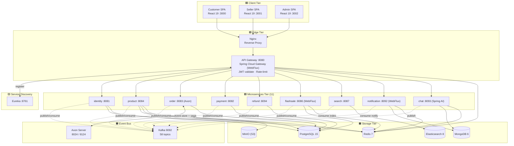

**Đặc điểm thiết kế tầng:**

- **Client tier**: 3 SPA độc lập, không SSR — bundler Vite tạo bundle nhẹ, build siêu nhanh.
- **Edge tier**: Nginx phục vụ static frontend; Gateway WebFlux là **một điểm duy nhất** validate JWT + rate-limit.
- **Microservices tier**: mỗi service tự đăng ký với Eureka, gateway routing theo `serviceId`.
- **Event Bus** tách đôi: **Axon** cho domain event nội bộ + saga; **Kafka** cho cross-service integration.
- **Storage tier**: Polyglot — chọn DB hợp loại workload (xem §6).

---

## 4. Phân rã 11 microservice

Hệ thống có **11 service** thuộc 4 nhóm theo trách nhiệm.

### Bảng 4.1 — Tổng quan service

| Nhóm | Service | Port | DB | Pattern | Trách nhiệm chính |
|------|---------|------|----|---------|---|
| Hạ tầng | **api-gateway** | 8080 | Redis | Spring Cloud Gateway | Routing, JWT, rate-limit |
| Hạ tầng | **discovery-service** | 8761 | — | Eureka | Service registry |
| Identity | **identity-service** | 8081 | PostgreSQL + Redis | JPA | Auth, JWT, user, address |
| Catalog | **product-service** | 8084 | PostgreSQL + MinIO + Redis | JPA | Sản phẩm, biến thể, giỏ hàng, ảnh |
| Sale | **flashsale-service** | 8086 | PostgreSQL (R2DBC) + Redis | WebFlux | Phiên flash sale, giá khuyến mãi |
| Sale | **search-service** | 8087 | Elasticsearch + Redis | CQRS read | Tìm kiếm full-text VN |
| Order | **order-service** | 8083 | PostgreSQL + Axon | CQRS/ES + Saga | Vòng đời đơn, RTS |
| Money | **payment-service** | 8082 | PostgreSQL + Kafka | JPA | Stripe Connect, transfers |
| Money | **refund-service** | 8094 | PostgreSQL + Kafka | JPA | Hoàn tiền, RTS automation |
| UX | **notification-service** | 8092 | MongoDB + Redis | WebFlux + SSE | Đẩy thông báo real-time |
| UX | **chat-service** | 8093 | MongoDB + Redis | WebFlux + Spring AI | AI assistant, tool calling |

### Bảng 4.2 — Tài sản nội tại của mỗi service

| Thuộc tính | Quy tắc thiết kế |
|------------|------------------|
| **Database riêng** | Một service không được query DB của service khác — chỉ qua API/Event. |
| **Codebase riêng** | Module Maven riêng, build artifact JAR riêng. |
| **Cấu hình riêng** | `application.yaml` riêng + env var qua `.env`. |
| **Triển khai riêng** | Mỗi service một image Docker, scale độc lập. |
| **Dùng chung** | Chỉ qua `common-lib`: DTO, JWT util, hằng số Kafka topic. |

---

## 5. Bản đồ tương tác giữa các service

Sơ đồ dưới đây cho thấy **quan hệ Sync (REST)** và **Async (Kafka/Axon event)** giữa các service:

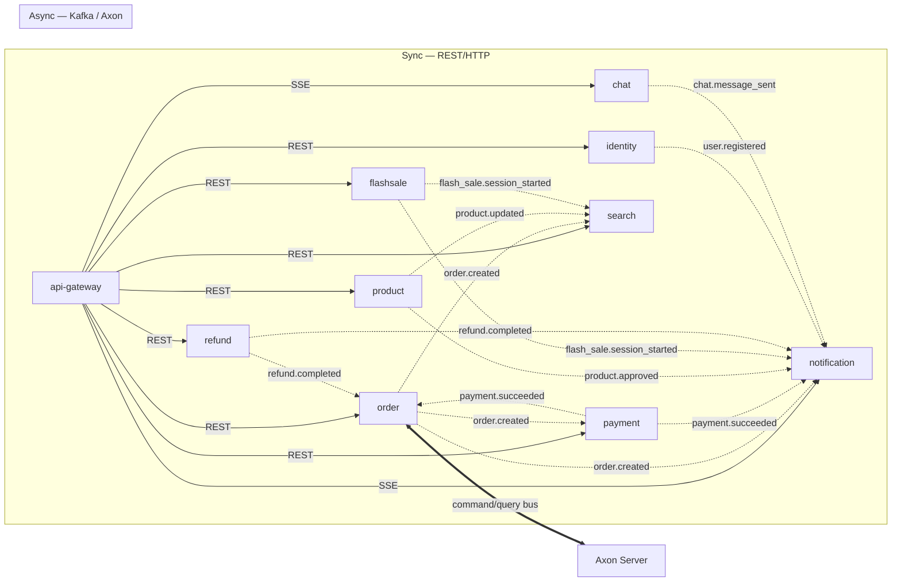

**Nguyên tắc giao tiếp:**

| Use case | Loại giao tiếp | Lý do |
|----------|---------------|------|
| Client → Service | REST qua Gateway | Đơn giản, có sẵn JWT context |
| Cross-service đồng bộ cần kết quả ngay (vd. validate stock) | **Kafka request-reply** (14 topic) | Tránh coupling REST, có timeout, retry, idempotent |
| Cross-service phát tán event | **Kafka event** (44 topic) | Fan-out đa consumer, replay được |
| Domain event nội bộ aggregate | **Axon event** | Lưu vào event store, replay aggregate state |
| Service → Client | **SSE** (Server-Sent Events) | Push real-time một chiều, nhẹ hơn WebSocket |

---

## 6. Thiết kế lớp lưu trữ (Polyglot Persistence)

Mỗi loại workload chọn một loại DB phù hợp — không ép một DB cho tất cả.

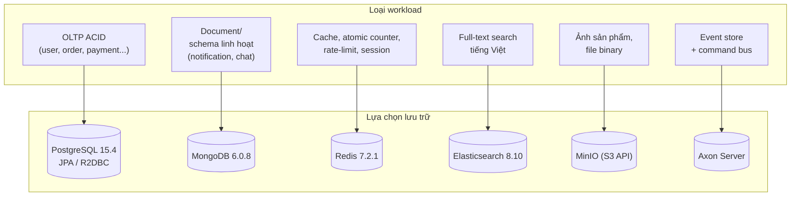

### Bảng 6.1 — Vì sao chọn từng DB

| DB | Vì sao chọn | Service sử dụng |
|----|------------|----------------|
| **PostgreSQL** | ACID, JPA/R2DBC trưởng thành, hỗ trợ JSONB cho `attributes` linh hoạt, partial index cho admin queue | identity, product, order, payment, refund, flashsale |
| **MongoDB** | Schema linh hoạt cho notification/chat — payload đa dạng, không cần migration mỗi lần đổi shape | notification, chat |
| **Redis** | Atomic decrement cho flash sale, rate-limit token bucket, refresh token TTL, pub/sub | gateway, identity, product, flashsale, search, notification, chat |
| **Elasticsearch** | Full-text tiếng Việt + fuzzy + aggregation, field collapsing SKU → product | search |
| **MinIO** | API tương thích S3 → có thể swap sang AWS S3 mà không đổi code | product (ảnh) |
| **Axon Server** | Event store có sẵn snapshot, command/query bus qua gRPC, UI quản trị 8024 | order |

---

## 7. Thiết kế cơ sở dữ liệu (ERD nhóm)

Schema được nhóm theo **bounded context** — mỗi nhóm thuộc về một service và **không chia sẻ bảng với service khác**.

### 7.1. Sơ đồ nhóm bảng (high-level)

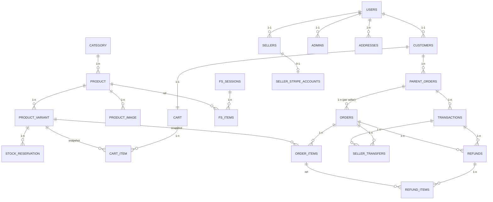

### 7.2. Bảng nhóm theo service

| Service | Nhóm | Bảng chính |
|---------|------|-----------|
| identity | identity | users, roles, customers, sellers, admins, addresses |
| product | catalog | category, product, product_variant, product_image, stock_reservation |
| product | cart | cart, cart_item |
| flashsale | flash_sale | fs_sessions, fs_items |
| order | orders | parent_orders, orders, order_items |
| payment | payments | seller_stripe_accounts, transactions, seller_transfers |
| refund | refunds | refunds, refund_items |
| notification | notifications | mg_notifications (MongoDB) |
| search | search | Elasticsearch index `skus` (không phải bảng SQL) |
| chat | ai_chat | chat_sessions, chat_messages, pending_confirmations, tool_call_logs |

### 7.3. Một số quyết định thiết kế dữ liệu đáng chú ý

| Bảng | Quyết định | Lý do |
|------|-----------|------|
| `product.status` | Enum 7 trạng thái: `draft / pending / approved / rejected / active / out_of_stock / inactive` + `reject_count` 3-strike + partial index `WHERE status='pending'` | Hỗ trợ admin review queue FIFO, giới hạn re-submit |
| `product.attributes` | `JSONB` + GIN index | Mỗi ngành hàng có thuộc tính khác nhau (size/màu/ROM…) — JSONB linh hoạt, GIN cho filter nhanh |
| `stock_reservation.expires_at` | TTL 15 phút | Buyer rời checkout → tồn kho tự release, tránh oversell |
| `parent_orders` ↔ `orders` | 1-N (1 đơn cha → N đơn theo seller) | Giỏ hàng đa seller → một transaction Stripe nhưng nhiều dòng tiền |
| `seller_transfers.status` | Enum 5 trạng thái: `ELIGIBLE / IN_TRANSIT / PAID / FAILED / RETRYING` | Theo dõi vòng đời payout độc lập với transaction |
| `pending_confirmations.expires_at` | TTL 5 phút (TTL index MongoDB) | Auto cleanup confirmation chưa được xác nhận |
| ES index `skus` | SKU-first + field collapsing theo `product_id` | Listing hiển thị SKU đại diện (giá thấp nhất, còn hàng) qua inner_hits |

---

## 8. Thiết kế Event-Driven (Kafka + Axon)

Hệ thống dùng **2 event bus song song** với mục đích khác nhau.

### 8.1. Phân vai trò

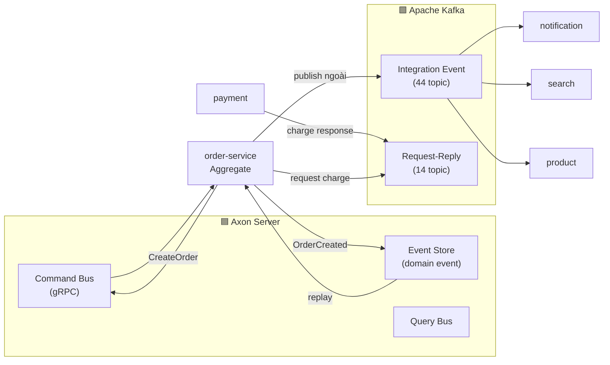

### 8.2. Khi nào dùng cái nào

| Use case | Bus | Ví dụ topic |
|----------|-----|------------|
| Lệnh trong aggregate (CreateOrder, ConfirmDelivery) | **Axon Command** | `OrderAggregate` |
| Event nội bộ aggregate, replay tái dựng state | **Axon Event** | `OrderCreated`, `OrderShipped` |
| Saga điều phối Order ↔ Payment ↔ Product | **Axon Saga** | `OrderPaymentSaga` |
| Event tích hợp cross-service | **Kafka Event** | `order.created`, `payment.succeeded`, `product.updated` |
| Gọi qua biên service cần kết quả đồng bộ | **Kafka Request-Reply** | `product.reserve_stock.request/reply` |
| Push tới client | **SSE** từ notification/chat | `events:notifications` |

### 8.3. Danh mục 58 Kafka topic (rút gọn theo prefix)

| Prefix | Số topic | Producer | Consumer chính |
|--------|---------|----------|---------------|
| `identity.*` | 5 | identity | notification |
| `product.*` | 8 | product | search, notification |
| `cart.*` | 3 | product | order |
| `order.*` | 10 | order | payment, product, notification, search |
| `payment.*` | 6 | payment | order, notification, refund |
| `refund.*` | 5 | refund | order, payment, notification |
| `seller_transfer.*` | 4 | payment | notification |
| `flash_sale.*` | 8 | flashsale | search, notification, product |
| `stripe.*` | 4 | payment | notification |
| `chat.*` | 3 | chat | notification |
| `notification.*` | 2 | notification | — |

---

## 9. Thiết kế các luồng nghiệp vụ trọng tâm

### 9.1. Luồng Checkout (Saga đa service)

Đây là luồng phức tạp nhất — đụng chạm **4 service** và đòi hỏi nhất quán nghiệp vụ.

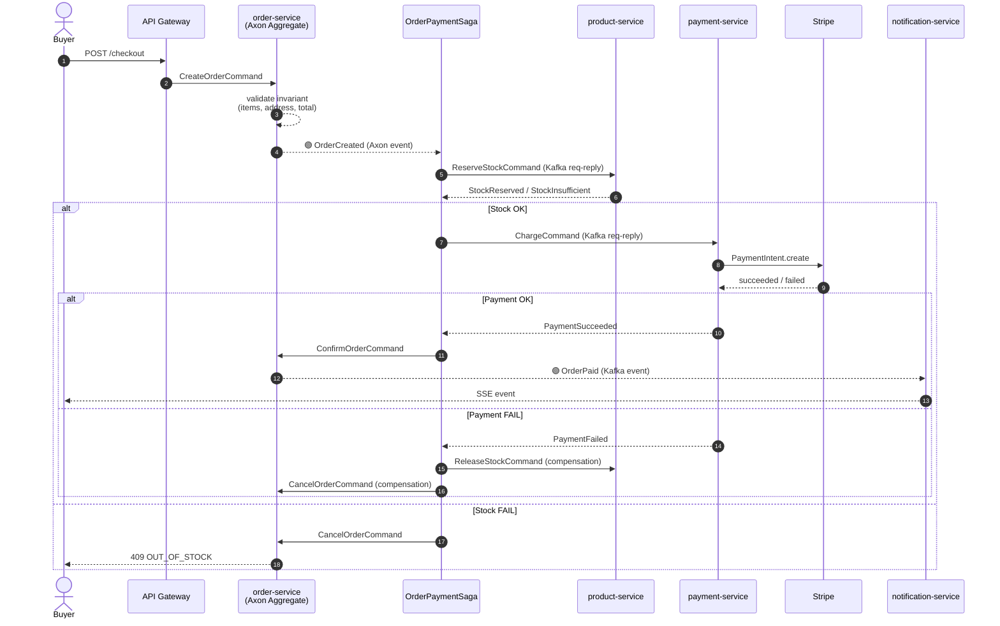

**Đặc điểm thiết kế:**

- **Saga không có DB transaction xuyên service** — mỗi bước là 1 transaction cục bộ + compensation.
- **Idempotency key** trên mỗi command để retry không sinh đơn trùng.
- **Reservation TTL 15 phút** — nếu saga sập giữa chừng, tồn kho tự release qua scheduler.

### 9.2. Luồng Flash Sale

Reactive + Redis atomic — đảm bảo throughput cao khi nghìn buyer cùng vào.

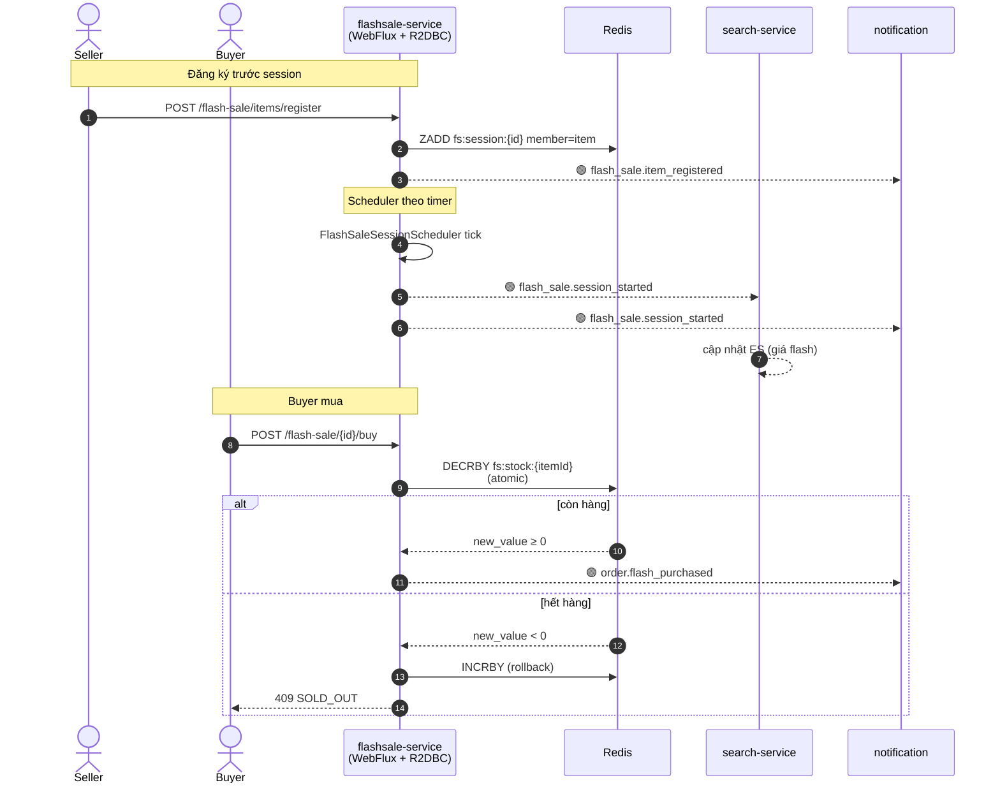

**Vì sao Redis atomic decrement?**

- PostgreSQL UPDATE…WHERE stock>0 cũng đúng nhưng latency cao hơn khi traffic dồn.
- `DECRBY` trên Redis là **một single thread atomic op**, không cần lock — đủ nhanh cho hàng nghìn request/giây.

### 9.3. Luồng Refund (Return To Sender — RTS)

Quy trình 3 bên: Buyer → Seller → Admin → Stripe.

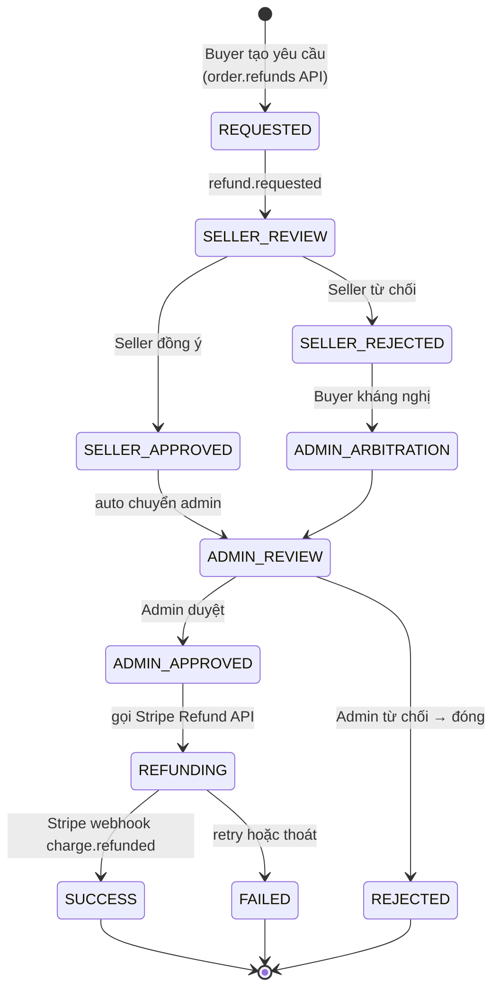

**Đặc điểm:**

- `refund-service` không có public endpoint tạo refund — entry duy nhất là **order-service** (`/orders/{id}/refunds`). Đây là **alternate path có chủ ý** so với docs cũ.
- Khi refund thành công, `seller_transfers.refunded_amount` được trừ tương ứng → có thể trigger reversal nếu đã payout.

### 9.4. Luồng AI Chat (Tool Calling + Human-in-the-loop)

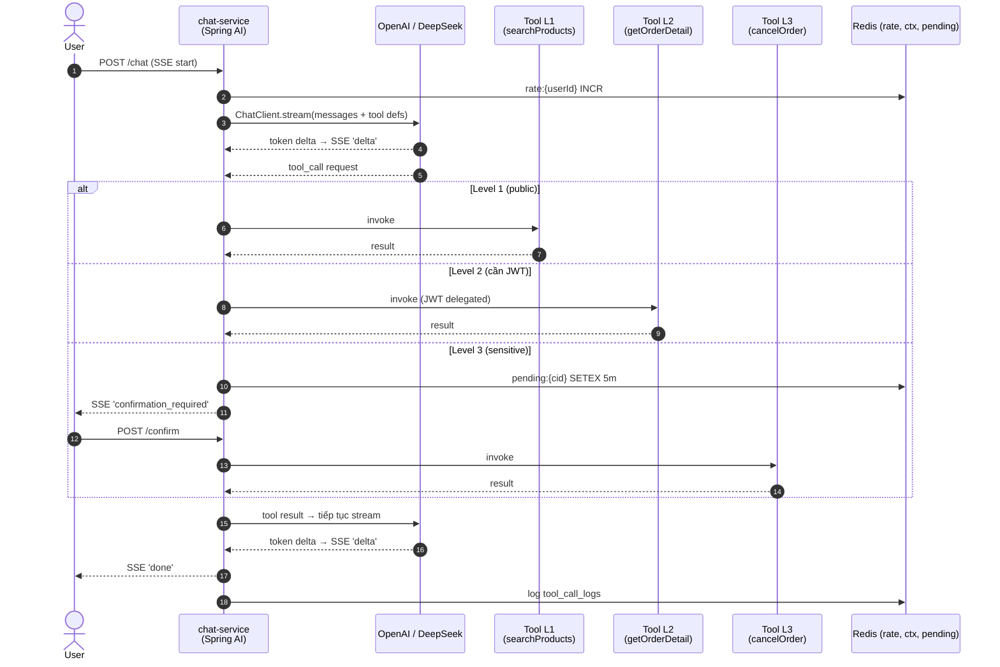

**Bảng 9.1 — Phân lớp rủi ro tool**

| Level | Loại | Yêu cầu | Ví dụ |
|-------|------|---------|------|
| 1 | Đọc public | Không cần auth | `searchProducts`, `searchFaq` |
| 2 | Đọc personal | JWT hợp lệ | `getOrderDetail`, `getUserProfile` |
| 3 | Ghi/xóa | JWT + Human confirm | `cancelOrder`, `deleteAccount` |

### 9.5. Luồng Notification (SSE Push)

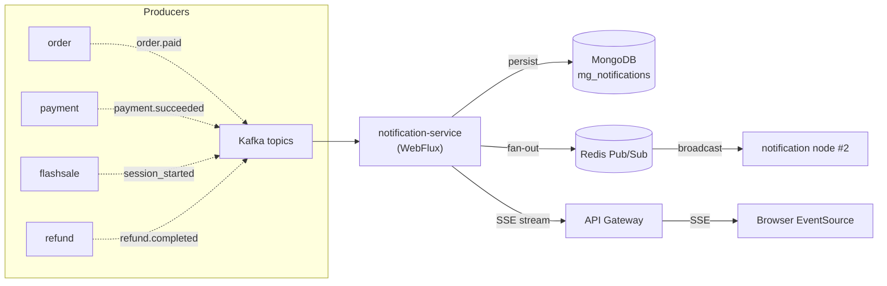

**Tại sao SSE thay vì polling?**

- Polling 5s gây tải DB cao và trễ thông báo.
- WebSocket khả dụng nhưng phức tạp + cần auth lại — không cần 2-way ở đây.
- SSE đơn hướng, qua HTTP, native browser API (`EventSource`), reconnect tự động.

---

## 10. Thiết kế bảo mật

### 10.1. Mô hình xác thực JWT

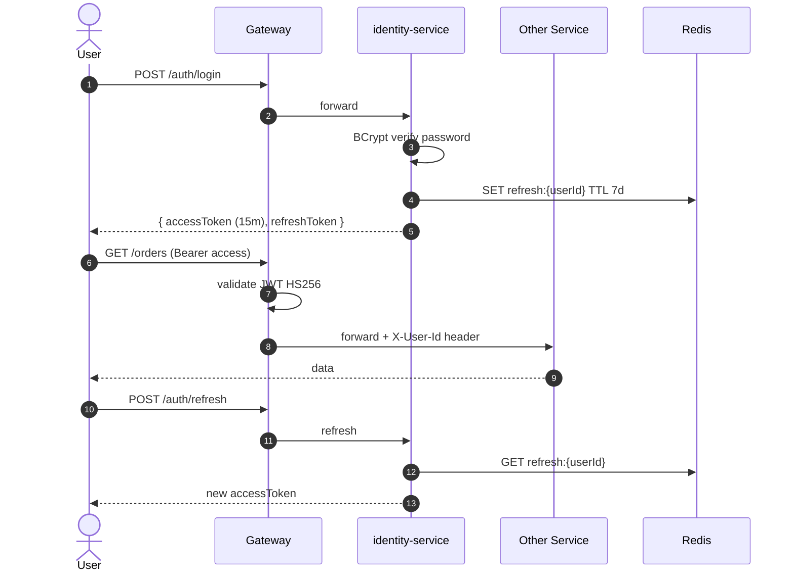

### 10.2. Mô hình phân quyền

| Lớp | Cơ chế |
|-----|--------|
| Authentication | Spring Security 6 + JWT HS256 |
| Authorization | Annotation `@PreAuthorize("hasRole('SELLER')")` trên endpoint |
| Role | `BUYER` / `SELLER` / `ADMIN` (lưu trong `users.role`) |
| Password | BCrypt cost 10 |
| Refresh token | Redis TTL 7 ngày, rotate khi refresh |
| Rate-limit | Token bucket Redis ở gateway + endpoint chat |
| CORS | Cấu hình tại Gateway |
| Exception | `AuthorizationDeniedException` → `403 AUTH_002` (đã sửa từ `500 SYS_001`) |

### 10.3. Bảo mật AI

| Rủi ro | Biện pháp |
|--------|-----------|
| Prompt injection ép gọi tool sai | System prompt cứng + tool whitelist + per-tool `@Tool` description rõ ràng |
| LLM hallucination về dữ liệu thật | Bắt buộc gọi tool, không trả lời từ kiến thức chung |
| Hành động không thể đảo ngược | Human-in-the-loop (`pending_confirmations`) cho Level 3 |
| Quota abuse | Redis rate-limit 20 req/phút/user, tool 10 req/phút/user |
| Leak JWT | Backend gọi tool nội bộ với JWT delegated, không lộ ra LLM |

---

## 11. Thiết kế Frontend (3 SPA)

### 11.1. Kiến trúc Monorepo Frontend

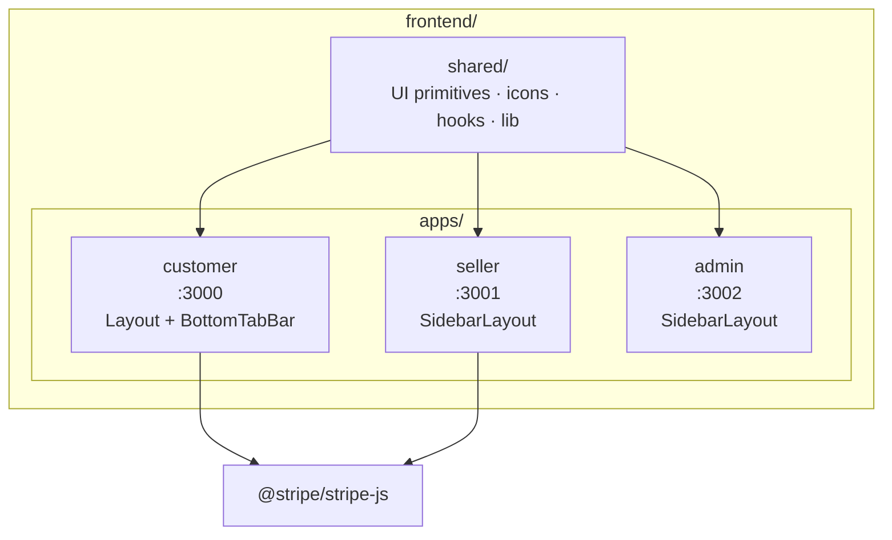

### 11.2. Stack chung

| Lớp | Công nghệ |
|-----|----------|
| UI library | React 19 |
| Bundler | Vite 6 (HMR, ESM native) |
| Type | TypeScript 5.6 |
| Routing | React Router 6.26 |
| Server state | TanStack Query 5.62 (cache, retry, optimistic) |
| Client state | Zustand 5 (auth, cart) — siêu nhẹ |
| HTTP | Axios 1.7 + interceptor (gắn JWT, refresh token) |
| Style | Tailwind CSS 3.4 + brand palette |
| Toast | `sonner` qua wrapper `@shared/lib/toast` (notify.*) |
| Token | js-cookie |
| Icon | `shared/components/icons.tsx` (không phụ thuộc icon lib) |

### 11.3. Phân chia trách nhiệm 3 app

| App | Mục đích | Tính năng chính | Layout |
|-----|---------|----------------|--------|
| **Customer** | B2C — mua sắm | Browse, search, cart, checkout, theo dõi đơn, chat AI, RTS request | `Layout + BottomTabBar` (mobile-friendly) |
| **Seller** | B2B — bán hàng | Quản lý sản phẩm, ảnh, biến thể, đăng ký flash sale, theo dõi đơn, payout, refund respond | `SidebarLayout` |
| **Admin** | Quản trị | Duyệt sản phẩm, quản lý flash sale, duyệt refund, dashboard, user management | `SidebarLayout` |

### 11.4. Vì sao 3 SPA tách biệt thay vì 1 monolith?

- **Bảo mật**: bundle admin không bị ship cho buyer → giảm bề mặt tấn công, không lộ admin route.
- **Hiệu năng**: mỗi app build bundle riêng nhỏ hơn nhiều so với mega app.
- **Team**: 3 team độc lập có thể deploy không ảnh hưởng nhau.
- **UX**: 3 audience khác nhau → IA, layout, navigation khác hẳn.

---

## 12. Tổng kết các quyết định thiết kế

### Bảng 12.1 — Bảng quyết định kiến trúc (ADR rút gọn)

| # | Quyết định | Đánh đổi | Lý do chọn |
|---|-----------|---------|-----------|
| 1 | Microservices 11 service thay vì monolith | Phức tạp vận hành ↑ | Scale theo domain, cô lập lỗi, deploy độc lập |
| 2 | CQRS/ES chỉ áp dụng `order-service` | Học cost cao | Order cần audit + replay; service khác không cần → tránh over-engineer |
| 3 | Axon Server + Kafka song song | 2 bus phải vận hành | Axon mạnh cho domain event; Kafka mạnh cho integration event |
| 4 | Saga orchestration (không choreography) | Một saga coordinator | Dễ debug, dễ thấy state, phù hợp Axon Saga |
| 5 | Reactive chỉ cho flashsale/notification/chat | Stack hỗn hợp | Reactive đắt khi nghiệp vụ vốn blocking; bật virtual thread đủ cho blocking service |
| 6 | Polyglot persistence (5 loại DB) | Vận hành phức tạp | Mỗi workload có công cụ phù hợp |
| 7 | Stripe Connect Express | Phụ thuộc Stripe | Tránh tự build KYC + multi-vendor payout |
| 8 | Spring AI thay vì gọi OpenAI trực tiếp | Lệ thuộc Spring ecosystem | Tool calling, ChatClient API thống nhất, swap LLM dễ |
| 9 | 3 SPA tách biệt | Lặp UI primitives | Bảo mật, hiệu năng, team autonomy |
| 10 | SSE thay vì WebSocket | Một chiều | Đủ dùng cho push notification, đơn giản, native browser |
| 11 | Redis atomic cho flash sale | Single-point bottleneck | Throughput cực cao, latency thấp; DB không kham nổi traffic dồn |
| 12 | Elasticsearch SKU-first | Index lớn hơn product-first | Field collapsing cho phép vừa hiển thị product card vừa filter theo SKU price/stock |

### Bảng 12.2 — Trách nhiệm 1 dòng / service

| Service | "Tôi chịu trách nhiệm về…" |
|---------|---------------------------|
| api-gateway | …là cổng duy nhất ra ngoài, validate JWT và giới hạn tốc độ. |
| discovery | …biết service nào đang sống ở đâu. |
| identity | …ai là ai, có quyền gì, mật khẩu, token. |
| product | …danh mục, sản phẩm, biến thể, ảnh, giỏ hàng, đặt trước tồn kho. |
| flashsale | …phiên giảm giá theo khung giờ, atomic decrement tồn flash. |
| order | …vòng đời đơn hàng, audit trail, điều phối checkout. |
| payment | …charge Stripe, chia tiền cho seller, webhook. |
| refund | …workflow hoàn tiền 3 bên, gọi Stripe Refund. |
| search | …tìm kiếm tiếng Việt SKU-first. |
| notification | …đẩy thông báo real-time qua SSE. |
| chat | …trợ lý AI có tool calling + xác nhận con người. |

---

> **Tóm tắt Chương II:** hệ thống là **Microservices Event-Driven** với 11 service, dùng **CQRS/ES + Saga** cho domain phức tạp nhất (Order), **Reactive** cho domain throughput cao (FlashSale/Notification/Chat), và **Polyglot Persistence** chọn DB phù hợp workload. Bus sự kiện chia đôi: **Axon** cho domain, **Kafka** cho tích hợp. Frontend là 3 SPA độc lập với shared UI primitives. Mọi quyết định đều bám sát 5 tiêu chí: nhất quán nghiệp vụ → cô lập lỗi → scale theo domain → tiến hóa → trải nghiệm vận hành.

*Cập nhật: 2026-06-16*
